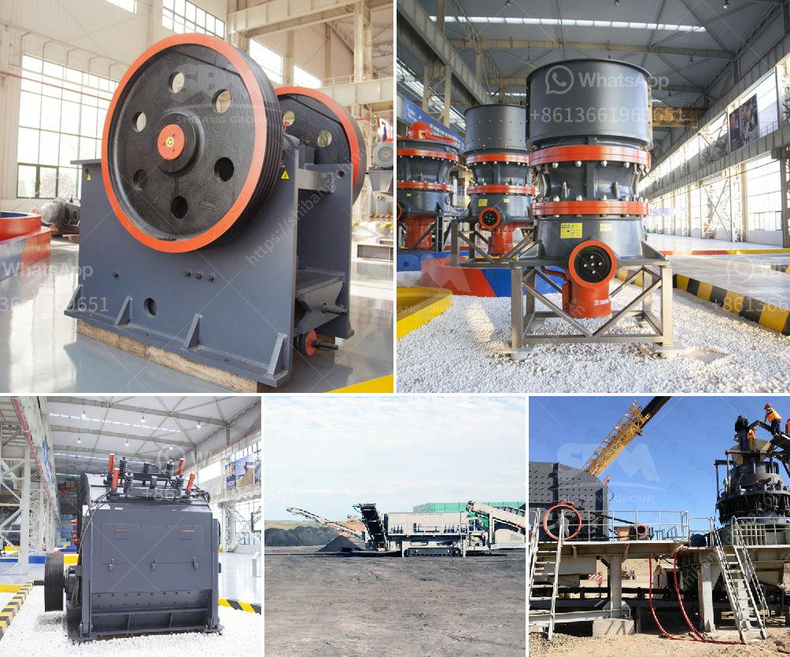

<h3>الطحن بالكرات في بنغالور</h3>
تكاد أن تجد في مدينة بنغالور في الهند مشروعًا غريبًا ومبتكرًا يُعرف باسم "الطحن بالكرات". فعلى الرغم من أن عملية الطحن تُعد أساسية في صناعات متنوعة مثل التعدين والتصنيع وصناعة الأسمنت، إلا أن طريقة الطحن بالكرات في بنغالور قد تجلب لك الدهشة وتغير نظرتك لهذه العملية.

يعود تاريخ استخدام الكرات في عمليات الطحن إلى أكثر من قرن، حيث تستخدم تلك الكرات الصلبة لسحق وتكسير المواد الصلبة إلى حجم صغير. ومع ذلك، تم استخدام تقنية الطحن بالكرات في بنغالور لتحقيق التقدم والتطور في هذا المجال.

تعتمد عملية الطحن بالكرات في بنغالور على فكرة مبتكرة وجديدة تتمثل في استخدام كرات ثقيلة مصنوعة من الصلب وتستخدم للطحن بشكل متكرر. وبالإضافة إلى ذلك، يتم استخدام نوع خاص من الكرات يسمى "كرات الطحن السريع"، وهي تمتاز بسرعة التحرك وثبات التوازن ومقاومة التآكل.

وتعمل الكرات الثقيلة على تكسير المواد بفعل قوة الجاذبية، حيث يتم تحميل المواد في أسفل صومعة كبيرة وثم توجيهها نحو مسار حلقي أفقي ضيق يتم تدوير الكرات فيه بسرعة عالية. ونتيجة لذلك، تتم طحن المواد الصلبة وتكسيرها بمقدار أكبر، حيث يكون تأثير الطحن بالكرات أقوى وأكثر فعالية مقارنة بطرق الطحن التقليدية.

تعتبر هذه التقنية الحديثة في عملية الطحن بالكرات مفتاح النجاح في تحقيق أداء عالي وجودة عالية في صناعات مختلفة مثل صناعة الحديد والصلب والأسمنت والزجاج والكيماويات. حيث تمتاز بالسهولة في الاستخدام والصيانة المنخفضة والتكلفة الأقل.

بالإضافة إلى ذلك، تعتبر تقنية الطحن بالكرات في بنغالور أيضًا أكثر فعالية من حيث الطاقة، فهي تسمح بتوفير الطاقة وتقليل استهلاك الكهرباء، مما يجعلها اختيارًا مستدامًا للشركات التي تهتم بالحفاظ على البيئة وتقليل الانبعاثات الضارة.

وفي الختام، يمكن القول أن تقنية الطحن بالكرات في بنغالور قد حققت خطوات هائلة في تطوير عملية الطحن وتحسين كفاءتها. إنها خطوة مبتكرة تُظهر نجاح الهند في مجال الابتكار التقني وإظهار قدراتها في تطوير صناعاتها.
<h3>Contact us</h3><ul><li><strong>Whatsapp:&nbsp;<a href="https://wa.me/8613661969651">+8613661969651</a></strong></li><li><a href="https://swt.shibang-china.com/?git&amp;zhl&amp;الطحن بالكرات في بنغالور"><strong>Online Service(chat now)</strong></a></li></ul><h3>Related</h3><ul><li><a href='مصنع كسارة 150 طن في الساعة.md'>مصنع كسارة 150 طن في الساعة</a></li><li><a href='سعر آلة سحق الحجر في باكستان.md'>سعر آلة سحق الحجر في باكستان</a></li><li><a href='آلة الكوك البترولية.md'>آلة الكوك البترولية</a></li><li><a href='كم من الأرض مطلوبة لكسارة الحجر.md'>كم من الأرض مطلوبة لكسارة الحجر</a></li><li><a href='مطحنة الكرة مواد الاسمنت والطاقة.md'>مطحنة الكرة مواد الاسمنت والطاقة</a></li></ul>