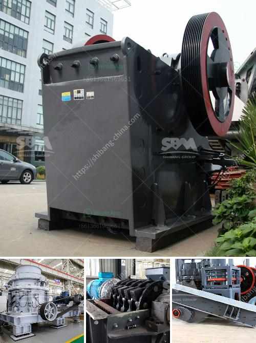

<h3>الطحن بالكرات يعتمد على ماذا</h3>
الطحن بالكرات هو عملية تستخدم في صناعة الأسمنت والمعادن والألوان والكيماويات ومواد البناء الأخرى. تهدف هذه العملية إلى تحطيم الجسيمات وتقليل حجمها لتحقيق خواص معينة مثل الليونة أو زيادة المعدنية.

تمتاز عملية الطحن بالكرات بسهولتها وفاعليتها في تكسير المواد بشكل متساوٍ ودقيق. يتم ذلك من خلال وجود كرات صلبة من الفولاذ أو السيراميك تحتوي على قوة اصطدام وانفجار معينة. عندما تدور المطحنة ، تتعرض الكرات للضغط والاحتكاك والاصطدام بالمواد الموجودة في الداخل. هذا الحركة الدورانية الثابتة يؤدي إلى تكسير وسحق الجسيمات بشكل فعال.

يعتمد فعالية عملية الطحن بالكرات على عدة عوامل بما في ذلك حجم الكرات وتركيزها وسرعة الدوران وفترة الطحن. تحطم الجسيمات أساسًا بواسطة احتكاكها بين الجدران الداخلية للمطحنة والكرات. عندما تكون الكرات كبيرة ، فإنها تسبب قوة ضغط أعلى وتؤدي إلى تكسير الجسيمات بشكل أكبر. ومع زيادة سرعة الدوران وفترة الطحن ، تنتج قوة اصطدام أقوى بين الجسيمات والكرات وتعزز عملية الطحن.

يعتبر الطحن بالكرات طريقة فعالة لتحقيق الطحن الناعم حيث يتم تحقيق حجم الجسيمات الصغيرة جدًا. يتراوح حجم الجسيمات المحققة بين عدة ميكرومترات إلى أقل من 1 ميكرومتر. هذه الخواص جعلت الطحن بالكرات أسلوبًا رائجًا في صناعة المواد الكيميائية والطلاء وصناعة الألوان. تحقق العملية أيضًا من تحسين خواص المنتجات مثل القابلية للذوبان واللزوجة والنفاذية والقدرة على الامتصاص.

بالاختصار ، الطحن بالكرات هو عملية فعالة تهدف إلى تحطيم الجسيمات وتقليل حجمها. يعتمد فعالية الطحن على عدة عوامل مثل حجم الكرات وسرعة الدوران وفترة الطحن. تحقق العملية من تجانس المواد وتعزيز خواصها المطلوبة مما يجعلها أسلوبًا شائعًا في صناعات متعددة.
<h3>Contact us</h3><ul><li><strong>Whatsapp:&nbsp;<a href="https://wa.me/8613661969651">+8613661969651</a></strong></li><li><a href="https://swt.shibang-china.com/?git&amp;zhl&amp;الطحن بالكرات يعتمد على ماذا"><strong>Online Service(chat now)</strong></a></li></ul><h3>Related</h3><ul><li><a href='مطحنة الهامر للحبوب.md'>مطحنة الهامر للحبوب</a></li><li><a href='مطحنة الهامر من إيديبيسا.md'>مطحنة الهامر من إيديبيسا</a></li><li><a href='آلة سحق جوز الهند.md'>آلة سحق جوز الهند</a></li><li><a href='كسارات متنقلة في الولايات المتحدة المتحدة.md'>كسارات متنقلة في الولايات المتحدة المتحدة</a></li><li><a href='كسارة الفك المحمولة في غرب أفريقيا تجار.md'>كسارة الفك المحمولة في غرب أفريقيا تجار</a></li></ul>