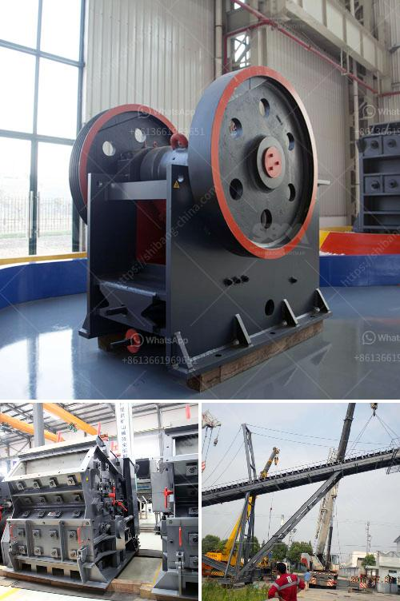

<h3>الفارق بين الرمل ومسحوق الحجر المكسر</h3>
يعد الرمل ومسحوق الحجر المكسر من المواد المستخدمة على نطاق واسع في العديد من الصناعات والتطبيقات المختلفة مثل البناء والتشييد، وصناعة الزجاج والسيراميك، وتصنيع المواد اللاصقة والدهانات. ومع ذلك، فإن هناك اختلافات كبيرة بينهما تتعلق بالمميزات والخصائص التقنية والتطبيقية. سنستكشف في هذه المقالة الفروق بين الرمل ومسحوق الحجر المكسر.

أولاً، من حيث التكوين، فإن الرمل عبارة عن ترسب الحبيبات المعدنية والصخرية في الأنهار والبحار والمحيطات على مر الزمن. وهو يتكون بشكل رئيسي من حبيبات السيليكا ولكن يمكن أن يحتوي أيضاً على الكوارتز والفلسبار والجبس والمعادن الطينية الأخرى. بالمقابل، فإن مسحوق الحجر المكسر يتم الحصول عليه عن طريق تكسير الحجر الطبيعي أو الصخور في الكسارات ومن ثم طحنها إلى حجم ناعم.

ثانياً، من حيث الحجم والتوزيع الحبيبية، فإن الرمل يتميز بتواجده في حبيبات كبيرة نسبياً وتوزيع غير متجانس، وقد يتراوح حجم حبيبات الرمل بين 0.0625 ملم إلى 2 ملم. بالمقابل، فإن مسحوق الحجر المكسر يكون في حجم أصغر وأدق، حيث يمكن أن تصل قياسات حبيباته إلى 75 ميكرون، ويتميز بتوزيع حبيباته المتجانسة.

ثالثاً، من حيث الخصائص الميكانيكية، فإن الرمل يعتبر أكثر قابلية للتآكل والتكسر نظراً لحجم حبيباته الكبير وتوزيعه غير المتجانس. بالمقابل، يتميز مسحوق الحجر المكسر بمتانة أعلى وقوة ضغطية أكبر نظراً لحجمه الأصغر وتوزيعه المتجانس.

رابعاً، من حيث الاستخدامات المتعددة، يمكن استخدام الرمل في العديد من التطبيقات مثل بناء الطرق والهندسة المدنية وتصنيع الزجاج والسيراميك والمواد اللاصقة. بالمقابل، يمكن استخدام مسحوق الحجر المكسر في صناعة الخرسانة والأسفلت والطلاءات والمواد الإضافية للبناء.

بشكل عام، رغم وجود بعض الاختلافات بين الرمل ومسحوق الحجر المكسر، فإنهما يعتبران مواد بنائية أساسية مهمة في صناعة البناء والتشييد، ويتطلب استخدام المادة المناسبة تبعاً للاحتياجات والتطبيقات المحددة لكل مشروع.
<h3>Contact us</h3><ul><li><strong>Whatsapp:&nbsp;<a href="https://wa.me/8613661969651">+8613661969651</a></strong></li><li><a href="https://swt.shibang-china.com/?git&amp;zhl&amp;الفارق بين الرمل ومسحوق الحجر المكسر"><strong>Online Service(chat now)</strong></a></li></ul><h3>Related</h3><ul><li><a href='كسارة الفك ميم FR.md'>كسارة الفك ميم FR</a></li><li><a href='مطحنة الكرة للذهب في إندونيسيا.md'>مطحنة الكرة للذهب في إندونيسيا</a></li><li><a href='كسارة حجر مستعملة للبيع في أوروبا.md'>كسارة حجر مستعملة للبيع في أوروبا</a></li><li><a href='عملية إنتاج الجبس.md'>عملية إنتاج الجبس</a></li><li><a href='كسارة حجر لاستخراج الحجر.md'>كسارة حجر لاستخراج الحجر</a></li></ul>