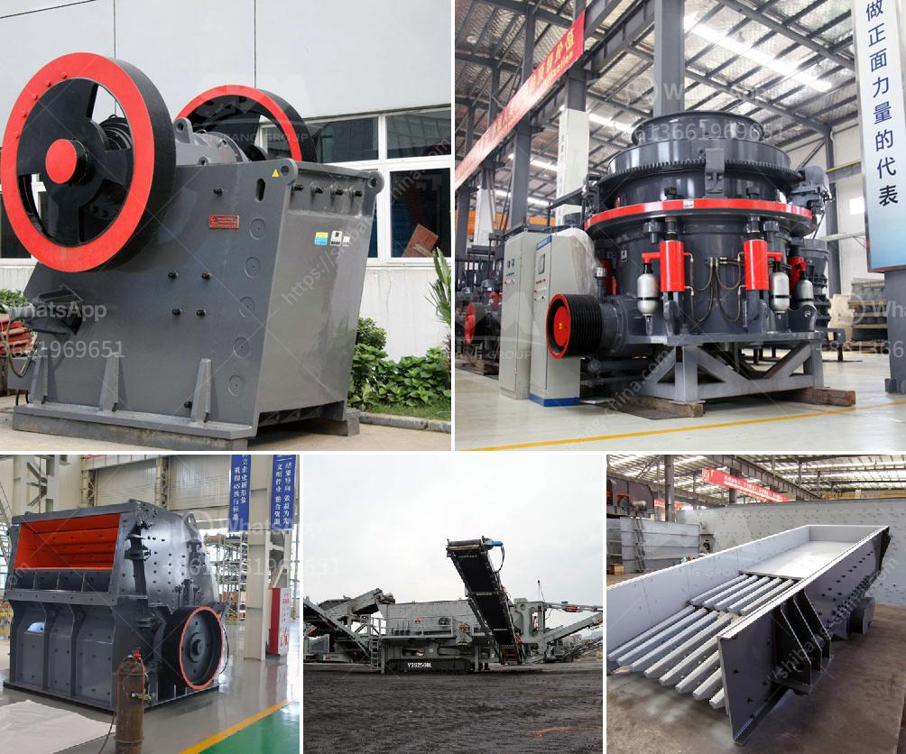

<h3>الفرق بين الطحن والتلميع</h3>
الطحن والتلميع هما عمليتان مهمتان في عالم الصناعة والتشطيب، وعلى الرغم من أنهما ينتميان إلى نفس العملية العامة، إلا أنهما يختلفان في طبيعة العمل المنجز والأدوات المستخدمة والنتائج المتوقعة. في هذه المقالة، سنستعرض الفرق بين الطحن والتلميع.

الطحن هو عملية إزالة طبقة رقيقة من السطح باستخدام أداة طحن مثل آلة طحن أو طاحونة يدوية. تستخدم هذه الأدوات عادة القرص أو الحجر الصناعي لإزالة العيوب والخدوش والتجاويف من السطح. تعتبر عملية الطحن جزءًا من العمليات الأولية في التشطيب، حيث يتم استخدامها لإعداد السطح قبل البدء في عملية التلميع. يتم التحكم في مستوى الطحن بواسطة تغيير شدة الضغط وسرعة الطحن ونوع الأداة المستخدمة.

من ناحية أخرى، يتم استخدام التلميع لتحسين اللمعان والمظهر العام للسطح. يستخدم العديد من الصناعيين وحتى الآلات المنزلية التلميع لتحسين جودة السطح ووضوحه. يستخدم العديد من المواد الملمعة مثل المعجون أو الشمع لإعطاء السطح مظهرًا لامعًا وناعمًا. تستخدم آلة تلميع مع وسائط خاصة مثل السفنجة أو القماش لتنفيذ عملية التلميع. تعتمد جودة التلميع على نوع الملمع والضغط المستخدم وسرعة الحركة ووقت التلميع.

بالمقارنة بين الطحن والتلميع، يمكن القول إن الطحن يستخدم لتحضير السطح وإزالة العيوب والخدوش الأكبر، بينما يستخدم التلميع لإعطاء لمعان نهائي للسطح. يعتمد الاختيار بين الطحن والتلميع على نوع السطح والاحتياجات المطلوبة. إذا كانت هناك تلفيات كبيرة في السطح، فمن الأفضل استخدام الطحن لتحضير السطح، ثم التلميع للحصول على لمعان نهائي. ولكن إذا كان السطح في حالة جيدة ويحتاج فقط إلى تحسين اللمعان، فإن التلميع البسيط يكفي.

بشكل عام، يعتبر الطحن أكثر صلابة وخشونة وتآكلًا من التلميع، حيث يستخدم لإزالة العرق والصدأ والتسوس. من ناحية أخرى، التلميع هو عملية أكثر نعومة وتماثلًا وتناسقًا، حيث يعطي المظهر النهائي للسطح.

باختصار، يجب أن نفهم أن الطحن والتلميع يتعاونان معًا لتحقيق النتائج النهائية المثالية. بينما يقوم الطحن بإعداد السطح، يقوم التلميع بتحسين اللمعان والمظهر العام للسطح.
<h3>Contact us</h3><ul><li><strong>Whatsapp:&nbsp;<a href="https://wa.me/8613661969651">+8613661969651</a></strong></li><li><a href="https://swt.shibang-china.com/?git&amp;zhl&amp;الفرق بين الطحن والتلميع"><strong>Online Service(chat now)</strong></a></li></ul><h3>Related</h3><ul><li><a href='آلة معالجة خام المنغنيز بسعر.md'>آلة معالجة خام المنغنيز بسعر</a></li><li><a href='مطحنة الكرة لكلنكر الأسمنت.md'>مطحنة الكرة لكلنكر الأسمنت</a></li><li><a href='مصنع إسمنت مربح للبيع في تاميل نادو.md'>مصنع إسمنت مربح للبيع في تاميل نادو</a></li><li><a href='سعر خط إنتاج الجبس.md'>سعر خط إنتاج الجبس</a></li><li><a href='قمع التفريغ لمطحنة الكرة.md'>قمع التفريغ لمطحنة الكرة</a></li></ul>