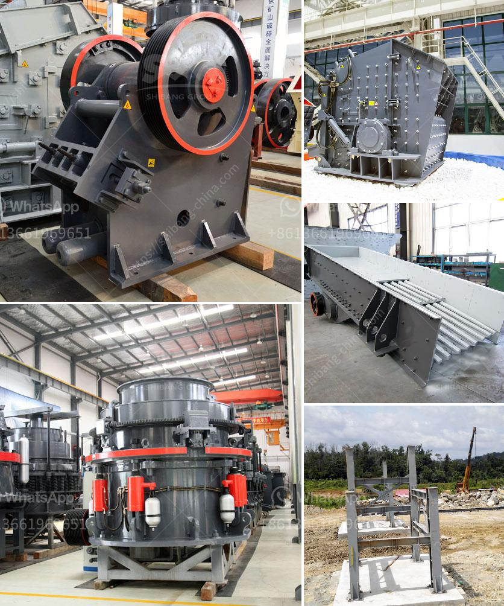

<h3>الفرق بين كسارة الفك وكسارة الصدم</h3>
تعد كسارة الفك وكسارة الصدم اثنين من أنواع الكسارات الأكثر شيوعًا في صناعة التعدين والبناء. على الرغم من أن كلاهما يستخدم لتكسير المواد وسحقها، إلا أنهما يختلفان في الهيكل وطريقة التشغيل والاستخدامات. سنتناول في هذه المقالة الفروق الرئيسية بينهما.

فيما يتعلق بالهيكل، فإن كسارة الفك تتكون من إطار رئيسي ومحور، حيث يتم ترتيب الفك الثابت والفك المتحرك على المحور لتشكيل فتحة تغذية. تعمل الفكوك على فتح وإغلاق هذه الفتحة عند التشغيل والتوقف، مما يسمح بإدخال واخراج المواد بكفاءة. بالإضافة إلى ذلك، تتحرك الفكوك الثابتة والمتحركة في حركة تقابلية لتكسير المواد بينهما عن طريق الضغط والشد.

أما كسارة الصدم، فتتألف من الغرفة السحق والمطرقة والبلاطة ومصد الاصطدام. في هذا النمط، يتم إغلاق المواد في الغرفة السحق ومعالجتها بواسطة المطرقة والبلاطة عندما تصطدم بها، لتنتج عنها جزيئات أصغر. يحدث التكسير بسرعة عالية وبأسلوب صدمي، ويعمل نظام المطرقة والبلاطة على تقسيم المواد إلى جزيئات صغيرة بفضل سرعة الصدم.

بالنسبة لطريقة التشغيل، تعمل كسارة الفك وكسارة الصدم بطرق مختلفة. تستخدم كسارة الفك عادة في التكسير الأولي، حيث تأخذ المواد الكبيرة وتقسمها إلى قطع صغيرة قبل أن تمر إلى مرحلة التكسير التالية. بالمقابل، تُستخدم كسارة الصدم عندما تكون المواد متينة بالفعل ولا تحتاج إلى تقسيم أولي. يتم استخدامها لتكسير المواد المتوسطة والصغيرة التي تم بالفعل تكسيرها بواسطة كسارات أخرى. يعتبر تأثير الصدمة هو المحرك الأساسي لعمل كسارة الصدم، حيث تعمل عن طريق دفع المواد بواسطة المطرقة لتصطدم بها وتكسرها.

أخيراً، تختلف استخدامات كسارة الفك وكسارة الصدم. تستخدم كسارة الفك عادة لتكسير المواد الخام والحجارة الكبيرة لإنتاج حصى ومواد بناء أخرى. بينما تستخدم كسارة الصدم لتشكيل المواد المكسرة إلى تراصات ورقائق أصغر، وهي تستخدم أساسًا في تكسير الخرسانة والأسفلت والزجاج والمعادن.

باختصار، يمكن القول إن كسارة الفك تستخدم لتكسير المواد الخام وتقسيمها إلى حجم أصغر، في حين أن كسارة الصدم تعمل عن طريق الصدمة لتحطيم المواد التي تم تكسيرها بالفعل. تختلف هذه الكسارتين في الهيكل وطريقة العمل والتطبيقات، ويجب اختيار الكسارة الملائمة وفقًا لاحتياجات المشروع والمواد المطلوب تكسيرها.
<h3>Contact us</h3><ul><li><strong>Whatsapp:&nbsp;<a href="https://wa.me/8613661969651">+8613661969651</a></strong></li><li><a href="https://swt.shibang-china.com/?git&amp;zhl&amp;الفرق بين كسارة الفك وكسارة الصدم"><strong>Online Service(chat now)</strong></a></li></ul><h3>Related</h3><ul><li><a href='مورد آلة طحن الكرة في إندونيسيا.md'>مورد آلة طحن الكرة في إندونيسيا</a></li><li><a href='مصنع كسارة للبيع في المملكة العربية السعودية.md'>مصنع كسارة للبيع في المملكة العربية السعودية</a></li><li><a href='سعر معدات الطحن 250 طن.md'>سعر معدات الطحن 250 طن</a></li><li><a href='تكلفة كسارة الحصى.md'>تكلفة كسارة الحصى</a></li><li><a href='كسارة الفك ميم FR.md'>كسارة الفك ميم FR</a></li></ul>