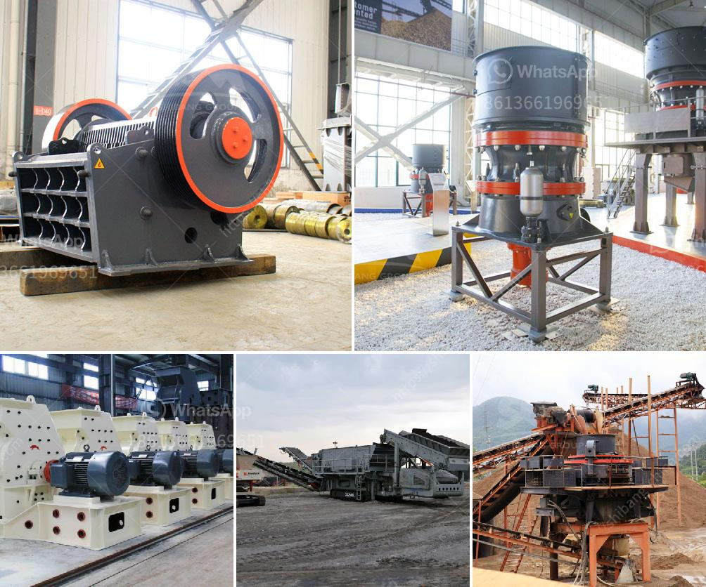

<h3>الفرق بين مطاحن الكرات ومطاحن الأنابيب</h3>
تعتبر مطاحن الكرات ومطاحن الأنابيب من أهم أنواع مطاحن الطحن المستخدمة في صناعة الخامات المعدنية والمواد البناء، حيث تقوم هذه المطاحن بطحن المواد الخام إلى حجم الجسيمات المطلوب قبل استخدامها في عمليات الإنتاج اللاحقة.

تختلف مطاحن الكرات عن مطاحن الأنابيب في العديد من النواحي. تعتمد مطاحن الكرات على تدوير الكرات المعدنية الثقيلة الموجودة داخل الأسطوانة المعدنية، حيث يتم سحق المواد الخام بفعل سقوط الكرات على الخامات وتحطمها. بالمقابل، تعتمد مطاحن الأنابيب على تدوير أنابيب الصلب طولياً وأفقياً، حيث تتحرك المواد الخام عبر المطحنة بواسطة ضغط الهواء أو سرعة الدوران المرتفعة.

نقطة أخرى تختلف فيها المطاحن هي طريقة التحكم في حجم الجسيمات النهائي. يمكن ضبط حجم الجسيمات بسهولة في مطاحن الكرات من خلال ضبط مساحة الشريط التالف بواسطة الكرات. بينما تكون عملية تحكم حجم الجسيمات في مطاحن الأنابيب أكثر صعوبة، حيث يجب تغيير أحجام الأنابيب أو تدفق الهواء لتحقيق حجم الجسيم المطلوب.

بالإضافة إلى ذلك، تختلف تكاليف التشغيل والصيانة بين النوعين. نظرًا لاستخدام الكرات المعدنية الثقيلة، قد تحتاج مطاحن الكرات إلى استهلاك أعلى للطاقة وزيادة في تكاليف التشغيل والصيانة. بالمقابل، تكون مطاحن الأنابيب أكثر فاعلية من حيث استهلاك الطاقة وتحتاج إلى صيانة أقل.

في الختام، رغم وجود بعض الاختلافات في التصميم وطريقة التشغيل، يتشابه الغرض من استخدام مطاحن الكرات ومطاحن الأنابيب وهو طحن المواد الخام. يجب على الشركات اختيار النوع المناسب وفقًا لمتطلبات إنتاجها واحتياجاتها التشغيلية.
<h3>Contact us</h3><ul><li><strong>Whatsapp:&nbsp;<a href="https://wa.me/8613661969651">+8613661969651</a></strong></li><li><a href="https://swt.shibang-china.com/?git&amp;zhl&amp;الفرق بين مطاحن الكرات ومطاحن الأنابيب"><strong>Online Service(chat now)</strong></a></li></ul><h3>Related</h3><ul><li><a href='مورد سيور ناقلة للفحم من الهند.md'>مورد سيور ناقلة للفحم من الهند</a></li><li><a href='سيور ناقلة في ماليزيا.md'>سيور ناقلة في ماليزيا</a></li><li><a href='كسارات الفك المستعملة في إسبانيا.md'>كسارات الفك المستعملة في إسبانيا</a></li><li><a href='آلات سحق الحجر اليابانية.md'>آلات سحق الحجر اليابانية</a></li><li><a href='تكلفة مصنع الإسمنت الصغير بسعة 2000 طن يوميًا.md'>تكلفة مصنع الإسمنت الصغير بسعة 2000 طن يوميًا</a></li></ul>