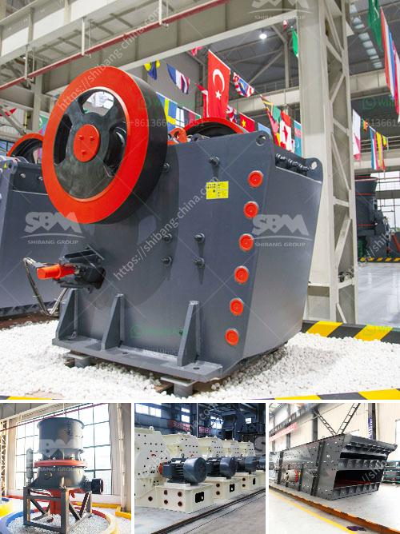

<h3>الفرق بين مطاحن الكرة وكسارة الفك</h3>
تعتبر مطاحن الكرة وكسارة الفك من أهم المعدات التي تستخدم في صناعة التعدين ومعالجة المواد الخام. على الرغم من أن الهدف الرئيسي للاثنين هو سحق المواد الخام، إلا أن لكل منهما ميزات فريدة تجعله ملائمًا لاستخدامات مختلفة. سأستعرض في هذه المقالة الفروق الرئيسية بين مطاحن الكرة وكسارة الفك.

أولاً، فيما يتعلق بتصميم المعدات، فإن مطاحن الكرة تتكون من غرفة سحق تحتوي على جرة تُحمل بواسطة محامل وتدور على محور أفقي. يتم تعبئة هذه الجرة بالكرات الصلبة التي تقوم بسحق المواد الخام عن طريق الاحتكاك والضغط. بالمقابل، تتكون كسارة الفك من صفيحتين فكيتين يتحركان بشكل دوري لسحق المواد الخام.

ثانياً، فيما يتعلق بأداء التكسير، تُعتبر مطاحن الكرة أكثر كفاءة في سحق المواد إلى حجم أصغر بسبب قوة الاحتكاك الموجودة بين الكرات والمواد الخام. يتم استخدامها بشكل رئيسي لتكسير المواد الجافة والرطبة بشكل متساوٍ. على الجانب الآخر، تعتبر كسارة الفك قادرة على تكسير المواد الخام إلى حجم أكبر بشكل عام، ويستخدمها عادةً في سحق المواد ذات الصلابة العالية.

ثالثاً، فيما يتعلق بتكلفة الصيانة، فإن مطاحن الكرة تحتاج إلى الكثير من الصيانة بسبب تآكل الكرات والغلاف الداخلي للجرة. علاوة على ذلك، فإن استبدال الكرات يتطلب توقف المطحنة ويؤثر على الإنتاجية. بالمقارنة، تتطلب كسارة الفك صيانة أقل، حيث لا تحتوي على أجزاء معدنية تتآكل بسرعة.

أخيرًا، عندما يتعلق الأمر بحجم الإخراج، فإن مطاحن الكرة تعتبر قادرة على تحقيق حجم مُطلوب للمواد المسحوقة، في حين يمكن أن تحقق كسارة الفك حجمًا أكبر. لذا، فإن اختيار استخدام كلا المعدات يعتمد على استخدام المواد وغرض العملية.

باختصار، على الرغم من أن مطاحن الكرة وكسارة الفك تستخدمان للتكسير، إلا أن لكل منهما استخدامات مختلفة وميزات فريدة. يعتمد اختيار المعدة المناسبة على المواد الخام وحجم الإخراج المطلوب وشروط العمل.
<h3>Contact us</h3><ul><li><strong>Whatsapp:&nbsp;<a href="https://wa.me/8613661969651">+8613661969651</a></strong></li><li><a href="https://swt.shibang-china.com/?git&amp;zhl&amp;الفرق بين مطاحن الكرة وكسارة الفك"><strong>Online Service(chat now)</strong></a></li></ul><h3>Related</h3><ul><li><a href='طاحونة مطرقية صغيرة بقطر 10 مم.md'>طاحونة مطرقية صغيرة بقطر 10 مم</a></li><li><a href='كسارات لآلة إعادة التدوير في الإمارات.md'>كسارات لآلة إعادة التدوير في الإمارات</a></li><li><a href='مصنع كسارة في الهند.md'>مصنع كسارة في الهند</a></li><li><a href='كسارة حجر لصنع رمل البناء.md'>كسارة حجر لصنع رمل البناء</a></li><li><a href='اختلافات بين مطحنة الهامر ومطحنة الكرة.md'>اختلافات بين مطحنة الهامر ومطحنة الكرة</a></li></ul>