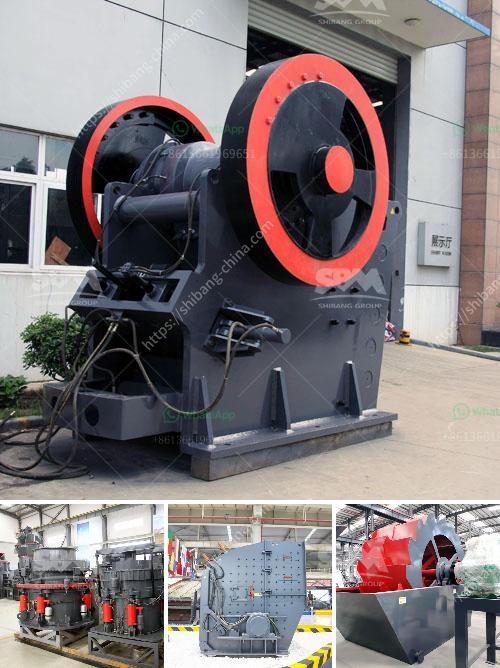

<h3>الفصل المغناطيسي لرمل خام الحديد</h3>
يُعد الفصل المغناطيسي لرمل خام الحديد أحد الطرق الشائعة والفعالة لفصل الشوائب المغناطيسية عن خام الحديد. يتم استخدام هذه الطريقة في عمليات تكرير الخامات المعدنية لاستخلاص المعادن بشكل فعال.

خلال عملية الفصل المغناطيسي، يتم استخدام المغناطيسية الطبيعية للحديد لفصل الجسيمات المغناطيسية من غير المغناطيسية. يتم استخدام المغناطيس في تجهيز خام الحديد لإنتاج منتج نهائي ذو نقاوة عالية.

تتكون طريقة الفصل المغناطيسي من عدة مراحل. تبدأ بتكسير الخام إلى جسيمات صغيرة باستخدام كسارات ومطاحن. ثم يتم تمرير الخام المكسور عبر جهاز المغناطيسية حيث يتم توليد مجال مغناطيسي قوي يلتقط الشوائب المغناطيسية الموجودة في الخام.

عندما يمر الخام عبر المغناطيس، يتسبب المجال المغناطيسي في جذب الشوائب المغناطيسية من الخام، في حين تظل الجسيمات غير المغناطيسية غير متأثرة وتمر بسهولة من خلال الجهاز. تتم الاستفادة من فروق المغناطيسية في الجسيمات المختلفة لفصل الشوائب المغناطيسية.

بعد فصل الشوائب المغناطيسية عن الخام، يتم تخزين المنتج المغناطيسي في أوعية خاصة لاحتواء الجسيمات. ثم يتم استخدام أجهزة الترشيح والتجفيف للتخلص من الماء والشوائب الأخرى المتبقية.

يُعتبر الفصل المغناطيسي لرمل خام الحديد طريقة فعالة جدًا لتحسين جودة المنتج النهائي وزيادة الكفاءة العامة لعملية التكرير. يقلل هذا الفصل من التلوث البيئي الناتج عن استخراج المعادن والشوائب الضارة. كما يضمن فصل المعادن المغناطيسية القيمة والاستفادة القصوى من الموارد الطبيعية.

باستخدام طريقة الفصل المغناطيسي، يتم تحقيق تركيز أعلى لخام الحديد بشكل فعال ويتم تحسين جودة المنتج النهائي. وبالتالي، يتم تحقيق أقصى استفادة اقتصادية وبيئية من موارد الحديد.
<h3>Contact us</h3><ul><li><strong>Whatsapp:&nbsp;<a href="https://wa.me/8613661969651">+8613661969651</a></strong></li><li><a href="https://swt.shibang-china.com/?git&amp;zhl&amp;الفصل المغناطيسي لرمل خام الحديد"><strong>Online Service(chat now)</strong></a></li></ul><h3>Related</h3><ul><li><a href='مصنع معالجة رمل الحديد للبيع في باكستان.md'>مصنع معالجة رمل الحديد للبيع في باكستان</a></li><li><a href='معدات تعدين كاثود النحاس.md'>معدات تعدين كاثود النحاس</a></li><li><a href='آلة معالجة الكاولين في المصنع.md'>آلة معالجة الكاولين في المصنع</a></li><li><a href='مصنع كسارة الصخور الذهبية المحمولة.md'>مصنع كسارة الصخور الذهبية المحمولة</a></li><li><a href='سؤال حول عملية الطحن بالكرات.md'>سؤال حول عملية الطحن بالكرات</a></li></ul>