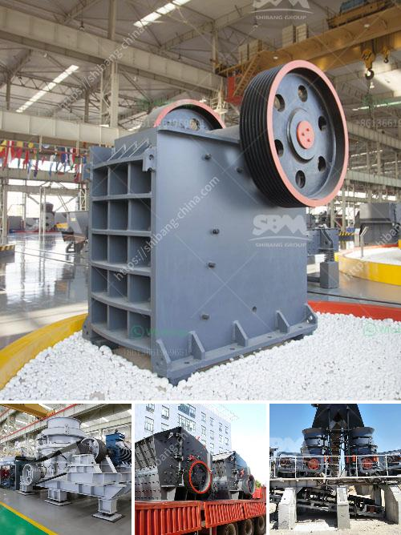

<h3>الكسارة الرئيسية للرخام</h3>
تُعتبر الكسارة الرئيسية للرخام من أهم المرافق الصناعية في صناعة الرخام. إنها تُستخدم لتحويل الأحجار الرخامية الكبيرة إلى قطع أصغر تُصنع منها المنتجات المُختلفة مثل البلاط والألواح والأعمدة والمصابيح. تعتبر هذه العملية الأولية مهمة جدًا لأنها تساهم في تحضير المواد الخام لتصنيع العديد من المنتجات المربحة.

تتكون الكسارة الرئيسية للرخام عادة من عدة أجزاء رئيسية تشمل آلة التغذية الاهتزازية وكسارة الفك وكسارة الصدم. تبدأ العملية بتحميل الأحجار الرخامية الكبيرة في التغذية الاهتزازية التي تضعها على السير الناقل بطريقة منتظمة. يتم تحويل المواد القادمة إلى كسارة الفك حيث يتم سحقها بواسطة الفك المتحرك والثابت. ثم، يتم تحميل الأحجار المسحوقة إلى كسارة الصدم حيث يتم سحقها بواسطة مطرقة تدور بسرعة عالية. وأخيرًا، يتم تفريغ المواد المكسرة من الكسارة الرئيسية في السير الناقل أو المكبس الهبوطي.

تتمتع الكسارة الرئيسية للرخام بمزايا عديدة. فهي تتميز بكفاءة عالية وإنتاجية كبيرة، حيث يمكنها سحق الأحجار الكبيرة بكميات كبيرة في وقت قصير. كما تتميز بسهولة الاستخدام والصيانة البسيطة، مما يدعم تشغيل مستمر ومستدام للمصنع. ومن المهم أيضًا الإشارة إلى أن الكسارة الرئيسية للرخام قادرة على التعامل مع أحجام وأوزان مختلفة من الأحجار الرخامية، وبالتالي فهي تلبي احتياجات العملاء المُختلفة.

في الختام، تكمن أهمية الكسارة الرئيسية للرخام في دورها الحاسم في عملية تحويل الأحجار الرخامية الكبيرة إلى أصغر قطع تُستخدم في تصنيع المنتجات المختلفة. بفضل تقنياتها المتقدمة وكفاءتها العالية، تساهم الكسارة الرئيسية في زيادة الإنتاجية وتحسين جودة المنتجات في صناعة الرخام. إنها تعد أحد العوامل الرئيسية لنجاح المصانع الرخامية وتحقيق الأرباح.
<h3>Contact us</h3><ul><li><strong>Whatsapp:&nbsp;<a href="https://wa.me/8613661969651">+8613661969651</a></strong></li><li><a href="https://swt.shibang-china.com/?git&amp;zhl&amp;الكسارة الرئيسية للرخام"><strong>Online Service(chat now)</strong></a></li></ul><h3>Related</h3><ul><li><a href='كسارة الرخام إيطاليا.md'>كسارة الرخام إيطاليا</a></li><li><a href='مواصفات معدات مصنع طحن الحجر.md'>مواصفات معدات مصنع طحن الحجر</a></li><li><a href='سعر مطرقة مطحنة سعة صنع في الصين.md'>سعر مطرقة مطحنة سعة صنع في الصين</a></li><li><a href='سعر تشغيل المطحنة للطن في ماليزيا.md'>سعر تشغيل المطحنة للطن في ماليزيا</a></li><li><a href='حجم كرات الطحن في مطحنة الكرة لطحن الكوارتز.md'>حجم كرات الطحن في مطحنة الكرة لطحن الكوارتز</a></li></ul>