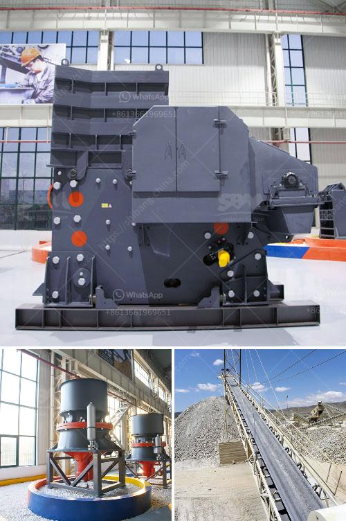

<h3>الكسارة المحمولة ١٥٠ طن في الساعة</h3>
الكسارات المحمولة هي واحدة من أحدث التقنيات التي تستخدم في صناعة البناء والتعدين. وتعتبر الكسارة المحمولة ١٥٠ طن في الساعة واحدة من أكثر الكسارات استخداما في هذه الصناعة.

تتميز الكسارة المحمولة ١٥٠ طن في الساعة بعدة مزايا. فهي سهلة النقل والتركيب، ويمكن نقلها من موقع إلى آخر دون أي مشاكل. كما أنها توفر مساحة كبيرة للتشغيل المريح والسهل. هذه الميزة تساعد على تحسين كفاءة العمل وزيادة الإنتاجية.

تتألف الكسارة المحمولة ١٥٠ طن في الساعة من عدة أجزاء أساسية. يتضمن ذلك الوحدة الكسارة وناقل الحزام والشاشة الاهتزازية والمولد الكهربائي. يعمل نظام التشغيل بطريقة بسيطة. حيث يتم إدخال المواد الخام إلى وحدة الكسارة من خلال ناقل الحزام، وتقوم الكسارة بسحق المواد إلى حجم مطلوب. ثم يتم نقل المواد المسحوقة عن طريق الناقل الحزامي الثانوي إلى الشاشة الاهتزازية، حيث يتم فرز المواد المسحوقة إلى أحجام مختلفة وفقا للمعايير المطلوبة. وفي النهاية، يتم تفريغ المواد المنتجة من خلال الناقل الحزامي الثالث.

تعد الكسارة المحمولة ١٥٠ طن في الساعة مثالية للانتاج الصغير والمتوسط. فهي تعمل بكفاءة عالية وتوفر وقتًا وجهدًا في عملية الكسر والفرز. كما أنها تستهلك طاقة أقل بكثير مقارنة بالكسارات التقليدية، وبالتالي توفر تكاليف الطاقة أيضًا.

من الجدير بالذكر أن الكسارة المحمولة ١٥٠ طن في الساعة تستخدم على نطاق واسع في مجالات مختلفة. فهي تستخدم في تكسير الحجارة، والخرسانة، والإسفلت، والركام، والصخور الصلبة. ويتم تطبيقها بشكل خاص في المشاريع الصغيرة والمتوسطة مثل الطرق السريعة ومناجم التعدين ومواقع البناء.

باختصار، الكسارة المحمولة ١٥٠ طن في الساعة هي معدة حديثة توفر الكفاءة والسهولة في العمل. تمثل تقنية متقدمة في صناعة البناء والتعدين وتلبي احتياجات مشاريع الإنشاءات المختلفة.
<h3>Contact us</h3><ul><li><strong>Whatsapp:&nbsp;<a href="https://wa.me/8613661969651">+8613661969651</a></strong></li><li><a href="https://swt.shibang-china.com/?git&amp;zhl&amp;الكسارة المحمولة ١٥٠ طن في الساعة"><strong>Online Service(chat now)</strong></a></li></ul><h3>Related</h3><ul><li><a href='مصنع تحسين خام الحديد الموردين.md'>مصنع تحسين خام الحديد الموردين</a></li><li><a href='موردين معدات سحق السيليكا.md'>موردين معدات سحق السيليكا</a></li><li><a href='فرق بين مطحنة ريموند وضغط عالي.md'>فرق بين مطحنة ريموند وضغط عالي</a></li><li><a href='شركة تصنيع آلات الكسارة في زامبيا.md'>شركة تصنيع آلات الكسارة في زامبيا</a></li><li><a href='تبيع شاشات الاهتزاز للحصى والرمل.md'>تبيع شاشات الاهتزاز للحصى والرمل</a></li></ul>