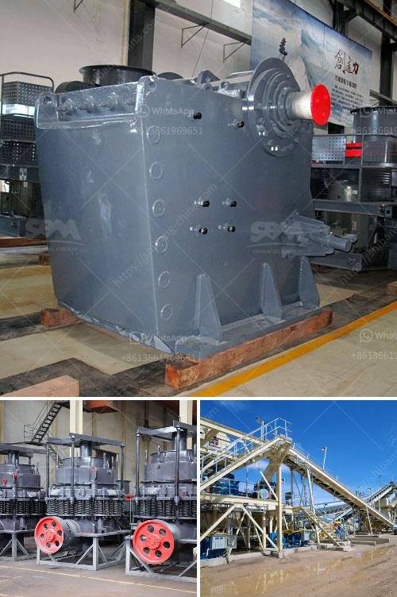

<h3>المعدات اللازمة لبدء تعدين الحجر الجيري</h3>
تعتبر صناعة التعدين من أهم الصناعات في العالم، حيث يتم فيها استخراج الموارد الطبيعية والمعادن من باطن الأرض. واحدة من الموارد الطبيعية المهمة التي يتم استخراجها من التعدين هو الحجر الجيري.

الحجر الجيري هو صخر رسوبي يتكون أساسًا من كربونات الكالسيوم، ويتم استخدامه في عدة صناعات مختلفة مثل صناعة الإسمنت والجبس والزجاج والأسمدة والصناعات الكيميائية. لبدء تعدين الحجر الجيري، يتطلب الأمر استخدام مجموعة من المعدات اللازمة لجمع واستخراج الحجر الجيري بفعالية. فيما يلي بعض المعدات الأساسية التي يجب توافرها:

1. الحفارات: تستخدم الحفارات لاستخراج الطبقات العلوية من التربة والصخور العائقة والوصول إلى طبقات الحجر الجيري.

2. المتفجرات: يجرى تفجير الصخور الصعبة باستخدام المتفجرات لتفتيتها وتسهيل عملية التعدين.

3. آلات الحمل والنقل: تستخدم هذه الآلات لنقل الحجارة والصخور الخام من موقع التعدين إلى مواقع المعالجة والتخزين.

4. الكسارات: تستخدم الكسارات لسحق الحجارة الكبيرة إلى قطع صغيرة من حجم مطلوب. يتم تخزين هذه القطع في مستودعات أو نقلها مباشرة إلى المصانع للمعالجة اللاحقة.

5. الشاشات والغرابيل: تستخدم لفصل وتصنيف الحجارة المكسورة حسب الحجم والشكل لتلبية متطلبات العملاء المختلفة.

6. الناقلات: يتم استخدام الناقلات لنقل الحجارة المكسورة أو المعالجة من محطة إلى أخرى داخل المصنع أو خارجه.

7. معدات المعالجة الثانوية: تشمل مطاحن الكرة ومطاحن الأسطوانة ومعدات التجفيف والتصفية والتحبيب وغيرها. تستخدم هذه المعدات لصقل وتحسين الحجر الجيري الخام وتحويله إلى منتج نهائي.

تتطلب عملية التعدين الناجحة توافر معدات متطورة وآليات فعالة لزيادة الإنتاجية وتقليل التكاليف وتحسين السلامة. يجب أيضًا الاهتمام الشديد بصيانة واستبدال المعدات بانتظام لضمان أداءها المستدام وتحقيق النتائج المرجوة.

استخراج وتعدين الحجر الجيري هي عملية تتطلب تدابير السلامة المناسبة. يجب على العمال ارتداء معدات السلامة الملائمة مثل الخوذ والسترات الواقية والنظارات الواقية وحذاء الأمان. من المهم أيضًا توفير تدريب للعمال حول كيفية استخدام المعدات بطرق صحيحة وآمنة.

في الختام، تعتبر المعدات المذكورة أعلاه ضرورية لبدء عملية تعدين الحجر الجيري. يتطلب التعامل مع هذه المعدات مهارة وخبرة لضمان تنفيذ العملية بنجاح. يمكن للاستثمار في المعدات المناسبة وتنفيذ إجراءات السلامة اللازمة، أن يكون لتعدين الحجر الجيري أثر إيجابي على الصناعة والاقتصاد المحلي.
<h3>Contact us</h3><ul><li><strong>Whatsapp:&nbsp;<a href="https://wa.me/8613661969651">+8613661969651</a></strong></li><li><a href="https://swt.shibang-china.com/?git&amp;zhl&amp;المعدات اللازمة لبدء تعدين الحجر الجيري"><strong>Online Service(chat now)</strong></a></li></ul><h3>Related</h3><ul><li><a href='سعر كسارة الحجر pe 600 900.md'>سعر كسارة الحجر pe 600 900</a></li><li><a href='شركة تصنيع الحجر في داكا.md'>شركة تصنيع الحجر في داكا</a></li><li><a href='سعر مصنع الأسمنت على نطاق صغير في الهند.md'>سعر مصنع الأسمنت على نطاق صغير في الهند</a></li><li><a href='مصنع الجبس في نيجيريا.md'>مصنع الجبس في نيجيريا</a></li><li><a href='قائمة معدات مصنع الأسمنت.md'>قائمة معدات مصنع الأسمنت</a></li></ul>