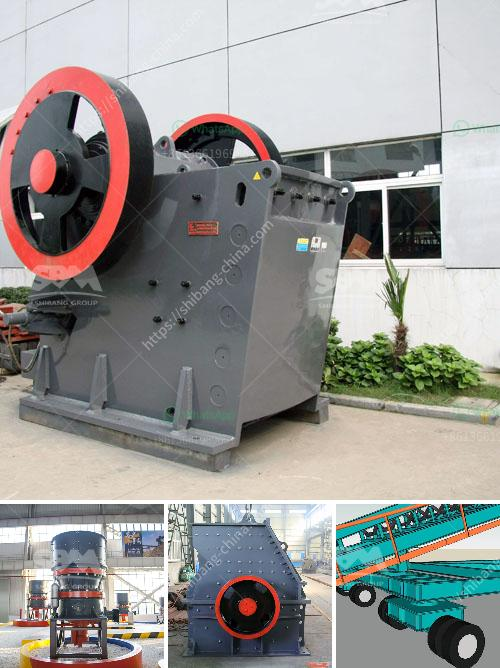

<h3>المعدات المطلوبة لإنشاء محجر الجرانيت</h3>
إن إنشاء محجر الجرانيت يتطلب مجموعة مختارة من المعدات الخاصة التي تساهم في إنتاج أعلى جودة من الجرانيت وتسهم في تسريع وتسهيل عملية الإنتاج. سأقدم في هذه المقالة نظرة عامة على المعدات المطلوبة لإنشاء محجر الجرانيت.

أولاً وقبل كل شيء، يجب أن يكون لديك آلات قطع الجرانيت. تشمل هذه الآلات المناشير الكهربائية والمناشير المائية. تعمل المناشير الكهربائية عن طريق تشغيل المحرك الكهربائي وتأتي بأحجام مختلفة وقدرات قطع مختلفة. من ناحية أخرى، تستخدم المناشير المائية تقنية المياه المضغوطة لقطع الجرانيت بفعالية ودقة أعلى.

ثانياً٬ تحتاج أيضًا إلى آلات تنظيف الجرانيت. يتم استخدام هذه الآلات لإزالة الأوساخ والبقع من الجرانيت بعد عملية القطع. تتضمن الآلات شفاطات الغبار لجمع الغبار المتولد أثناء عملية القطع والتنظيف.

ثالثاً٬ معدات المعالجة والتشطيب مهمة جدًا. يجب أن تحتوي ورشة المحجر على آلات للتلميع والتشكيل والنقش على الجرانيت. تتضمن هذه الآلات المراجل والطواحين الكهربائية وآلات التلميع بالألواح الساطعة. يساعد استخدام هذه الآلات على تحقيق نتائج نهائية مرئية للجرانيت وتحسين جودته ومظهره.

رابعاً، تحتاج إلى المعدات التكنولوجية والحديثة. يساعدك استخدام أجهزة الكمبيوتر والبرامج في إدارة المخزون ومراقبة العمليات وتحسين الإنتاجية. تستخدم العديد من المزارع التكنولوجيا المتقدمة مثل نظم تحديد المواقع العالمية والروبوتات في تحسين عمليات التعدين وتحسين الكفاءة.

في النهاية، يجب أن تأخذ في الاعتبار أن المعدات المطلوبة قد تختلف بناءً على حجم ونطاق مشروع المحجر. بعض المحاجر الكبيرة ربما تحتاج إلى مزيد من المعدات مثل الجرافات والشاحنات الكبيرة لنقل الجرانيت. عليك أيضًا النظر في توفير قوى العمل المؤهلة للتعامل مع هذه المعدات وضمان سلامتهم والحفاظ على صيانة وتشغيل المعدات بشكل جيد.

باختصار، يتطلب إنشاء محجر الجرانيت مجموعة متنوعة من المعدات المختلفة. يجب أن يكون لديك آلات قطع، وآلات تنظيف، ومعدات معالجة وتشطيب، ومعدات تكنولوجية حديثة. وفي النهاية، يجب أن تحترم موارد العمالة وتقديرهم للتعامل مع هذه المعدات بأمان وفاعلية.
<h3>Contact us</h3><ul><li><strong>Whatsapp:&nbsp;<a href="https://wa.me/8613661969651">+8613661969651</a></strong></li><li><a href="https://swt.shibang-china.com/?git&amp;zhl&amp;المعدات المطلوبة لإنشاء محجر الجرانيت"><strong>Online Service(chat now)</strong></a></li></ul><h3>Related</h3><ul><li><a href='كسارات الحجر في كاليفورنيا.md'>كسارات الحجر في كاليفورنيا</a></li><li><a href='آلة مطحنة الكرة في الصين.md'>آلة مطحنة الكرة في الصين</a></li><li><a href='كسارة الحجر الجيري مستعملة.md'>كسارة الحجر الجيري مستعملة</a></li><li><a href='كسارة للحجر الجيري.md'>كسارة للحجر الجيري</a></li><li><a href='كسارة الحجر ومصنع المحجر في بنجلاديش.md'>كسارة الحجر ومصنع المحجر في بنجلاديش</a></li></ul>