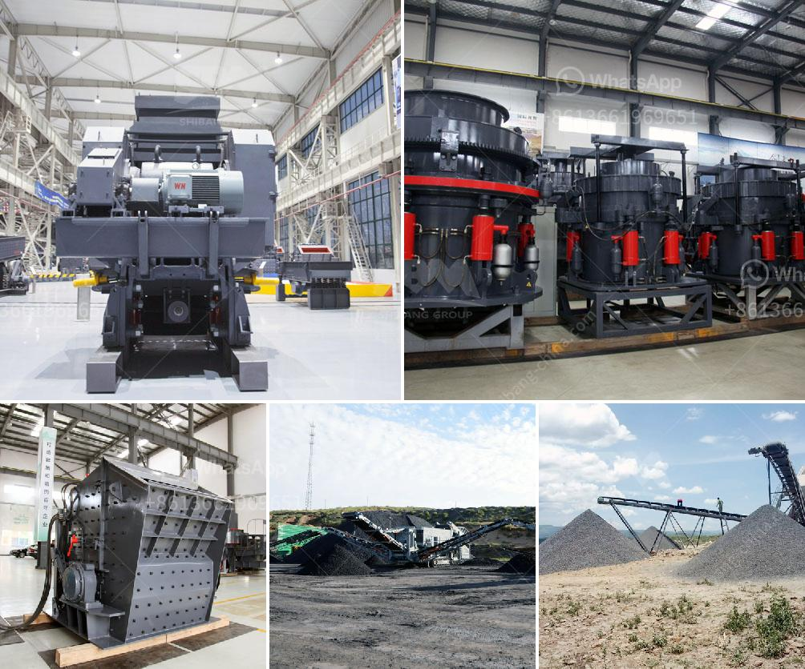

<h3>المعدات المطلوبة لتعدين الذهب على نطاق واسع</h3>
تعد تعدين الذهب على نطاق واسع من الصناعات المهمة والمربحة في إنتاج المعادن الثمينة. يتطلب تعدين الذهب المتقدم استخدام مجموعة متنوعة من المعدات اللازمة لاستخلاص الذهب من مناجمه. في هذه المقالة، سنستعرض المعدات الأساسية التي يتعين امتلاكها لتعدين الذهب على نطاق واسع.

أولاً وقبل أي شيء، يتوجب توظيف الشاحنات والمعدات الثقيلة للتنقل والتنقيب. تحتاج إلى شاحنات تعمل بوقود الديزل قوية وقادرة على حمل الصخور والأتربة الكبيرة لنقلها إلى أماكن الفرز والطحن. بجانب الشاحنات، يوجد المعدات الأخرى مثل دبابات الوقود، وآلات الحفر، ومعدات النقل الأخرى التي تستخدم في النقل الفعال والآمن للصخور والمواد المعدنية.

ثانياً، يجب استخدام آلات الفرز والفصل لفصل المادة الصخرية عن الذهب. من الآلات المستخدمة تعتمد على حجم النطاق الذي ترغب في استخراجه. تشمل تلك الآلات المكائن المهتزة، والمراحل الطردية، ومجموعة متنوعة من الفاصل الآلي والهيدروليكي للتحكم في تدفق المياه والوقت وسرعة الفصل. كل هذه الآلات تعمل معًا لفصل الصخور الغير ثمينة عن الذهب المستهدف، وتوفير مادة خام ذهبية لمراحل المعالجة التالية.

ثالثًا، تحتاج إلى استخدام المعدات لعملية التنقية واستخلاص الذهب من خامه. يمكن استخدام مجموعة متنوعة من المعدات في هذه العملية مثل آلات الفصل المركزية، والمصافي الجاذبة، وأنظمة استخلاص الذهب بالسيانيد. كل هذه المعدات تلعب دوراً مهماً في استخلاص الذهب وإزالة الشوائب الأخرى من المادة الخام.

أخيراً، يجب أن تستثمر في أدوات ومعدات تخزين ونقل الذهب بعد استخلاصه. يمكن أن تشمل هذه المعدات أكياس وحاويات النقل المقاومة للتلف والعوامل الجوية، ومختلف أنواع أدوات التخزين الآمنة مثل الخزائن والأماكن المؤمنة لحفظ الذهب.

في النهاية، يتضح أن تعدين الذهب على نطاق واسع يتطلب استخدام مجموعة متنوعة من المعدات المتطورة والمتخصصة لضمان استخراج الذهب بفعالية وكفاءة. إن امتلاك هذه المعدات ليس مهمة سهلة، حيث تتطلب الكثير من التخطيط والاستثمار. ومع ذلك، يمكن أن يكون تعدين الذهب على نطاق واسع يعتبر فرصة مربحة لتحقيق أرباح كبيرة للشركات والمستثمرين الذين يعملون في هذا القطاع المثير.
<h3>Contact us</h3><ul><li><strong>Whatsapp:&nbsp;<a href="https://wa.me/8613661969651">+8613661969651</a></strong></li><li><a href="https://swt.shibang-china.com/?git&amp;zhl&amp;المعدات المطلوبة لتعدين الذهب على نطاق واسع"><strong>Online Service(chat now)</strong></a></li></ul><h3>Related</h3><ul><li><a href='شراء وبيع حجر الكسارة في ماليزيا.md'>شراء وبيع حجر الكسارة في ماليزيا</a></li><li><a href='كسارة الصخور للبيع في الفلبين.md'>كسارة الصخور للبيع في الفلبين</a></li><li><a href='مطحنة أسمنت صغيرة مستعملة في الإمارات.md'>مطحنة أسمنت صغيرة مستعملة في الإمارات</a></li><li><a href='كيفية إعداد خطة عمل لمصنع الكسارات.md'>كيفية إعداد خطة عمل لمصنع الكسارات</a></li><li><a href='كسارة محمولة للكوبالت.md'>كسارة محمولة للكوبالت</a></li></ul>