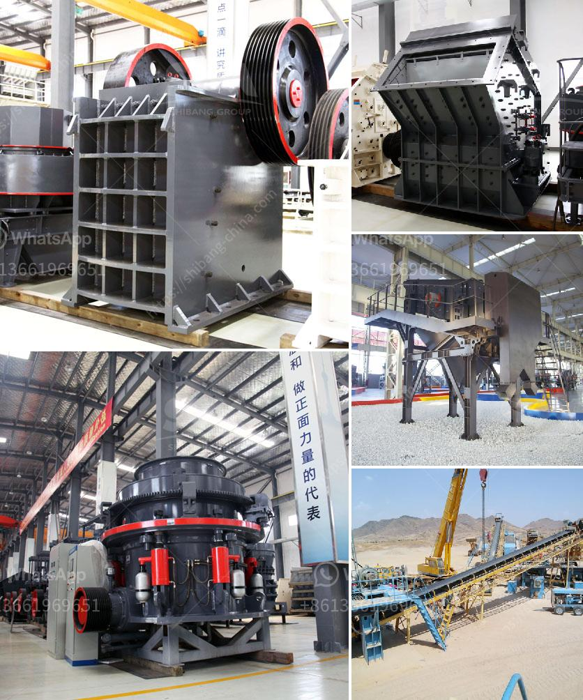

<h3>المعدات المطلوبة لتعدين الفحم</h3>
تعتبر صناعة تعدين الفحم واحدة من أهم الصناعات في العالم حيث يعتمد عليها الكثير من القطاعات الأخرى مثل الصناعة والكهرباء. وبالتالي، يحتاج تعدين الفحم إلى مجموعة متنوعة من المعدات التي تساعد في إنتاج واستخراج الفحم بطريقة فعالة وآمنة. سنستعرض في هذه المقالة بعض المعدات الأساسية المطلوبة لتعدين الفحم.

أحد المعدات الرئيسية المطلوبة هو المعدات الثقيلة، ومن بينها الحفارات اللافتة (draglines) والحفارات الدوارة (rotary drills). تستخدم الحفارات اللافتة لنقل الأرض والصخور والرمل وذلك بواسطة نظام السلة المزودة بمحرك فعال، بينما تستخدم الحفارات الدوارة لحفر الثقوب العميقة لاستخراج الفحم.

كذلك، تحتاج صناعة تعدين الفحم إلى الآلات الناقلة والقطارات الصغيرة وحزام النقل لنقل الفحم المستخرج من المناجم إلى مناطق التخزين أو وسائل النقل الأخرى. تستخدم الآلات الناقلة (conveyor systems) لنقل الفحم بكميات كبيرة وبسرعة، ويتم تشغيلها بواسطة الحزام الناقل الذي يحمل الفحم من المناجم إلى المواقع المطلوبة.

وبطبيعة الحال، تعتمد هذه المعدات على تقنيات الكهرباء والهيدروليك، ولذلك يتطلب تعدين الفحم أيضًا استخدام المولدات والمعدات الكهربائية لتشغيل الأجهزة المختلفة.

لا يمكن الحديث عن معدات التعدين دون ذكر المعدات الواقية والسلامة. يجب توفير المعدات الواقية المناسبة للعمال في المناجم مثل الخواذات الواقية والملابس الواقية وأجهزة اتصال وأجهزة كشف الغازات وأجهزة الإنقاذ. فالسلامة والحماية تعد أولوية قصوى في صناعة التعدين، لاسيما أن المناجم قد تصبح بيئة خطرة وقد يحدث فيها حوادث خطيرة.

باختصار، تتطلب صناعة تعدين الفحم العديد من المعدات المختلفة تتراوح ما بين المعدات الثقيلة مثل الحفارات والآلات الناقلة، إلى المولدات والمعدات الكهربائية، وأيضًا المعدات الواقية والسلامة. يجب أن تكون هذه المعدات عالية الجودة وفعالة من حيث الأداء لضمان تشغيل ناجح ومستدام لعمليات تعدين الفحم.
<h3>Contact us</h3><ul><li><strong>Whatsapp:&nbsp;<a href="https://wa.me/8613661969651">+8613661969651</a></strong></li><li><a href="https://swt.shibang-china.com/?git&amp;zhl&amp;المعدات المطلوبة لتعدين الفحم"><strong>Online Service(chat now)</strong></a></li></ul><h3>Related</h3><ul><li><a href='كسارة الحجر للبيع في بيرو.md'>كسارة الحجر للبيع في بيرو</a></li><li><a href='خطة عمل لإنتاج الجبس.md'>خطة عمل لإنتاج الجبس</a></li><li><a href='كسارة الحجر بوزولانا للبيع.md'>كسارة الحجر بوزولانا للبيع</a></li><li><a href='مطاحن الكرة للحجر الجيري في ماليزيا.md'>مطاحن الكرة للحجر الجيري في ماليزيا</a></li><li><a href='خط إنتاج الرمل الاصطناعي.md'>خط إنتاج الرمل الاصطناعي</a></li></ul>