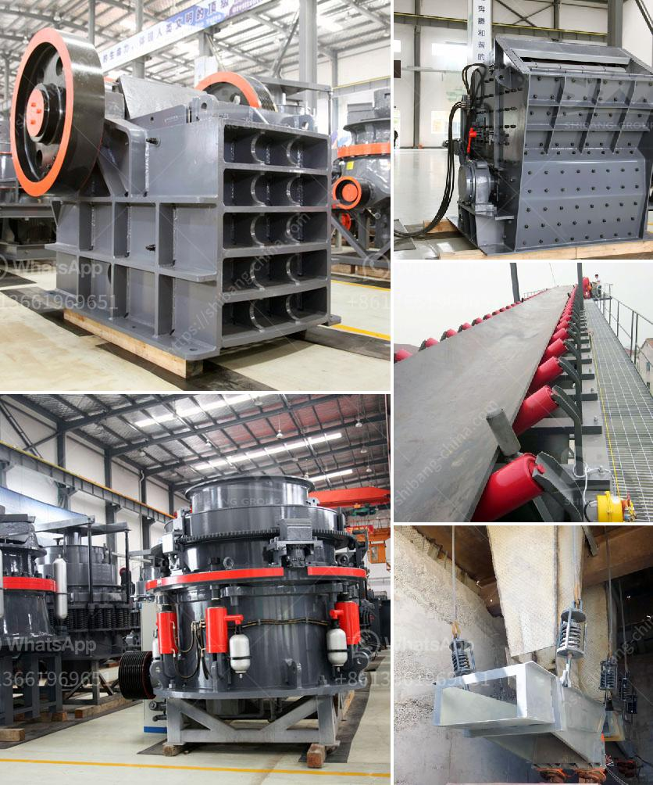

<h3>المعدات المطلوبة لعمل محجر الجرانيت</h3>
يتطلب عمل محجر الجرانيت العديد من المعدات المتخصصة التي تساعد في عملية استخراج وتجهيز الجرانيت. وتشمل المعدات المطلوبة ما يلي:

1. معدات الحفر: تشمل حفارات الصخور والحفارات الهيدروليكية والحفارات الدوارة. تستخدم هذه المعدات لحفر الثقوب في الصخور الصلبة لاستخراج الجرانيت.

2. الجرافات: تستخدم الجرافات لإزالة الصخور الكبيرة والحجارة من المحجر. يمكن استخدام الجرافات الكبيرة لنقل كميات كبيرة من الجرانيت.

3. المناشير الكهربائية: تستخدم لقطع الجرانيت إلى أحجام محددة بعد استخراجه. تأتي المناشير الكهربائية بأحجام وأشكال مختلفة لتناسب الاحتياجات المحددة.

4. الرافعات الشوكية: تستخدم لنقل الأحجار الثقيلة والألواح الكبيرة من الجرانيت داخل المحجر. يمكن أن تتحرك الرافعات الشوكية بسرعة وبسهولة ، مما يسهل من عملية النقل والتحميل.

5. الكسارات: تستخدم لسحق الجرانيت الكبير إلى حجم صغير وتجهيز الأحجار للاستخدام في المباني والطرق والأعمال الديكورية الأخرى. تعمل الكسارات بواسطة تطبيق قوة عالية لكسر الصخور.

6. الآلات الكهربائية والأدوات اليدوية: تشمل المثاقب اللاسلكية والمطارق الهوائية والصواميل والمفاتيح والأدوات اليدوية الأخرى التي تستخدم في عملية تجهيز الجرانيت وتثبيته.

7. نقالات الحجارة: تستخدم لنقل الجرانيت النهائي من المحجر إلى العملاء. تتنوع نقالات الحجارة في الحجم والقوة والسعة لتناسب الاحتياجات المحددة.

يجب الاعتناء بشكل صحيح بالمعدات والأدوات المستخدمة في عمل محجر الجرانيت لضمان السلامة والكفاءة. يجب أيضًا إجراء الصيانة الدورية لهذه المعدات لضمان استدامتها وأدائها الأمثل.

باختيار المعدات المناسبة والاستثمار في تكنولوجيا حديثة وفعالة ، يمكن أن يؤدي عمل محجر الجرانيت إلى الحصول على منتج نهائي عالي الجودة وتوفير وقت وجهد وموارد.
<h3>Contact us</h3><ul><li><strong>Whatsapp:&nbsp;<a href="https://wa.me/8613661969651">+8613661969651</a></strong></li><li><a href="https://swt.shibang-china.com/?git&amp;zhl&amp;المعدات المطلوبة لعمل محجر الجرانيت"><strong>Online Service(chat now)</strong></a></li></ul><h3>Related</h3><ul><li><a href='عملية تصنيع لوح الجبس.md'>عملية تصنيع لوح الجبس</a></li><li><a href='اقتباسات مطحنة الكرة.md'>اقتباسات مطحنة الكرة</a></li><li><a href='مطحنة الأسطوانة بيرينج.md'>مطحنة الأسطوانة بيرينج</a></li><li><a href='استخدام مصانع التكسير للبيع في الإمارات.md'>استخدام مصانع التكسير للبيع في الإمارات</a></li><li><a href='سعر مصنع كسارة الحجر.md'>سعر مصنع كسارة الحجر</a></li></ul>