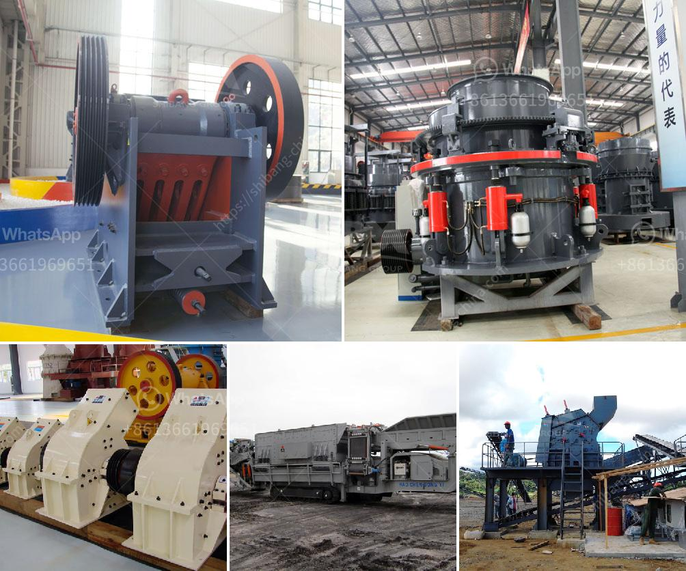

<h3>المواصفات الفنية لمطحنة الكرة</h3>
تُعد مطحنة الكرة أحد المعدات الهامة في صناعة طحن المواد الخام. وهي تُستخدم على نطاق واسع في مجالات مختلفة مثل صناعة الإسمنت والمعادن والفحم والخامات الكيميائية. تعتبر المواصفات الفنية لمطحنة الكرة مؤشرًا مهمًا للتحكم في جودة العمل وكفاءتها.

أولاً، يُعتبر حجم مطحنة الكرة من أهم المعايير التقنية. يتم قياس حجم المطحنة بوحدة القدرة الإنتاجية بالتناقص المزدوج، مما يعني أنك تحتاج إلى اختيار الحجم المناسب لملائمة احتياجات الإنتاج المحددة. يتفاوت حجم مطحنة الكرة من وحدة إنتاج صغيرة تستخدم لاختبارات المختبرات إلى وحدة إنتاج كبيرة تستخدم في الصناعات الكبيرة.

ثانيًا، يتم تحديد سرعة الدوران للمطحنة وفقًا للمادة التي ستتم طحنها. فإذا كنت ترغب في طحن مادة صلبة بقوة كبيرة، فسيكون لديك سرعة دوران عالية، بينما إذا كنت ترغب في طحن مادة ناعمة وهشة، فسيكون لديك سرعة دوران أقل.

ثالثًا، الحجم والتصميم الداخلي للمطحنة يؤثران أيضًا على أدائها. تتكون المطحنة من جسم أسطواني يحتوي على مجموعة من الكرات المعدنية. تتحرك الكرات بفعل دوران الجسم الأسطواني وتتولد قوة احتكاك تسبب تحطيم وطحن المواد الخام. يجب أن يكون تصميم المطحنة بمثابة نظام فعال يسمح بتوزيع الكرات بشكل مناسب حتى يتم تحقيق أقصى قدر من الطحن.

وأخيرًا، تتضمن المواصفات الفنية لمطحنة الكرة أيضًا نظام التحكم والمحرك. يجب أن يكون للمطحنة المحرك القادر على توفير القدرة الكافية للدوران والطحن بشكل فعال، وكذلك الحفاظ على مستوى التحكم المطلوب في سرعة الدوران.

باختصار، المواصفات الفنية لمطحنة الكرة تشمل الحجم والسرعة والتصميم الداخلي ونظام التحكم والمحرك. يتعين على المشتري أن يكون لديه المعرفة اللازمة لفهم هذه المواصفات واختيار المطحنة المثالية لاحتياجاته. تلتزم الشركات المصنعة بتوفير المواصفات التقنية المحددة لتسهيل عملية اختيار المشتري.
<h3>Contact us</h3><ul><li><strong>Whatsapp:&nbsp;<a href="https://wa.me/8613661969651">+8613661969651</a></strong></li><li><a href="https://swt.shibang-china.com/?git&amp;zhl&amp;المواصفات الفنية لمطحنة الكرة"><strong>Online Service(chat now)</strong></a></li></ul><h3>Related</h3><ul><li><a href='مطاحن هامر زراعية مستعملة.md'>مطاحن هامر زراعية مستعملة</a></li><li><a href='تحسين الجرافيت.md'>تحسين الجرافيت</a></li><li><a href='مصنع الكرة لتكسير السليكات.md'>مصنع الكرة لتكسير السليكات</a></li><li><a href='أسعار مطاحن الكرة في جنوب أفريقيا.md'>أسعار مطاحن الكرة في جنوب أفريقيا</a></li><li><a href='خطة عمل محجر الجرانيت.md'>خطة عمل محجر الجرانيت</a></li></ul>