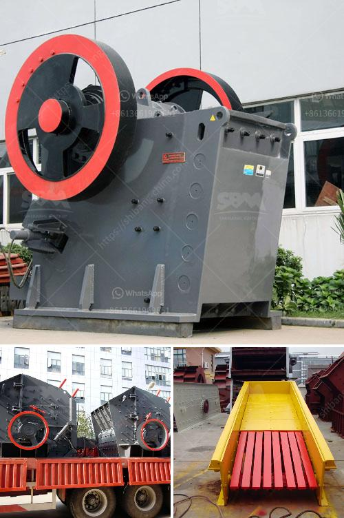

<h3>الميزة الرئيسية لكسارة الصدم أو الفك</h3>
تعتبر المطاحن الصدمية وكسارات الفك أدوات قوية وفعالة في صناعة التعدين والبناء. لذلك، يجب على المستثمرين والمهندسين المعرفة بالميزات الرئيسية لهذه الكسارات لاختيار الآلة المناسبة والحصول على النتائج المرجوة. هذه المقالة ستركز على الميزة الرئيسية لكسارات الفك والصدمة.

ميزة رئيسية لكسارة الفك هي قدرتها على سحق المواد بفعالية. تصمم الكسارات الفك لتكون قوية وقادرة على التعامل مع المواد الصلبة بكفاءة فائقة. تستخدم هذه الكسارات المبدأ الأساسي للضغط لسحق المواد بين سطحين مبدأيين: سطح ثابت وآخر متحرك. وتحقق ذلك بحركة ос؛ درجة تحرك الفك للأعلى والأسفل.

عندما يتم تطبيق قوة الضغط المناسبة، يتم تكسير المواد وسحقها إلى حجم أصغر. يتم استخدام كسارة الفك عادةً في مرحلة سحق الأولية، حيث يتم سحق المواد الخام الكبيرة إلى حجم أصغر قبل نقلها إلى مرحلة التجهيز الأخرى.

من ناحية أخرى، تتميز كسارات الصدم بقدرتها على سحق المواد عن طريق تأثير الصدمة. يتعرض المواد لقوة التصادم المباشرة مع روتور الكسارة، مما يؤدي إلى تكسيرها وتفتتها. وظيفة روتور الكسارة هي محاكاة حركة الصدمة وتوجيهها في اتجاه محدد. هذا يسمح بتكسير المواد بشكل فعال ومتجانس.

تتميز كسارات الصدم بقدرتها على سحق المواد الصلبة والقوية، وتستخدم على نطاق واسع في صناعات مختلفة مثل التعدين والبناء والطاقة. وتُستخدم عادة في مراحل ما بعد سحق الأولية، حيث تسحق المواد الخام المسحوقة التي يتم تكسيرها بواسطة كسارة الفك إلى حجم أصغر وتحويلها إلى شكل دقيق.

باختصار، الميزة الرئيسية لكسارات الفك والصدمة هي قدرتها على سحق المواد بفعالية وفي وقت قصير. يعتبر اختيار الكسارة المناسبة أمرًا حاسمًا لضمان الحصول على الكفاءة والنتائج المطلوبة. لهذا السبب، يجب على المستثمرين والمهندسين اختيار الكسارة التي تتناسب مع متطلبات مشروعهم وتوفر الأداء المثلى والجودة المطلوبة.
<h3>Contact us</h3><ul><li><strong>Whatsapp:&nbsp;<a href="https://wa.me/8613661969651">+8613661969651</a></strong></li><li><a href="https://swt.shibang-china.com/?git&amp;zhl&amp;الميزة الرئيسية لكسارة الصدم أو الفك"><strong>Online Service(chat now)</strong></a></li></ul><h3>Related</h3><ul><li><a href='كسارة حجر مستعملة في أونتاريو.md'>كسارة حجر مستعملة في أونتاريو</a></li><li><a href='كسارة الحجر في الفلبين للبيع.md'>كسارة الحجر في الفلبين للبيع</a></li><li><a href='مطحنة الكرات للحجر الجيري.md'>مطحنة الكرات للحجر الجيري</a></li><li><a href='قائمة مصنعي آلات سحق اليابان.md'>قائمة مصنعي آلات سحق اليابان</a></li><li><a href='آلات إنتاج الجبس.md'>آلات إنتاج الجبس</a></li></ul>