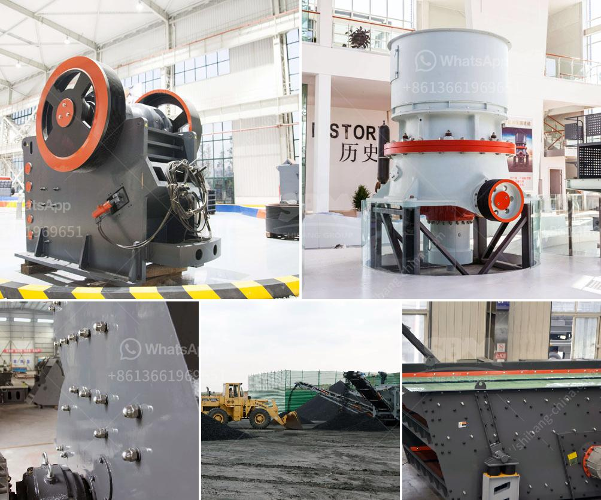

<h3>الهيدروليك في مطحنة الكرة الرأسية</h3>
تطورت تقنية الهيدروليك في جميع المجالات الصناعية والتطبيقات على مدى العقود الماضية، وتعتبر مطاحن الكرة الرأسية واحدة من التطبيقات الهيدروليكية الأكثر رواجًا في مجال الصناعة. تستخدم مطاحن الكرة الرأسية بشكل أساسي في صناعة الأسمنت والتعدين والطاقة الكهرومائية والصناعات الكيماوية وغيرها.

يعود تاريخ تطبيق الهيدروليك في مطاحن الكرة الرأسية إلى عقود عديدة، حيث يتم استخدام النظام الهيدروليكي في ضبط شدة ومستوى الضغط داخل الطاحونة، مما يؤدي إلى تحسين كفاءة عملية الطحن وتقليل الاهتزازات والضوضاء. تعتمد مطاحن الكرة الرأسية على الكرات الفولاذية الموجودة في داخلها لطحن المواد الخام بواسطة الضغط والاحتكاك المستمرين. وعندما يبدأ النظام الهيدروليكي في تشغيل الطواحين، يتم التحكم في ضيق الفجوة بين الكرات الفولاذية لتحقيق فعالية أفضل في عملية الطحن.

تسمح التقنية الهيدروليكية أيضًا بضبط التدفق والضغط في النظام بدقة، مما يؤدي إلى تجانس أكبر في توزيع الجسيمات والحد من انتقال الحرارة والاحتكاك. بالإضافة إلى ذلك، يتم استخدام الهيدروليك في آلية رفع الغطاء العلوي للطاحونة، مما يسهل عملية الصيانة والوصول إلى الأجزاء الداخلية بسهولة.

توفر مطاحن الكرة الرأسية التي تعمل بواسطة الهيدروليك عدة مزايا مقارنة بالتكنولوجيا الأخرى. فهي توفر كفاءة أعلى في عملية الطحن وتقليل استهلاك الطاقة. كما تتميز بتصميمها المدمج الذي يقلل من مساحة الأرضية المطلوبة ويوفر التكاليف في التركيب. وبفضل نظام التحكم الهيدروليكي الدقيق، يتم تقليل الاهتزاز والضوضاء، مما يحسن بيئة العمل ويزيد من الصحة والسلامة للعاملين.

بشكل عام، فإن مطاحن الكرة الرأسية التي تعمل بواسطة الهيدروليك تعتبر تقنية متقدمة وفعالة في صناعة الطحن. تُستخدم في عمليات عديدة من صناعة الأسمنت إلى صناعة التعدين، وتحسن من كفاءة العمليات والإنتاجية بشكل عام. وبفضل التطور المستمر للتقنية الهيدروليكية، يمكن توقع المزيد من التحسينات في الأداء والكفاءة في المستقبل.
<h3>Contact us</h3><ul><li><strong>Whatsapp:&nbsp;<a href="https://wa.me/8613661969651">+8613661969651</a></strong></li><li><a href="https://swt.shibang-china.com/?git&amp;zhl&amp;الهيدروليك في مطحنة الكرة الرأسية"><strong>Online Service(chat now)</strong></a></li></ul><h3>Related</h3><ul><li><a href='مصنع كسارة كامل للبيع في جنوب أفريقيا.md'>مصنع كسارة كامل للبيع في جنوب أفريقيا</a></li><li><a href='كسارة فكية بمقدار 100 طن في الساعة.md'>كسارة فكية بمقدار 100 طن في الساعة</a></li><li><a href='مصنع غسيل الماس في جنوب أفريقيا.md'>مصنع غسيل الماس في جنوب أفريقيا</a></li><li><a href='شركات مصنعي مطاحن الأسطوانات في الهند.md'>شركات مصنعي مطاحن الأسطوانات في الهند</a></li><li><a href='كسارة الحجر في ماليزيا.md'>كسارة الحجر في ماليزيا</a></li></ul>