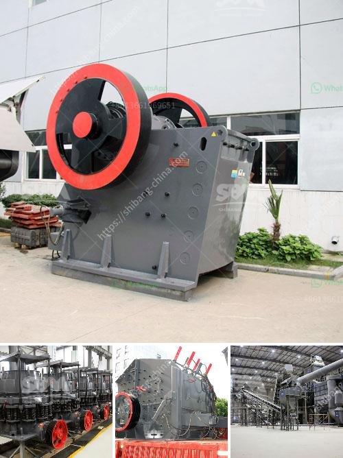

<h3>اليابان لمصنع تكسير متنقل</h3>
اليابان هي دولة تقع في شرق آسيا، وتعتبر واحدة من أكثر الدول تقدمًا في العالم من حيث التكنولوجيا والابتكار. وتوفر اليابان العديد من الفرص التجارية والاستثمارية في العديد من القطاعات، بما في ذلك صناعة تكسير المواد المتنقلة.

تعد صناعة تكسير المواد المتنقلة من الصناعات الحديثة والمبتكرة في اليابان. وتهدف هذه الصناعة إلى تقديم حلول فعالة ومرنة للعملاء من خلال توفير مصانع تكسير متنقلة. وتعنى هذه المصانع بتكسير المواد بشكل سريع وفعال في أماكن متعددة، مثل محاجر الصخور أو المواقع البعيدة عن مصانع التكسير الثابتة.

من المميزات البارزة لصناعة تكسير المواد المتنقلة في اليابان هو الابتكار المستمر في تصميم هذه المصانع. فقد تم تطوير تقنيات متقدمة للتكسير، مما يسهل عملية تحويل المواد إلى حجم مطلوب بطريقة سريعة وفعالة. وبفضل استخدام التكنولوجيا المتطورة، يمكن تعديل وظائف هذه المصانع بسهولة وتجهيزها وفقًا لاحتياجات العميل.

تنتج مصانع تكسير المواد المتنقلة في اليابان مجموعة واسعة من المواد، بما في ذلك الصخور والمعادن والخرسانة والحجارة والركام. وتستخدم هذه المواد في العديد من الصناعات، مثل البناء والبنية التحتية والطرق والسكك الحديدية.

كما أن صناعة تكسير المواد المتنقلة تسهم في الحفاظ على البيئة. فعند استخدام المصانع المتنقلة، يمكن تجنب نقل المواد الثقيلة لمسافات طويلة، مما يؤدي إلى تقليل انبعاثات ثاني أوكسيد الكربون وتلوث الهواء. كما أن استخدام هذه المصانع يقلل من استخدام المساحات الأرضية ويسهم في الحد من التدهور البيئي.

علاوة على ذلك، تعمل صناعة تكسير المواد المتنقلة في اليابان على توفير فرص عمل للعديد من العاملين. فالمصانع المتنقلة تحتاج إلى عمال مهرة لتشغيلها وصيانتها، مما يسهم في تعزيز الاقتصاد المحلي وتحسين الحياة الاقتصادية للمجتمعات المحلية.

باختصار، فإن صناعة تكسير المواد المتنقلة في اليابان تعد قطاعًا مهمًا ومبتكرًا في الاقتصاد الياباني. وتوفر هذه الصناعة حلولًا مرنة ومتطورة لعملائها، كما تسهم في الحفاظ على البيئة وتوفير فرص عمل للعاملين. وتشكل هذه الصناعة جزءًا من الريادة التكنولوجية التي تشتهر بها اليابان وتعزز من مكانتها كدولة رائدة في مجال التكنولوجيا والابتكار.
<h3>Contact us</h3><ul><li><strong>Whatsapp:&nbsp;<a href="https://wa.me/8613661969651">+8613661969651</a></strong></li><li><a href="https://swt.shibang-china.com/?git&amp;zhl&amp;اليابان لمصنع تكسير متنقل"><strong>Online Service(chat now)</strong></a></li></ul><h3>Related</h3><ul><li><a href='موردين محمولين لكسارة الحجر.md'>موردين محمولين لكسارة الحجر</a></li><li><a href='قائمة الأسعار في زيمبابوي لمطاحن الكرة.md'>قائمة الأسعار في زيمبابوي لمطاحن الكرة</a></li><li><a href='الشركة المصنعة للكسارة الرئيسية من الرخام.md'>الشركة المصنعة للكسارة الرئيسية من الرخام</a></li><li><a href='مطاحن الكرة في فيزاج.md'>مطاحن الكرة في فيزاج</a></li><li><a href='آلات تكسير وفرز.md'>آلات تكسير وفرز</a></li></ul>