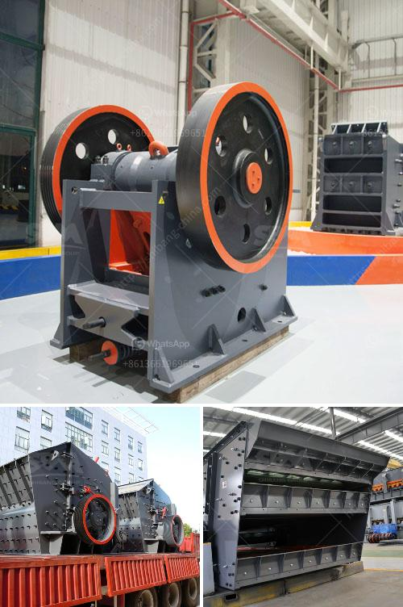

<h3>بدء عمل كسارة الجرانيت</h3>
تعتبر الكسارات من أهم الوحدات التي تستخدم في عملية الإنتاج، حيث تقوم بتحويل المواد الخام إلى منتج نهائي يتم استخدامه في مختلف الصناعات. ومن أهم أنواع الكسارات التي تستخدم في صناعة البناء والتشييد، كسارات الجرانيت.

تعد الجرانيت من أقوى أنواع الصخور الطبيعية، وتتميز بالصلابة والمتانة. وبالتالي، فإن كسارة الجرانيت تستخدم لكسر الصخور الصلبة بغرض استخراج الجرانيت الذي يمكن استخدامه في البناء والتصميم الداخلي والديكور.

عند بدء عمل كسارة الجرانيت، يجب اتباع عدة خطوات قبل أن يتمكن المنتج من البدء في العمل بشكل كامل. أولاً، يتم تحديد موقع الكسارة بعناية، فعملية استخراج الجرانيت تحتاج إلى مساحة كبيرة وبنية تحتية قوية. بعد ذلك، يتم تأسيس المنشأة بناءً على تصميم هندسي معتمد، حيث يتم تجهيز الكسارة بالمعدات اللازمة لعملية الكسر والفرز والغسيل.

تتكون الكسارة الأساسية من محطة مراقبة وصوامع تخزين للجرانيت المكسر، ووحدة كسر رئيسية تعمل على تحويل الصخور الصلبة إلى قطع أصغر، بالإضافة إلى ناقلات الحزام المختلفة ووحدة فرز وتصنيف تقوم بفصل الجرانيت المكسر حسب حجمه.

تعتبر عملية الكسر والفرز من أهم خطوات الإنتاج، حيث يتم تقسيم الجرانيت من حجم كبير جدًا إلى أحجام مختلفة تناسب استخدامات مختلفة. بعد ذلك، يتم تنظيف الجرانيت وغسله للتأكد من نقاء المنتج النهائي، حيث يتم إزالة أي شوائب ممكنة.

يجب أيضًا أخذ الاحتياطات اللازمة للحفاظ على البيئة وصحة العاملين في عملية الكسارة. فمثلًا، يجب تجهيز مصانع التصنيع بأنظمة ترشيح الغبار للحد من تلوث الهواء، بالإضافة إلى وجود نظام لمكافحة الضوضاء للحد من الأصوات العالية التي تنتج خلال العملية.

بعد بدء عمل كسارة الجرانيت، يمكن للمنتج أن يستفيد من المواد الخام ذات الجودة العالية ويبدأ في إنتاج منتجاته. ويتيح ذلك للشركة فرصة لتزويد السوق بكميات كبيرة من الجرانيت الجاهز للاستخدام في صناعة البناء والديكور.

بشكل عام، تعد كسارات الجرانيت استثمارًا جيدًا في صناعة البناء والتشييد، حيث توفر موارد طبيعية غنية ومنتجات عالية الجودة. ومع بدء عمل الكسارة، يمكن الاستفادة من هذه الموارد وتلبية احتياجات السوق المتزايدة.
<h3>Contact us</h3><ul><li><strong>Whatsapp:&nbsp;<a href="https://wa.me/8613661969651">+8613661969651</a></strong></li><li><a href="https://swt.shibang-china.com/?git&amp;zhl&amp;بدء عمل كسارة الجرانيت"><strong>Online Service(chat now)</strong></a></li></ul><h3>Related</h3><ul><li><a href='عمل المطحنة الكرة بالهندية.md'>عمل المطحنة الكرة بالهندية</a></li><li><a href='حسابات تصميم مجفف دوار.md'>حسابات تصميم مجفف دوار</a></li><li><a href='شركات المحاجر في بوكواس وأماسامان.md'>شركات المحاجر في بوكواس وأماسامان</a></li><li><a href='رسم مصنع غسيل الفحم.md'>رسم مصنع غسيل الفحم</a></li><li><a href='مصنع غسيل الكروم الطبيعي.md'>مصنع غسيل الكروم الطبيعي</a></li></ul>