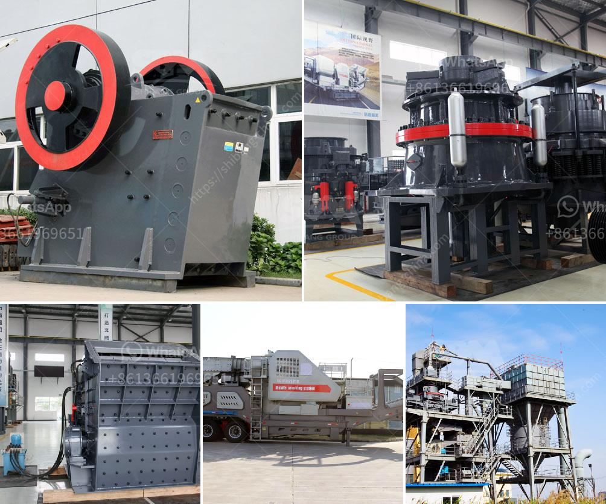

<h3>براميل أحزمة الناقلات في ماليزيا</h3>
تعدُّ ماليزيا واحدة من أهم الوجهات البحرية في جنوب شرق آسيا، حيث تتمتع بموقع جغرافي استراتيجي من خلال ممر مضيق ملقا المهم للغاية. وتعتبر براميل الأحزمة لنقل البضائع من أهم المكونات لسلاسة عملية النقل البحري في ماليزيا.

تُعد براميل أحزمة الناقلات بنية خاصة تُستخدم لنقل البضائع من أرصفة الموانئ إلى الناقلات البحرية. يتم تحميل البراميل بالبضائع، مثل المواد السائلة أو الغازات الضاغطة، وتعتبر واحدة من أكثر الوسائل فعالية لتخزين ونقل البضائع السائلة. وتُستخدَم البراميل أيضًا في صناعة النفط والغاز، حيث تُستخدم لنقل وتخزين مختلف المنتجات النفطية.

تتميّز ماليزيا بقسم كبير من اقتصادها يتعلق بالنفط والغاز والصناعات المرتبطة بهما. وتسعى الحكومة الماليزية جاهدة لتطوير قطاع البترول والغاز الطبيعي، حيث تهدف إلى زيادة إنتاجها العام وتعزيز قدرتها على تصدير المنتجات النفطية. وتعتمد ماليزيا بقوة على النقل البحري لتصدير النفط والغاز إلى العديد من دول العالم.

في هذا السياق، تلعب براميل أحزمة الناقلات دورًا حاسمًا في عملية النقل البحري للنفط والغاز في ماليزيا. ويحتاج قطاع النقل البحري في ماليزيا إلى براميل أحزمة الناقلات عالية الجودة ومتينة لضمان سلامة وحماية البضائع القابلة للتسرب.

من أجل تلبية هذه الاحتياجات، يتم تصنيع براميل أحزمة الناقلات في ماليزيا باستخدام تكنولوجيا حديثة وعالية الجودة. وتتمتع هذه البراميل بالعديد من المزايا، مثل المتانة والمقاومة للتآكل والتسريب. وتُصنع حسب المعايير العالمية لضمان جودة المنتج النهائي.

بالإضافة إلى ذلك، تعتبر البراميل مريحة وملائمة لعمليات الشحن والتفريغ والتخزين. فهي تأتي بأحجام وأشكال مختلفة تتناسب مع احتياجات العملاء ومتطلبات البضائع. كما أنها تُعد وسيلة فعالة وموثوقة للحفاظ على سلامة البضائع ومنع تلوث البيئة.

في الختام، تُعتبر براميل أحزمة الناقلات أحد العناصر الرئيسية في عملية النقل البحري للنفط والغاز في ماليزيا. تُستخدَم هذه البراميل لنقل وتخزين مجموعة متنوعة من المنتجات النفطية والغازية، مما يساهم في تعزيز قدرة ماليزيا على تصدير منتجاتها إلى أسواق العالم. وتستفيد ماليزيا من تقنيات تصنيع عالية الجودة لإنتاج براميل أحزمة الناقلات المتينة والموثوقة، مما يضمن سلامة وحماية البضائع أثناء نقلها عبر البحار.
<h3>Contact us</h3><ul><li><strong>Whatsapp:&nbsp;<a href="https://wa.me/8613661969651">+8613661969651</a></strong></li><li><a href="https://swt.shibang-china.com/?git&amp;zhl&amp;براميل أحزمة الناقلات في ماليزيا"><strong>Online Service(chat now)</strong></a></li></ul><h3>Related</h3><ul><li><a href='مصنع كربونات الكالسيوم المرسبة.md'>مصنع كربونات الكالسيوم المرسبة</a></li><li><a href='تكلفة عند استخدام كسارة الحجر.md'>تكلفة عند استخدام كسارة الحجر</a></li><li><a href='مصنع إسمنت مربح للبيع في تاميل نادو.md'>مصنع إسمنت مربح للبيع في تاميل نادو</a></li><li><a href='آلة طحن الكوارتز المستعملة للبيع.md'>آلة طحن الكوارتز المستعملة للبيع</a></li><li><a href='مطحنة طحن عمودية.md'>مطحنة طحن عمودية</a></li></ul>