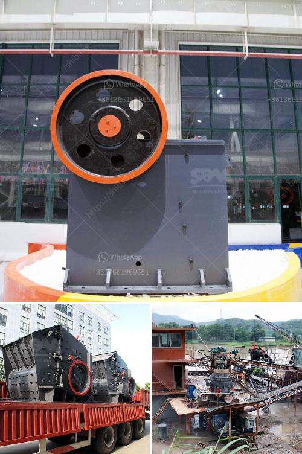

<h3>بناء شاشات اهتزاز</h3>
تُعَد شاشات الاهتزاز من التقنيات الحديثة التي أصبحت أكثر استخداماً وانتشاراً في العديد من المجالات. فهي تستخدم في صناعة التعدين، والبناء، وإعادة تدوير المواد، والتصنيع، وغيرها العديد من التطبيقات. تقوم هذه الشاشات بفصل المواد الصلبة عن السوائل عن طريق تأثير الاهتزازات عليها. في هذه المقالة، سنتطرق إلى بناء شاشات الاهتزاز وبعض الاستخدامات المتعددة لها.

يعتبر البناء الجيد هو الأساس لأداء شاشة الاهتزاز بكفاءة. تتألف الشاشة عادةً من إطار يحتوي على طبقات عديدة، تستخدم لفصل الجسيمات حسب حجمها. طبقة الشاشة العلوية هي الطبقة الأكثر قابلية للتلف، وتحتاج إلى تغيير متكرر للحفاظ على الأداء المثلى. عادة ما تكون شبكة متينة تتألف من أسلاك معدنية مثبتة على إطار معدني ليتحمل الاهتزازات والاجهادات. هناك أيضًا حاجة لوجود نظام تعليق أو مثبتة للفصل بين الشاشة والإطار الداعم لتقليل الأضرار الناجمة عن الاهتزازات القوية.

تعتبر الاهتزازات الفعّالة للشاشة جزءًا هامًا من العملية. فالاهتزازات تعمل على تحريك الجسيمات عبر فتحات الشاشة بوتيرة تجبر الجسيمات الكبيرة على الانتقال بعيدًا عن الفتحات، وبالتالي فهي تعمل كمصفاة للحفاظ على السائل أو المواد السائلة. لتحقيق هذه الاهتزازات، يتم استخدام محرك ينتج قوة الاهتزاز. هنالك العديد من التصاميم المعقدة المتاحة، بدءًا من المحركات الكهروميكانيكية حتى المحركات الهيدروليكية والهوائية.

يجب أن يكون تصميم الشاشة وفقًا لاحتياجات التطبيق النهائي للشاشة. فعلى سبيل المثال، في صناعة التعدين، يُفضل استخدام شاشات الاهتزاز ذات الفتحات الكبيرة للتعامل مع مواد الاستخلاص الأكبر الحجم، في حين يستخدم نمط الشاشة المكثفة في صناعة النفايات لفصل المواد النشطة عن السوائل. هذا النوع من التصميمات يعزز كفاءة العمليات ويقلل من فاقد الوقت والتكاليف.

بشكل عام، تحتاج شاشات الاهتزاز إلى الصيانة الدورية والاهتمام للحفاظ على أدائها المثلى. يتضمن ذلك تغيير الشبكة التالفة وضبط الاهتزازات وتأكيد انتظام عمل المحرك. وبالتالي، فإن بناء وصيانة شاشات الاهتزاز تعد جزءاً هاماً للغاية في الاستفادة الكاملة من هذه التكنولوجيا الحديثة وتحسين العمليات الصناعية بشكل عام.

باختصار، يمكن القول إن بناء شاشات الاهتزاز ينطوي على توفير إطار قوي وشبكة متينة بالإضافة إلى نظام فعّال للإهتزازات، مما يساعد على فصل المواد الصلبة عن السوائل بكفاءة. تتمتع هذه التكنولوجيا بتطبيقات عديدة في الصناعات المختلفة وتعتبر جزءًا مهمًا من تحسين العمليات الحديثة.
<h3>Contact us</h3><ul><li><strong>Whatsapp:&nbsp;<a href="https://wa.me/8613661969651">+8613661969651</a></strong></li><li><a href="https://swt.shibang-china.com/?git&amp;zhl&amp;بناء شاشات اهتزاز"><strong>Online Service(chat now)</strong></a></li></ul><h3>Related</h3><ul><li><a href='كسارات صخور cec للبيع.md'>كسارات صخور cec للبيع</a></li><li><a href='كسارة الحجر للبيع في بيرو.md'>كسارة الحجر للبيع في بيرو</a></li><li><a href='آلة صنع الرمل في جنوب أفريقيا.md'>آلة صنع الرمل في جنوب أفريقيا</a></li><li><a href='محرك مطحنة الإسمنت للبيع في المملكة المتحدة.md'>محرك مطحنة الإسمنت للبيع في المملكة المتحدة</a></li><li><a href='تكلفة عند استخدام كسارة الحجر.md'>تكلفة عند استخدام كسارة الحجر</a></li></ul>