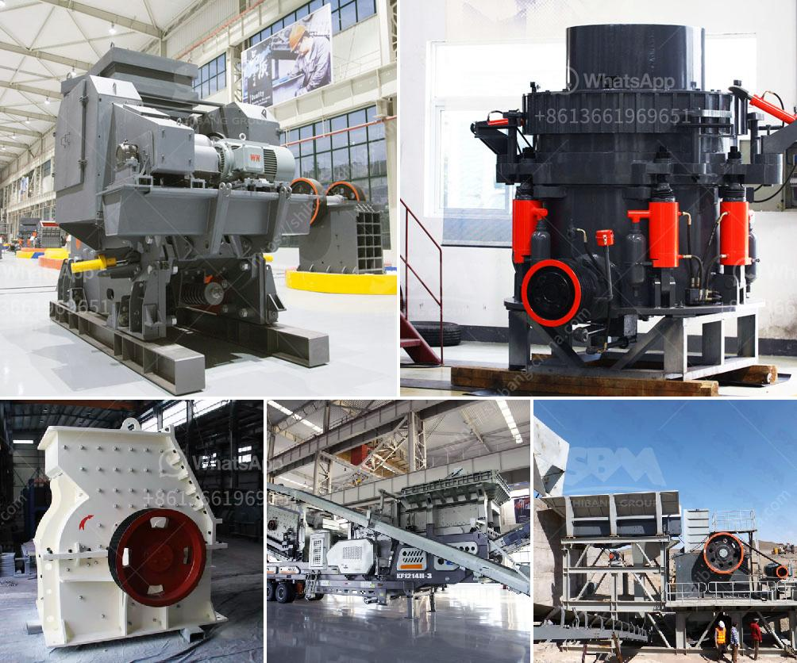

<h3>بناء مطحنة الكرة</h3>
تعتبر مطحنة الكرة واحدة من أهم الأجهزة المستخدمة في صناعة تكسير المواد الخام. تعمل المطاحن الكروية عن طريق تحويل الطاقة الكهربائية إلى طاقة ميكانيكية لتكسير المواد الخام إلى قطع صغيرة. تتكون هذه المطاحن من جسم أسطواني معبأ بكرات فولاذية أو سيراميكية بحجم محدد تدور داخل الأسطوانة. تستخدم في الصناعات المعدنية والمعادن الغير حديدية والمواد الكيميائية ومتطلبات البناء.

تعمل مطحنة الكرة بواسطة تحميل المواد الخام داخل الأسطوانة وتشغيل الجسم الأسطواني ، الذي يعكس الكرات داخل الأسطوانة، وهو ما يؤدي إلى تكسير المواد الخام بواسطة الكرات الموجودة داخلها. تعتبر سرعة دوران الأسطوانة وحجم الكرات من العوامل المؤثرة على كفاءة عمل المطحنة الكروية.

تتميز مطاحن الكرة بقدرتها على معالجة المواد الخام بشكل كبير في فترة زمنية قصيرة، مما يعني تحقيق إنتاجية عالية في العملية الإنتاجية. كما أنها قادرة على تكسير المواد الخام بشكل متجانس ودقيق، مما يؤدي إلى حصول أفضل نتائج في التكسير وتحسين جودة المنتج النهائي.

يتم استخدام مطاحن الكرة في مجموعة واسعة من الصناعات، بما في ذلك تصنيع الأسمنت، والسيراميك، والصناعات الكيميائية. تستخدم أيضا في معالجة المواد المعدنية مثل المعادن غير الحديدية والنحاس والذهب والفضة.

تتفاوت مطاحن الكرة في الحجم والسعة والاستخدام، ويمكن أن تكون مطاحن الكرة من الصغيرة التجريبية التي تستخدم في المعامل وحتى المطاحن الصناعية الكبيرة التي تستخدم في عمليات التصنيع عالية الكفاءة.

في الختام، تعد مطاحن الكرة أداة أساسية في صناعة تكسير المواد الخام والتي تلعب دورًا حيويًا في تحسين عمليات الإنتاج وتحسين جودة المنتج النهائي. يمكن أن يسهم استخدام مطاحن الكرة في تحقيق ربحية عالية بفضل إنتاجيتها العالية وقدرتها على تكسير المواد الخام بدقة وفعالية.
<h3>Contact us</h3><ul><li><strong>Whatsapp:&nbsp;<a href="https://wa.me/8613661969651">+8613661969651</a></strong></li><li><a href="https://swt.shibang-china.com/?git&amp;zhl&amp;بناء مطحنة الكرة"><strong>Online Service(chat now)</strong></a></li></ul><h3>Related</h3><ul><li><a href='موردين مطاحن الكرة في جنوب أفريقيا.md'>موردين مطاحن الكرة في جنوب أفريقيا</a></li><li><a href='كيماويات تعويم تحسين الفحم في الهند.md'>كيماويات تعويم تحسين الفحم في الهند</a></li><li><a href='كسارة الفك لتعدين الفحم.md'>كسارة الفك لتعدين الفحم</a></li><li><a href='عملية الكرة الطحن.md'>عملية الكرة الطحن</a></li><li><a href='تكلفة مشروع طحن التلك.md'>تكلفة مشروع طحن التلك</a></li></ul>