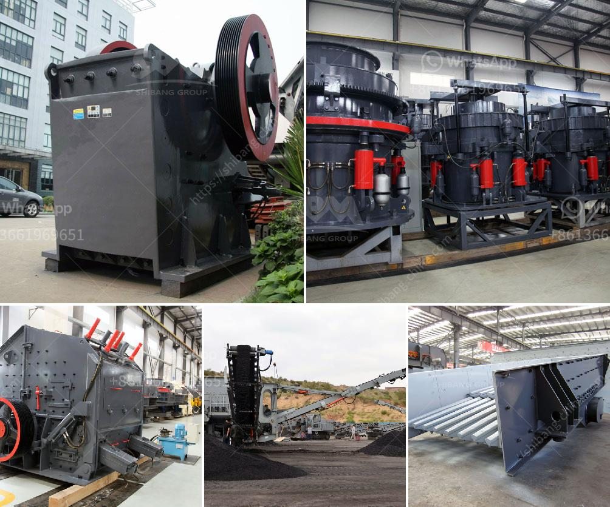

<h3>بيان طريقة لناقلات الحزام</h3>
تعتبر ناقلات الحزام أحد أهم وسائل النقل المستخدمة في العديد من الصناعات والشركات. فهي تستخدم لنقل المواد والبضائع على مسافات طويلة، وتتميز بكفاءتها واقتصاديتها. في هذه المقالة، سنتناول ببساطة طريقة عمل ناقلات الحزام.

تتكون ناقلات الحزام من حزام مطاطي أو من ألياف النايلون أو البوليستر، ويتم تثبيتها على بكرات دوارة تساعد في حركة الحزام. تستخدم المحركات الكهربائية لتحريك الحزام، ويمكن تعديل سرعتها واتجاهها حسب الحاجة.

عندما يتم تفعيل المحركات، يبدأ الحزام في التحرك ونقل المواد الموجودة عليه. توضع المواد على الحزام من خلال الأدوات الميكانيكية أو حملها يدويًا على الحزام نفسه. يتم ضبط توقيت الحزام لضمان تواجد المواد في الوقت المحدد والمكان المطلوب.

يعتبر الحزام من نوع النقل الجاذب، حيث تساعد قوة الاحتكاك ما بين الحزام والمواد المنقولة في جذب المواد وسحبها. وتتم عملية الجذب هذه بفضل الوزن الذي يولده المواد والجاذبية. بالتالي، فإن ناقلات الحزام تعتبر طريقة فعالة لنقل المواد بسهولة وسرعة.

تعتبر ناقلات الحزام متعددة الاستخدامات، فهي قادرة على نقل مجموعة واسعة من المواد مثل الحبوب والفحم والمعادن والغازات والسوائل. يمكن أن تعمل ناقلات الحزام في الأماكن المغلقة أو المفتوحة وعلى أنواع مختلفة من الأرضيات مثل الأخشاب أو الأسفلت أو الخرسانة.

لا يمكن إنكار أن ناقلات الحزام تعتبر طريقة أكثر أمانًا لنقل المواد مقارنة بوسائل النقل الأخرى. فمثلاً، عند استخدام الشاحنات أو المعدات الثقيلة، يمكن أن تحدث حوادث وأخطاء قد تتسبب في إصابة العمال أو تلف الممتلكات. ومع ذلك، تتمتع ناقلات الحزام بتصميم قوي ومتين يمنع حدوث حوادث أو انزلاق المواد المنقولة من الحزام.

باختصار، تعتبر ناقلات الحزام طريقة فعالة وآمنة لنقل المواد والبضائع على مسافات طويلة. تتميز بكفاءتها واقتصاديتها، وتستخدم في العديد من الصناعات مثل التعدين والزراعة والبناء والصناعات الغذائية. ناقلات الحزام تساعد في تحسين عمليات الإنتاج وزيادة الإنتاجية، وهي تعتبر حلاً مستدامًا وفعّالًا لنقل المواد في مختلف الظروف والبيئات.
<h3>Contact us</h3><ul><li><strong>Whatsapp:&nbsp;<a href="https://wa.me/8613661969651">+8613661969651</a></strong></li><li><a href="https://swt.shibang-china.com/?git&amp;zhl&amp;بيان طريقة لناقلات الحزام"><strong>Online Service(chat now)</strong></a></li></ul><h3>Related</h3><ul><li><a href='خطة عمل كاملة لمصنع تكسير الحجارة.md'>خطة عمل كاملة لمصنع تكسير الحجارة</a></li><li><a href='كسارات متنقلة في أبوجا.md'>كسارات متنقلة في أبوجا</a></li><li><a href='مصنعين كسارات في روسيا.md'>مصنعين كسارات في روسيا</a></li><li><a href='كسارة الكرة باكستان للبيع.md'>كسارة الكرة باكستان للبيع</a></li><li><a href='كسارة مخروطية في المملكة العربية السعودية.md'>كسارة مخروطية في المملكة العربية السعودية</a></li></ul>