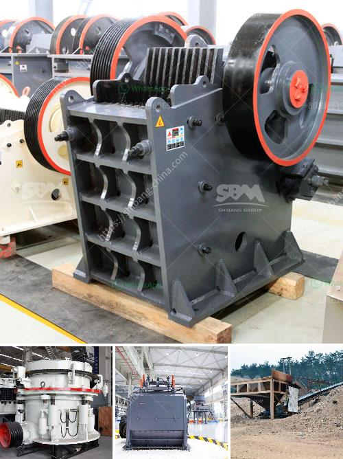

<h3>بيانات مصنع تحضير خام الكروم</h3>
يعتبر خام الكروم أحد الموارد الطبيعية الهامة في صناعة الصلب والمواد المقاومة للتآكل. ومصنع تحضير خام الكروم يعتبر من أهم الوحدات الصناعية التي تقوم بتحويل الخام إلى مادة نقية قابلة للاستخدام في صناعة المنتجات المختلفة التي تعتمد على الكروم.

ينقسم عملية تحضير خام الكروم إلى عدة خطوات أساسية. أولاً، يتم سحق الخام وطحنه إلى جزيئات صغيرة لتيسير عملية الفصل القادمة. بعد ذلك يتم استخلاص تركيز خام الكروم بواسطة استخدام الجاذبية ومطية وغيرها من العمليات الفصلية. يتم تحويل الخام إلى خليط زئبقي يحتوي على كميات معينة من المواد الأخرى، مثل الحديد والكبريت.

في الخطوة التالية، يتم تنقية الخليط الزئبقي للحصول على نقاء عالٍ من خام الكروم. يتم ذلك عن طريق تفاعل الخليط الزئبقي مع حمض الكبريتيك ومركبات أخرى. هذا التفاعل يؤدي إلى تكوين تفاعلات كيميائية تعزز عملية تركيز وتنقية خام الكروم بشكل كبير.

الخطوة الأخيرة في عملية تحضير خام الكروم هي تخفيض الخام للحصول على شكل نهائي معين. يتم ذلك بواسطة تفاعل معدن الكالسيوم مع الأكسجين المتبقي في الخام، مما ينتج عنه استخلاص المعدن النقي بنسبة عالية.

يعتبر مصنع تحضير خام الكروم بمثابة حلقة الوصل الرئيسية بين مناجم الكروم وصناعة المنتجات المشتقة منه. يكمن أهمية هذا المصنع في قدرته على تحويل الخام الخام إلى خام مركز ونقي يمكن أن يستخدم في صناعة المعدات الثقيلة والأجزاء الصناعية الأخرى. كما أن عملية تحضير خام الكروم تتطلب مراقبة دقيقة للعمليات الكيميائية وعمليات التنقية لضمان الجودة والتنافسية.
<h3>Contact us</h3><ul><li><strong>Whatsapp:&nbsp;<a href="https://wa.me/8613661969651">+8613661969651</a></strong></li><li><a href="https://swt.shibang-china.com/?git&amp;zhl&amp;بيانات مصنع تحضير خام الكروم"><strong>Online Service(chat now)</strong></a></li></ul><h3>Related</h3><ul><li><a href='سعر مصنع كسارة الحجر.md'>سعر مصنع كسارة الحجر</a></li><li><a href='سعة مطحنة الكرة 10 تف في ماليزيا.md'>سعة مطحنة الكرة 10 تف في ماليزيا</a></li><li><a href='كيفية صنع آلة كسارة خام الحديد.md'>كيفية صنع آلة كسارة خام الحديد</a></li><li><a href='مطحنة الكرة في كازاخستان.md'>مطحنة الكرة في كازاخستان</a></li><li><a href='كسارة عينة صغيرة.md'>كسارة عينة صغيرة</a></li></ul>