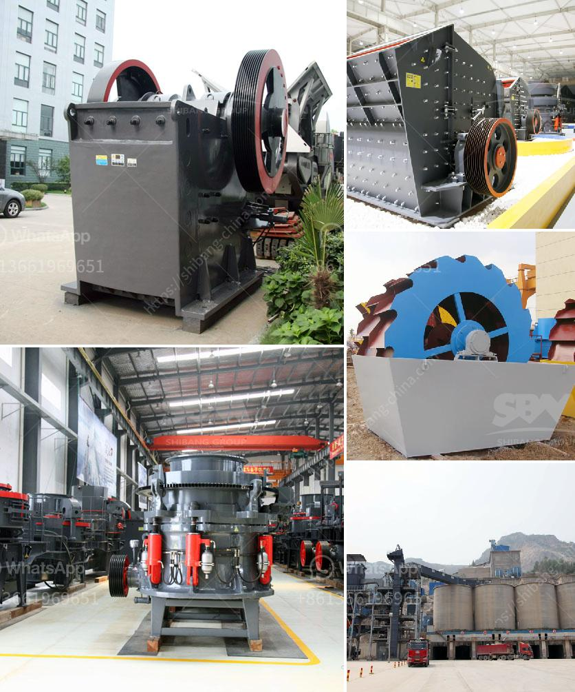

<h3>بيع آلة مطحنة الأسطوانة</h3>
تعتبر آلة مطحنة الأسطوانة واحدة من الأدوات الرئيسية في صناعة الغذاء والحبوب. إنها تساعد في طحن المواد الغذائية مثل القمح والأرز والشعير والشوفان وغيرها من الحبوب لإنتاج مسحوق ناعم يمكن استخدامه في عمليات التصنيع والطهي.

عند البحث عن آلة مطحنة الأسطوانة للبيع، هناك العديد من العوامل التي يجب مراعاتها قبل اتخاذ قرار الشراء. أولاً وقبل كل شيء، يجب أن يتم اختيار آلة ذات جودة عالية تستخدم مواد عالية الجودة في تصنيعها. يجب أن تتمتع بموثوقية عالية وتكون قادرة على تحمل الاستخدام المكثف.

بالإضافة إلى ذلك، يجب أن يتم اختيار آلة مطحنة الأسطوانة وفقًا لاحتياجات العمل والإنتاج المستهدف. يجب مراعاة معدلات الإنتاج المتوقعة وحجم المواد المراد طحنها. هناك آلات مطحنة الأسطوانة ذات قدرات مختلفة، بعضها يتميز بسعة إنتاجية أعلى وبعضها يتميز بسعر منخفض، لذا يجب مراعاة التوازن المثالي بين الأداء والتكلفة.

كما يجب مراعاة الكفاءة الطاقوية للآلة. يجب اختيار آلة تستهلك طاقة قليلة وتحافظ على الطاقة. هذا ليس فقط يعمل على تقليل تكاليف التشغيل، ولكنه أيضا يحافظ على البيئة.

أما عن السعر، فمن المهم أن يتم تحديد الميزانية المتاحة قبل البحث عن آلة مطحنة الأسطوانة. يجب الاهتمام بالجودة والأداء ومقارنة الأسعار بين الموديلات المختلفة للعثور على الخيار الأنسب.

قبل الشراء، يجب أيضًا أن تقوم بقراءة المزيد عن الموردين المختلفين والتحقق من سمعتهم وخدماتهم. يمكنك البحث على الإنترنت عن تقييمات ومراجعات المستخدمين السابقين للحصول على فكرة واضحة عن جودة الشركة وخدمة العملاء.

في النهاية، آلة مطحنة الأسطوانة هي استثمار هام لأي عمل في صناعة الغذاء أو الحبوب. يجب أن تكون قادرة على تلبية الاحتياجات المختلفة للعمل وتستخدم مواد ذات جودة عالية. بتحقيق التوازن المناسب بين الأداء والتكلفة، يمكنك اختيار آلة مطحنة الأسطوانة الأنسب لاحتياجاتك والتي ستساعدك على زيادة إنتاجيتك وتحسين جودة منتجاتك.
<h3>Contact us</h3><ul><li><strong>Whatsapp:&nbsp;<a href="https://wa.me/8613661969651">+8613661969651</a></strong></li><li><a href="https://swt.shibang-china.com/?git&amp;zhl&amp;بيع آلة مطحنة الأسطوانة"><strong>Online Service(chat now)</strong></a></li></ul><h3>Related</h3><ul><li><a href='تكلفة الآلات لمصنع الأسمنت.md'>تكلفة الآلات لمصنع الأسمنت</a></li><li><a href='مطحنة الكرة للذهب في إندونيسيا.md'>مطحنة الكرة للذهب في إندونيسيا</a></li><li><a href='مطحنة الكرة في معالجة المعادن.md'>مطحنة الكرة في معالجة المعادن</a></li><li><a href='صيانة محطة توليد الفحم بصيغة PDF.md'>صيانة محطة توليد الفحم بصيغة PDF</a></li><li><a href='جر المحمول في.md'>جر المحمول في</a></li></ul>