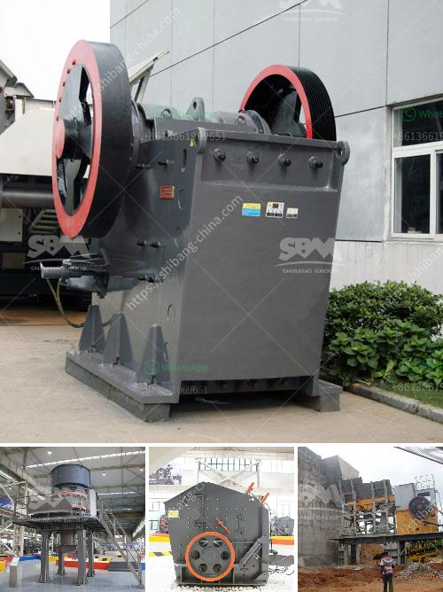

<h3>بيع الكسارات في ماليزيا</h3>
تعتبر ماليزيا واحدة من الدول النامية الرائدة في جنوب شرق آسيا، حيث تتمتع باقتصاد قوي وقطاع صناعي مزدهر. من بين الصناعات الهامة في ماليزيا تأتي صناعة البناء والتشييد، حيث تعد الكسارات جزءًا أساسيًا من هذا القطاع.

تلعب الكسارات دورًا حاسمًا في عملية التعدين والبناء والإصلاح في ماليزيا. تهدف كسارات ماليزيا إلى إنتاج مجموعة واسعة من المواد الاستخدامية المتطورة، مثل الحجر الكلسي والأسمنت والرمل والحصى. يتم استخدام هذه المواد في مشاريع البناء والتشييد المختلفة، مثل الطرق والجسور والمباني السكنية والتجارية.

يعود نجاح قطاع الكسارات في ماليزيا إلى عدة عوامل. أولاً، تعتبر الموارد الطبيعية الغنية في البلاد، مثل الحجر الكلسي والجرانيت، هي المكون الأساسي لهذه الصناعة. تتوفر هذه الموارد على نطاق واسع في أنحاء البلاد، مما يجعل الإنتاج ميسرًا وفعالاً.

ثانيًا، يعزى النجاح أيضًا إلى الطلب المتزايد على المواد الاستخدامية في ماليزيا. تشهد البلاد نموا اقتصاديا مستداما وتطورًا في البنية التحتية والعمران، مما أدى إلى زيادة الطلب على المواد الاستخدامية. بالإضافة إلى ذلك، يتزايد الاستهلاك الشخصي للإسمنت والرمل والحصى، نظرًا للتوسع السكاني وتحسين معيشة الناس.

ثالثًا، يتمتع قطاع الكسارات في ماليزيا بالتكنولوجيا المتطورة والمعدات الحديثة. استثمرت الشركات المحلية والأجنبية في تحديث وتطوير معدات الكسارات الحديثة لتحسين كفاءة الإنتاج وجودة المنتجات. تعتبر ماليزيا مركزًا لابتكارات التكنولوجيا في هذا القطاع، مما يسهم في تعزيز تنافسية المنتجات الماليزية على المستوى العالمي.

ومع ذلك، تواجه صناعة الكسارات في ماليزيا تحديات معينة. واحدة من هذه التحديات هي التأثير البيئي المحتمل لعمليات التعدين والتشغيل. تعمل الحكومة الماليزية بالتعاون مع الشركات الكسارات على تنفيذ إجراءات واستراتيجيات بيئية صارمة للحد من تلك التأثيرات البيئية السلبية.

في الختام، تلعب صناعة الكسارات دورًا حاسمًا في النمو الاقتصادي والتطور العمراني في ماليزيا. تعمل الكسارات على تلبية الطلب المتزايد على المواد الاستخدامية في مشاريع البناء والتشييد المختلفة. ومع استمرار التطور الاقتصادي في ماليزيا، من المتوقع أن تشهد صناعة الكسارات نموًا مستدامًا في السنوات القادمة.
<h3>Contact us</h3><ul><li><strong>Whatsapp:&nbsp;<a href="https://wa.me/8613661969651">+8613661969651</a></strong></li><li><a href="https://swt.shibang-china.com/?git&amp;zhl&amp;بيع الكسارات في ماليزيا"><strong>Online Service(chat now)</strong></a></li></ul><h3>Related</h3><ul><li><a href='سعة مطحنة الكرة للطين.md'>سعة مطحنة الكرة للطين</a></li><li><a href='مطحنة الكرات في تنزانيا.md'>مطحنة الكرات في تنزانيا</a></li><li><a href='آلة مسحوق رمل السيليكا إندونيسيا.md'>آلة مسحوق رمل السيليكا إندونيسيا</a></li><li><a href='مطحنة أسطوانية ثنائية المرور.md'>مطحنة أسطوانية ثنائية المرور</a></li><li><a href='مصنع تحسين الجرافيت للبيع.md'>مصنع تحسين الجرافيت للبيع</a></li></ul>