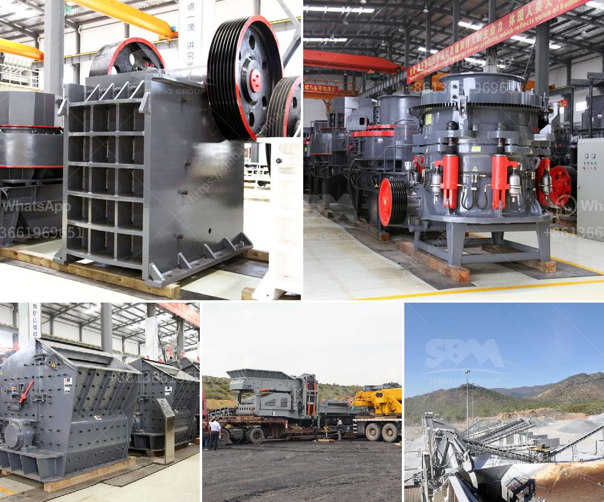

<h3>بيع كسارة الحجر 400 طن في الساعة</h3>
تعد كسارات الحجر من أهم الآلات المستخدمة في صناعة التكسير والتكسير الثانوي للصخور الصلبة. تتوفر العديد من أنواع الكسارات التي تختلف في القدرات والمواصفات. واحدة من هذه الكسارات هي كسارة الحجر بسعة 400 طن في الساعة.

إن بيع كسارة الحجر بسعة 400 طن في الساعة يعتبر عرضًا جيدًا للشركات المهتمة بصناعة البناء والهندسة المدنية والمقاولات. فهذه الكسارة تعتبر قوية وعالية الكفاءة، وتتيح للشركات إنتاج كمية كبيرة من الحصى والركام بشكل سريع وفعال.

يحتوي هذا النوع من الكسارة على العديد من المكونات المهمة التي تضمن الأداء العالي والمستدام. تشمل المكونات الرئيسية لكسارة الحجر بسعة 400 طن في الساعة الفك المتحرك والفك الثابت، والإطار، والربطة الحديدية، والمحرك الكهربائي، ونظام التحكم، ومغذيات الاهتزاز، والسير الناقل، والتجهيزات الأخرى الضرورية.

تتميز كسارة الحجر هذه بقدرتها على تكسير الصخور الكبيرة وتحويلها إلى قطع صغيرة مناسبة للاستخدام في البناء والهندسة المدنية. يمكن استخدام الحصى والركام المنتج منها في إنشاء الطرق، وتعبيد الطرق، والمباني، وأعمال الخرسانة الجاهزة، والعديد من التطبيقات الأخرى في القطاعات العامة والخاصة.

بالإضافة إلى قدرتها على تكسير الصخور الكبيرة، فإن كسارة الحجر بسعة 400 طن في الساعة تتميز أيضًا بسهولة التشغيل والصيانة. توفر العديد من الشركات التي تطرح هذا النوع من الكسارات خدمات ما بعد البيع مثل التركيب والتشغيل والصيانة وتوفير قطع الغيار اللازمة، مما يجعل امتلاك هذا النوع من الكسارة أمرًا مريحًا واقتصاديًا للشركات.

بالمجمل، تعتبر كسارة الحجر بسعة 400 طن في الساعة آلة قوية وفعالة في صناعة التكسير والتكسير الثانوي. يجب أخذ مختلف العوامل في الاعتبار قبل اتخاذ قرار شراء هذا النوع من الكسارة، مثل ميزانية الشركة واحتياجاتها الفعلية. ومع ذلك، فإن ملاءمة هذا النوع من الكسارة لصناعة البناء والهندسة المدنية تجعلها خيارًا ممتازًا للشركات الباحثة عن زيادة الإنتاجية وتحسين جودة المنتج النهائي.
<h3>Contact us</h3><ul><li><strong>Whatsapp:&nbsp;<a href="https://wa.me/8613661969651">+8613661969651</a></strong></li><li><a href="https://swt.shibang-china.com/?git&amp;zhl&amp;بيع كسارة الحجر 400 طن في الساعة"><strong>Online Service(chat now)</strong></a></li></ul><h3>Related</h3><ul><li><a href='معالجة كسارة الكوارتز.md'>معالجة كسارة الكوارتز</a></li><li><a href='سير ناقل لرماد الفحم.md'>سير ناقل لرماد الفحم</a></li><li><a href='كسارة مخروطية للبيع.md'>كسارة مخروطية للبيع</a></li><li><a href='مصنع مسحوق الجبس في الهند.md'>مصنع مسحوق الجبس في الهند</a></li><li><a href='سعر كسارة الفك المحمولة.md'>سعر كسارة الفك المحمولة</a></li></ul>