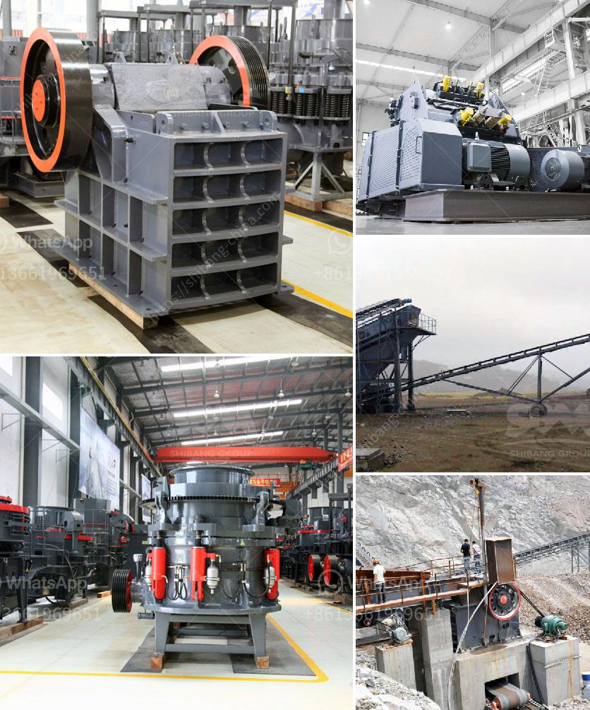

<h3>بيع كسارة الحجر للبيع</h3>
لا شك أن صناعة البناء هي إحدى الصناعات الحيوية التي تسهم في تطور وازدهار المجتمعات. ومن أهم الموارد التي يعتمد عليها البناء هو الحجر، حيث يتم استخدامه في بناء المباني والطرق والجسور والأنفاق والنصب التذكارية وغيرها من المشاريع الهندسية. ومن أجل تلبية احتياجات هذا السوق المتزايد، يتم توفير كسّارات الحجر للبيع.

تعتبر كسّارة الحجر معدة أساسية في عملية تكسير وسحق الصخور الضخمة للحصول على حصى ورمل وغيرها من المواد الأساسية لصناعة البناء. وعند البحث عن كسارة الحجر للبيع، يتوجب على المشتري أن يأخذ بعين الاعتبار العديد من العوامل الهامة.

أحد العوامل المهمة في شراء كسارة الحجر هو السعر. تتفاوت الأسعار بين الكسارات المستعملة والجديدة، وبين الكسارات التي تعتمد على التيار الكهربائي وتلك التي تعتمد على قوة المحرك الديزل. علاوة على ذلك، فإن حجم الكسارة وقدرتها على سحق الصخور أيضًا يؤثران على السعر. يتعين على المشتري أن يقارن بين الأسعار والمواصفات المتاحة ويختار ما يناسب احتياجاته وميزانيته.

عند الشراء، يجب على المشتري أن يأخذ في الاعتبار أيضًا الجودة والكفاءة والمتانة للكسارة. فالكسّارة الجيدة يجب أن تتحمل الاستخدام الشاق وأوقات التشغيل الطويلة دون التأثير على أدائها وجودتها. يمكن للمشتري أن يستفسر عن العلامة التجارية والتاريخ والسجلات الغنية للكسارة، ويلزم الاطلاع على توصيات وآراء العملاء السابقين قبل اتخاذ القرار النهائي.

بالإضافة إلى ذلك، يفضل أن يكون للكسارة خصائص تقنية يمكن التحكم فيها، مثل تعديل حجم الإخراج وتغيير السرعة والقدرة على ضبط زاوية الميل. هذه الميزات التقنية تضمن أن الكسارة قادرة على تلبية احتياجات المشروع المحدد وتعزيز الإنتاجية والكفاءة.

في الختام، يعتبر شراء كسارة الحجر مهمة حاسمة ولا ينبغي أن تتم بطريقة عشوائية. يجب على المشتري أن يحدد احتياجاته بدقة ويأخذ بعين الاعتبار العوامل المذكورة سابقًا مثل السعر والجودة والمواصفات التقنية. من خلال ذلك، يمكن للمشتري أن يضمن بحصوله على كسارة الحجر المثالية التي تلبي متطلباته وتعزز إنتاجيته.
<h3>Contact us</h3><ul><li><strong>Whatsapp:&nbsp;<a href="https://wa.me/8613661969651">+8613661969651</a></strong></li><li><a href="https://swt.shibang-china.com/?git&amp;zhl&amp;بيع كسارة الحجر للبيع"><strong>Online Service(chat now)</strong></a></li></ul><h3>Related</h3><ul><li><a href='معدات مصنع حجر الرمل.md'>معدات مصنع حجر الرمل</a></li><li><a href='مزايا وعيوب مطحنة الطحن.md'>مزايا وعيوب مطحنة الطحن</a></li><li><a href='مصنع معالجة البازلت.md'>مصنع معالجة البازلت</a></li><li><a href='كسارات مسحوق التلك.md'>كسارات مسحوق التلك</a></li><li><a href='كسارة فكية 10x.md'>كسارة فكية 10x</a></li></ul>