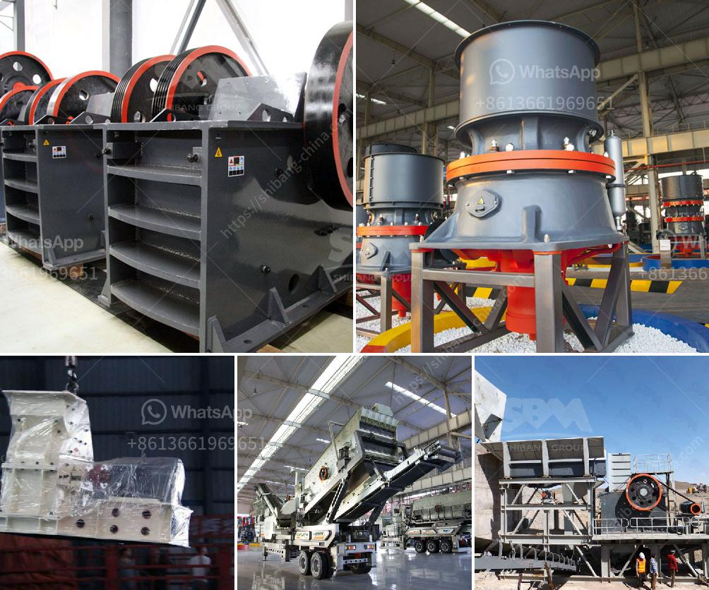

<h3>بيع كسارة الحجر</h3>
تُعتبر كسارة الحجر من الآلات الهندسية الحديثة التي تستخدم في عمليات تكسير الصخور والحجارة لتحويلها إلى حجم صغير يمكن استخدامه في مختلف المجالات مثل البناء والطرق وصناعة الأسمنت. وبفضل تطور التكنولوجيا، أصبحت الكسارات الحجرية تُستخدم على نطاق واسع في جميع أنحاء العالم، حيث أصبحت أداة هامة في الهندسة المدنية وصناعة البناء.

إن بيع كسارة الحجر يُعد فرصة تجارية مُجزية للعديد من الشركات التي تعمل في مجال صناعة البناء والمقاولات. وتأتي الكسارات بأشكال مختلفة وبمقاسات تُتناسب مع الطلب واحتياجات العملاء، فهناك كسارات صغيرة الحجم يتم استخدامها في المشاريع الصغيرة وكذلك كسارات أكبر الحجم يمكن تشغيلها في المشاريع الكبيرة.

توفر الكسارات الحجرية فوائد عديدة للمشترين، حيث تُسهِّل عملية تكسير الصخور وتحويلها إلى حجم صغير بسرعة وكفاءة عالية. وبالإضافة إلى ذلك، توفر الكسارات الحجرية تكاليف النقل وعملية شراء الحصى الجاهز، مما يسهم في توفير الموارد المالية والوقت للمشترين. كما أن استخدام الكسارات يُعد وسيلة فعالة للحفاظ على البيئة، حيث تُقلل من استخراج الحصى من المصادر الطبيعية وتُحسن استخدام الموارد الطبيعية المتجددة.

تتوفر الكسارات الحجرية في العديد من الأحجام والموديلات، وبالتالي يتراوح سعرها بين 200 و400 دولار وفقًا للمواصفات والقدرات التي تتضمنها. إذا كنت تود شراء كسارة حجرية، يُنصح بأخذ بعض العوامل في الاعتبار. من ضمن هذه العوامل، القوة المطلوبة لتشغيل الكسارة، حجم الصخور والحجارة المطلوب تكسيرها، العائد المُتوقع من العملية، والتقنيات الإضافية التي تتوفر مع الكسارة مثل الشاشات وأنظمة الفرز.

عند شراء الكسارة الحجرية، يفضل التعاون مع شركة ذات خبرة وأسماء موثوقة في هذا القطاع. يُنصح بشراء الكسارة من مصادر موثوقة تُقدم خدمات ما بعد البيع المناسبة، بما في ذلك الدعم التقني وتوفير قطع الغيار عند الحاجة. كما يُنصح بمراجعة تقييمات العملاء السابقين للتأكد من جودة المنتجات والخدمات المقدمة.

بالاختصار، يعتبر بيع كسارة الحجر فرصة تجارية جيدة للشركات التي تعمل في صناعة البناء والمقاولات. وبفضل التطور التكنولوجي واستخدام الكسارات الحديثة، أصبح من السهل والمربح تكسير الصخور وتحويلها إلى حجم صغير يمكن استخدامه في العديد من المجالات. لذا، يُنصح بشراء الكسارة من مصادر موثوقة وذات سمعة جيدة لتحقيق أفضل النتائج وتوفير الوقت والموارد المالية.
<h3>Contact us</h3><ul><li><strong>Whatsapp:&nbsp;<a href="https://wa.me/8613661969651">+8613661969651</a></strong></li><li><a href="https://swt.shibang-china.com/?git&amp;zhl&amp;بيع كسارة الحجر"><strong>Online Service(chat now)</strong></a></li></ul><h3>Related</h3><ul><li><a href='مطحنة الفحم لطحن الأسطوانة.md'>مطحنة الفحم لطحن الأسطوانة</a></li><li><a href='معدات معالجة الحجر الجيري في جنوب أفريقيا.md'>معدات معالجة الحجر الجيري في جنوب أفريقيا</a></li><li><a href='المعدات اللازمة لبدء تعدين الحجر الجيري.md'>المعدات اللازمة لبدء تعدين الحجر الجيري</a></li><li><a href='تكلفة تشغيل الكسارة في لاس فيغاس.md'>تكلفة تشغيل الكسارة في لاس فيغاس</a></li><li><a href='آلات تكسير الحجر في المملكة المتحدة.md'>آلات تكسير الحجر في المملكة المتحدة</a></li></ul>