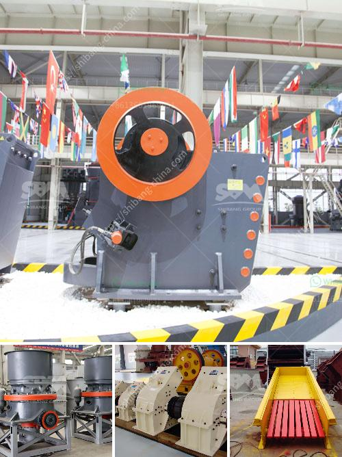

<h3>بيع كسارة الصخور</h3>
تعد كسارة الصخور أداة هامة في صناعة البناء وتعدين المحاجر، حيث تُستخدم لكسر وطحن الصخور والأحجار الكبيرة لتحويلها إلى حجم صغير يمكن استخدامه في إنشاء الطرق والمباني والمشاريع الأخرى. ومع تزايد الطلب على مواد البناء وتطور صناعة البناء، أصبحت كسارة الصخور ضرورة للعديد من الشركات في القطاع.

يتم بيع كسارات الصخور من قبل الشركات المتخصصة في تصنيع وتوريد المعدات الثقيلة. توفر هذه الشركات مجموعة متنوعة من كسارات الصخور بمختلف الأحجام والقدرات لتلبية احتياجات العملاء المختلفة. قد تشمل الطرز المتاحة كسارات فكية وكسارات صدمية وكسارات مخروطية وكسارات صغيرة الحجم للاستخدامات الأكثر خفة.

يعتمد سعر كسارة الصخور على عدة عوامل، بما في ذلك الحجم والنوع والقدرة والعلامة التجارية. في العادة، تتكلف كسارات الصخور ما بين 200 إلى 400 ألف دولار في السوق. ومع ذلك، يمكن أن تختلف الأسعار حسب المواصفات الفردية للكسارة ومدى تطلب تخصيصها لتناسب احتياجات المشتري.

هناك العديد من العوامل التي يجب النظر فيها عند اختيار وشراء كسارة الصخور. أحد الجوانب الرئيسية هو الأداء والجودة، حيث يجب أن تكون الكسارة قوية ومتينة وتستطيع التعامل مع الصخور الصعبة بسهولة. بالإضافة إلى ذلك، يجب أن تكون الكسارة سهلة التشغيل والصيانة، وتتوفر قطع الغيار بسهولة في حالة الحاجة إليها.

تعتبر التكلفة أيضًا عاملًا حاسمًا في اتخاذ قرار الشراء. يجب أن يكون سعر الكسارة معقولًا ومناسبًا للعملاء، مع مراعاة أداء الكسارة وجودتها. بالإضافة إلى ذلك، ينبغي النظر في خدمة العملاء والضمانات المقدمة من الشركة المصنعة، حيث يمكن أن تكون ذات قيمة عالية للعملاء.

بالنظر إلى الطلب المستمر على مواد البناء وتطور صناعة البناء حول العالم، يبدو أن سوق بيع كسارة الصخور مزدهرة. وبالتالي، تزداد المنافسة بين الشركات المصنعة وتأتي معها طرق وتقنيات جديدة لتطوير كسارات صخور متقدمة وفعالة من حيث التكلفة.

باختصار، يمثل بيع كسارة الصخور فرصة للشركات لتلبية احتياجات العملاء في صناعة البناء وتعدين المحاجر. يتطلب الاختيار الصحيح للكسارة مراعاة الأداء والجودة والتكلفة وخدمة العملاء. ومع تطور التكنولوجيا وزيادة الطلب، يبدو أن مستقبل بيع كسارة الصخور واعدًا ومزدهرًا.
<h3>Contact us</h3><ul><li><strong>Whatsapp:&nbsp;<a href="https://wa.me/8613661969651">+8613661969651</a></strong></li><li><a href="https://swt.shibang-china.com/?git&amp;zhl&amp;بيع كسارة الصخور"><strong>Online Service(chat now)</strong></a></li></ul><h3>Related</h3><ul><li><a href='معدات كسارة الحجر.md'>معدات كسارة الحجر</a></li><li><a href='كرات المطحنة للتعدين.md'>كرات المطحنة للتعدين</a></li><li><a href='مطحنة الهامر 20 طن شبكة الشاشة.md'>مطحنة الهامر 20 طن شبكة الشاشة</a></li><li><a href='أسعار مطاحن الكرة الاسمنت.md'>أسعار مطاحن الكرة الاسمنت</a></li><li><a href='شركة تصنيع كسارة الحصى.md'>شركة تصنيع كسارة الحصى</a></li></ul>