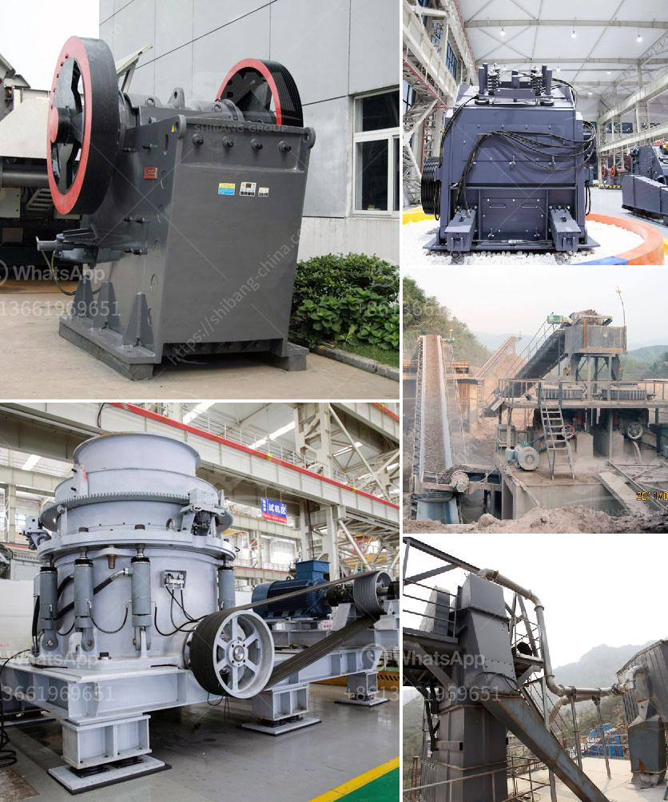

<h3>بيع كسارة الفك في كينيا</h3>
تُعد كسارة الفك أحد الأدوات الحاسمة في صناعة التعدين والبناء في كينيا. وبفضل قدرتها على سحق الصخور الكبيرة وتقسيمها إلى جزيئات صغيرة، فإنها تُستخدم بشكل واسع في تكسير الحجارة والفحص الأولي في تجهيز المواد الخام.

تتوفر كسارات الفك في العديد من الموديلات والأحجام، وتتراوح قدرتها على التشغيل من 200 إلى 400 طن في الساعة. وهذا يعني أنه يمكنها التعامل مع أحجام وأنواع صخور متنوعة بكفاءة عالية.

تستخدم كسارات الفك على نطاق واسع في صناعة التعدين في كينيا، حيث يتم استخراج المعادن الثمينة وغير الثمينة مثل الذهب والفضة والنحاس من الصخور. بواسطة كسارة الفك، يمكن تكسير هذه الصخور وتحويلها إلى قطع صغيرة من الحجم الملائم للمعالجة اللاحقة.

أيضًا، تُستخدم كسارات الفك في صناعة البناء في كينيا. فعند تجهيز المواد الخام مثل الحجر والرمل والحصى، يمكن استخدام كسارات الفك لتحطيم الحجارة الكبيرة إلى أحجام أصغر تستخدم في إنتاج الخرسانة والإسفلت ومواد البناء الأخرى.

في أعوام الأخيرة، تزايد الطلب على كسارات الفك في كينيا مع استمرار نمو صناعة التعدين والبناء في البلاد. ازدياد الطلب على المواد الخام كالمعادن والحصى يستدعي استخدام كسارات الفك لزيادة القدرة على التعامل مع هذه الكميات المتزايدة.

توفر الشركات المصنعة للمعدات الثقيلة في كينيا مجموعة متنوعة من كسارات الفك التي تتراوح في السعة ومختلف النماذج. وهذا يتيح للمشترين الاختيار من بين العديد من الخيارات وفقًا لاحتياجاتهم ومتطلباتهم الفردية.

في النهاية، تعد كسارة الفك أداة مهمة في صناعة التعدين والبناء في كينيا. تحظى بشعبية كبيرة بفضل قدرتها على تكسير الصخور وتجهيز المواد الخام بكفاءة. وبفضل الشركات المصنعة المتاحة في السوق، يمكن للمشترين الحصول على كسارة الفك التي تلبي احتياجاتهم الخاصة وبأسعار معقولة.
<h3>Contact us</h3><ul><li><strong>Whatsapp:&nbsp;<a href="https://wa.me/8613661969651">+8613661969651</a></strong></li><li><a href="https://swt.shibang-china.com/?git&amp;zhl&amp;بيع كسارة الفك في كينيا"><strong>Online Service(chat now)</strong></a></li></ul><h3>Related</h3><ul><li><a href='آلة تكسير الحجر نيجيريا.md'>آلة تكسير الحجر نيجيريا</a></li><li><a href='كسارة تأثير تنزانيا.md'>كسارة تأثير تنزانيا</a></li><li><a href='الشركة المصنعة لشاشات الاهتزاز.md'>الشركة المصنعة لشاشات الاهتزاز</a></li><li><a href='مصنع سيور الفحم في ألمانيا.md'>مصنع سيور الفحم في ألمانيا</a></li><li><a href='بيع كسارة الحجر.md'>بيع كسارة الحجر</a></li></ul>