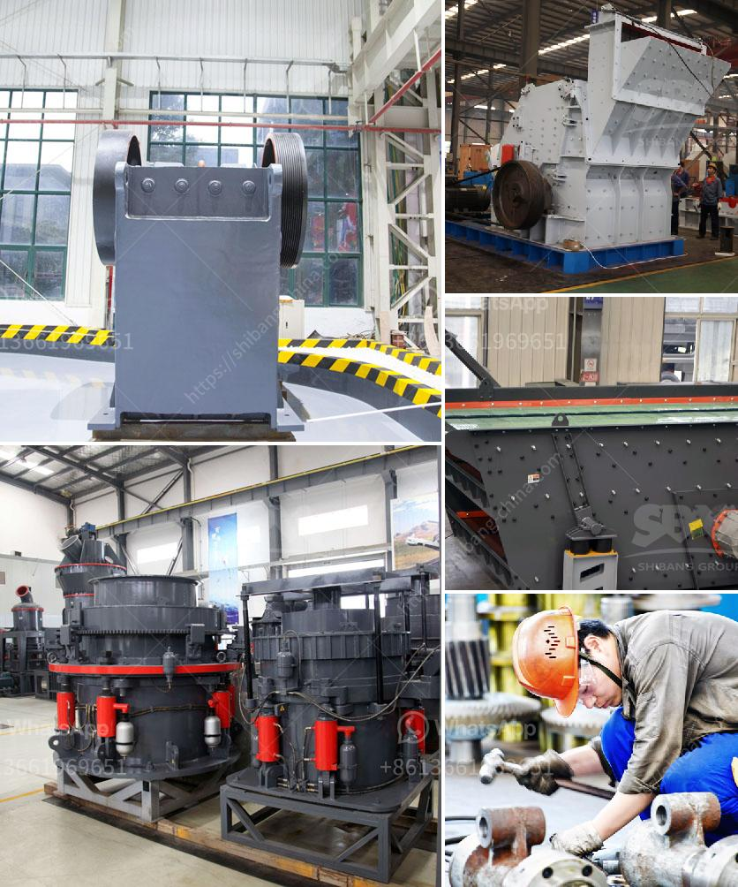

<h3>بيع كسارة تصنيع</h3>
تعتبر صناعة البناء والإنشاء من الصناعات الحيوية في كل دولة، حيث تشهد هذه الصناعة نمواً مستمراً في جميع أنحاء العالم. ومن بين المعدات الأساسية التي يحتاجها قطاع البناء هي الكسارات، التي تقوم بتكسير وسحق المواد الصلبة مثل الصخور والأحجار الكبيرة إلى حجم صغير يسهل العمل بها.

إن الكسارة هي أداة أساسية يعتمد عليها قطاع البناء لتحويل المواد الخام إلى مواد جاهزة للاستخدام في إنشاء المباني والطرق والجسور والأعمال العامة الأخرى. وبالتالي، يعتبر امتلاك كسارة تصنيع ذات جودة عالية أمرًا حاسمًا لضمان توفير المواد اللازمة بشكل دائم وبأسعار معقولة.

تتوفر الكسارات بمختلف الأحجام والأنواع، وتتنوع وفقًا لأحجام وأنواع المواد التي ستتعامل معها. ويعتمد الخيار المثالي لشراء كسارة تصنيع على احتياجات العمل ومدى كفاءة العمل التي يمكن أن توفرها.

فيما يتعلق بالأحجام، الكسارات الصغيرة التي تكسر مواد بحجم يتراوح من 200 إلى 400 ملم هي الأكثر شيوعاً في العديد من الأماكن. يتم استخدام هذه الكسارات في المشاريع الصغيرة وفي الأماكن التي يصعب الوصول إليها بواسطة الكسارات الأكبر حجمًا.

تتميز الكسارات بقدرتها العالية على تحمل الضغط والقوة الكبيرة، وتمكنها من تحويل المواد القاسية إلى حجم يمكن التعامل معه. وتتميز بأنها قادرة على تشغيل لفترات طويلة دون توقف، مما يسهم في زيادة الإنتاجية وتقليل التوقفات غير المخططة.

في النهاية، تُعد شراء كسارة تصنيع ضرورة للشركات والمقاولين في قطاع البناء. إن شراء كسارة بحجم 200-400 ملم يمكنها تلبية الاحتياجات الأساسية لمعظم المشاريع الصغيرة والمتوسطة. ومع مراعاة الجودة والكفاءة، يمكن للمشتري توفير النفقات وضمان استمراريته في العمل ولكسب الثقة والسمعة الجيدة في سوق البناء المحلية.
<h3>Contact us</h3><ul><li><strong>Whatsapp:&nbsp;<a href="https://wa.me/8613661969651">+8613661969651</a></strong></li><li><a href="https://swt.shibang-china.com/?git&amp;zhl&amp;بيع كسارة تصنيع"><strong>Online Service(chat now)</strong></a></li></ul><h3>Related</h3><ul><li><a href='مصنع تعدين الدولوميت في إثيوبيا.md'>مصنع تعدين الدولوميت في إثيوبيا</a></li><li><a href='كسارة صناعية.md'>كسارة صناعية</a></li><li><a href='مصنع تكسير الحصى في جنوب أفريقيا.md'>مصنع تكسير الحصى في جنوب أفريقيا</a></li><li><a href='قائمة مصانع حبيبات خام الحديد في الهند.md'>قائمة مصانع حبيبات خام الحديد في الهند</a></li><li><a href='عملية التئام الذاتي للحجر الجيري.md'>عملية التئام الذاتي للحجر الجيري</a></li></ul>