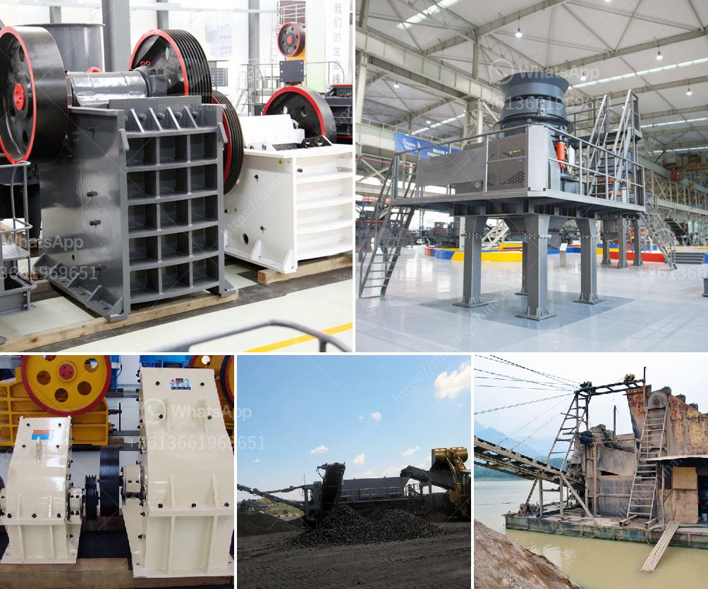

<h3>بيع كسارة طحن إندونيسيا</h3>
تعتبر صناعة البناء والتشييد من الصناعات الحيوية في أي اقتصاد، حيث يعتمد نمو أي دولة على تطور هذا القطاع. ومن أهم الأدوات التي يحتاجها قطاع البناء والتشييد هي الكسارات وآلات الطحن، التي تستخدم لتكسير وطحن المواد الخام المستخدمة في الإنشاءات.

إندونيسيا هي دولة تقع في جنوب شرق آسيا وتتمتع بتراث ثقافي غني، وتشتهر بقطاع البناء والتشييد النشط فيها. ولذلك، فإن بيع كسارة طحن في إندونيسيا يعد فرصة ممتازة للشركات المصنعة والمتخصصة في هذا المجال.

تتميز كسارة طحن بقدرتها على تحويل المواد الصلبة إلى قطع صغيرة، وتسهم في تحضير المواد اللازمة للإنتاج النهائي في قطاع البناء. وبالتالي، فإن الطلب على الكسارات وآلات الطحن في إندونيسيا يزيد سنوياً، بالنظر إلى التطور العمراني والبنى التحتية المتطورة في الدولة.

تعتبر الشركات المصنعة للكسارات وآلات الطحن في إندونيسيا فرصة مهمة للتوسع وزيادة الإنتاجية. يبحث المستثمرون دائمًا عن فرص استثمارية مميزة، ويمكنهم استغلال الطلب المتزايد على الكسارات وآلات الطحن في إندونيسيا. للشركات التي ترغب في بيع كسارات طحن في إندونيسيا، يمكنها استكشاف السوق وإجراء دراسة الجدوى لتحديد الاحتياجات والتوجهات السائدة في القطاع.

بالطبع، هناك منافسة شديدة في سوق الكسارات وآلات الطحن في إندونيسيا، حيث يعتبر العديد من الشركات المحلية والعالمية في هذا المجال. ولذلك، فإن تقديم منتجات عالية الجودة وتطوير التكنولوجيا المستخدمة في تلك الآلات ضروري لجذب العملاء واكتساب الثقة.

بخلاصة، يعتبر بيع كسارة طحن في إندونيسيا فرصة مثيرة للاهتمام. تقدم هذه الصناعة فرص استثمار مميزة للشركات المهتمة بقطاع البناء والتشييد. يجب على الشركات أن تقوم بدراسة السوق وفهم احتياجات العملاء والتوجهات السائدة في هذا القطاع لتحقيق النجاح والانتشار في السوق الإندونيسية.
<h3>Contact us</h3><ul><li><strong>Whatsapp:&nbsp;<a href="https://wa.me/8613661969651">+8613661969651</a></strong></li><li><a href="https://swt.shibang-china.com/?git&amp;zhl&amp;بيع كسارة طحن إندونيسيا"><strong>Online Service(chat now)</strong></a></li></ul><h3>Related</h3><ul><li><a href='جوال محطم الحجر الجيري.md'>جوال محطم الحجر الجيري</a></li><li><a href='مطحق الصخور في الفلبين.md'>مطحق الصخور في الفلبين</a></li><li><a href='مورد سيور ناقلة للفحم من الهند.md'>مورد سيور ناقلة للفحم من الهند</a></li><li><a href='سعر المطحنة للمعادن في بوليفيا.md'>سعر المطحنة للمعادن في بوليفيا</a></li><li><a href='كسارات حجر مستعملة للبيع.md'>كسارات حجر مستعملة للبيع</a></li></ul>