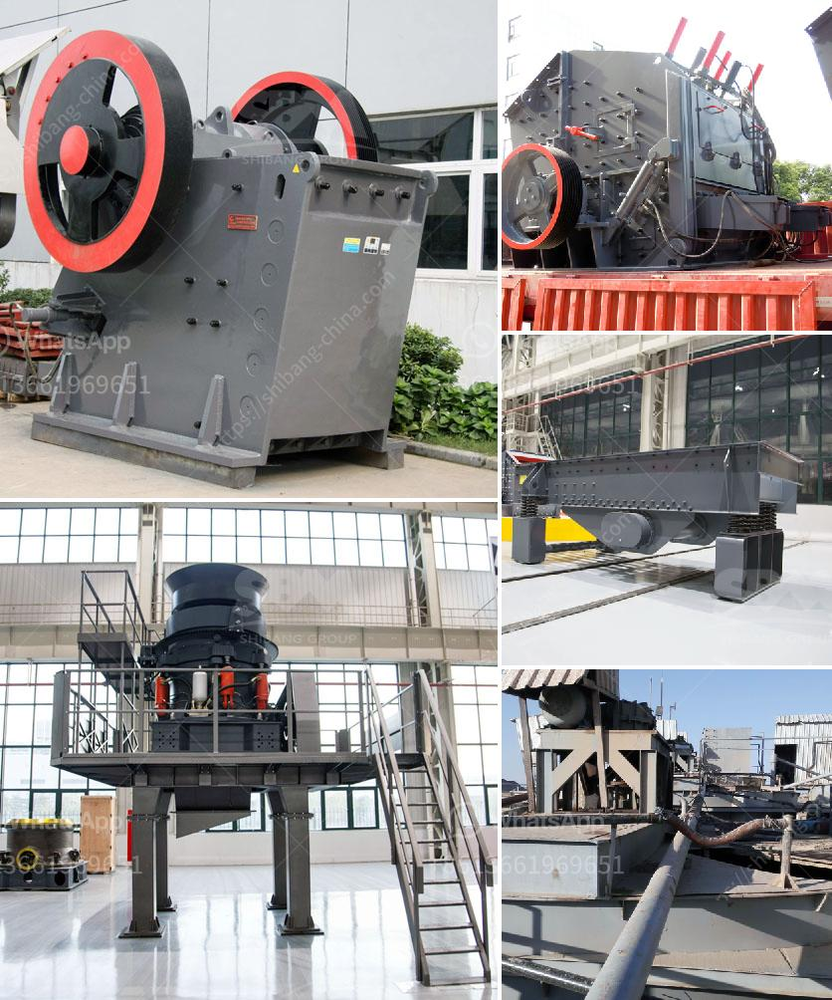

<h3>بيع كسارة مخروط قديمة</h3>
تعتبر كسارات المخروط أحد أهم الأدوات في صناعة التكسير والطحن. وتستخدم لتكسير الصخور الكبيرة وتحويلها إلى قطع صغيرة قابلة للاستخدام في عمليات البناء والطرق وغيرها من المجالات. ومع مرور الوقت والتطور التكنولوجي، يتحدث الكثير من الأشخاص عن الحاجة إلى تحديث واستبدال الآلات القديمة بأحدث التقنيات.

مع ذلك، هناك دائمًا من يكونون مهتمين بشراء الآلات والمعدات المستعملة، وبالتحديد الكسارات المخروطية القديمة. فقد يكون لديهم مشروع بناء صغير، أو يرغبون في توفير المال، أو يبحثون عن جهاز احتياطي للاستخدام في حالات الطوارئ.

إذا كانت لديك كسارة مخروطية قديمة وترغب في بيعها، فهناك بعض النصائح التي يمكن أخذها في الاعتبار لجعل عملية البيع ناجحة. أولاً وقبل كل شيء، عليك أن تقوم بفحص وتقييم حالة الكسارة. قم بإصلاح أي أعطال صغيرة وتأكد من أنها تعمل بشكل جيد قبل عرضها للبيع. علاوة على ذلك، من الضروري حجمة جميع القطع الاستهلاكية والتأكد من سلامة الأجزاء الحيوية. قد تكون هناك حاجة لإعادة طلاء الكسارة أو إجراء أي تحسينات أخرى لاستعادة مظهرها ووظائفها الجيدة.

ثانيًا، يجب عليك تحديد السعر الذي ترغب في بيع الكسارة بناءً على قيمتها الحالية وحالتها، فضلاً عن سوق الكسارات المخروطية المستعملة. قد تستفسر من خبراء في هذا المجال أو تبحث عن أسعار الكسارات المشابهة التي تباع. بعد تحديد السعر المناسب، يمكنك البدء في الترويج للكسارة المخروطية. يُنصح بالإعلان في المواقع المختصة ببيع المعدات الثقيلة أو المضخمات الصوتية المحلية والإعلانات المطبوعة في الصحف المحلية.

أخيرًا، يمكن أن يساعدك تقديم ضمان محدود للكسارة على زيادة فرص بيعها. قد يكون العملاء المحتملين قلقين بشأن شراء آلة قديمة، ولكن الضمان يمكن أن يعطيهم الثقة في أن الكسارة ستكون في حالة جيدة لفترة من الزمن.

عند البيع، يجب التأكد من وجود عقد رسمي يبين شروط ومعلومات البيع وكذلك أي ضمان من البائع. يجب أن يكون العقد موقعًا من قبل الطرفين واحترام الشروط المتفق عليها.

في النهاية، بيع كسارة مخروطية قديمة قد يكون تحديًا، ولكن مع التحضير المناسب والترويج الجيد، يمكنك جذب المشترين المهتمين وإتمام الصفقة بنجاح. قد تجد شخصًا يرغب في استخدامها في مشروع يعود عليه بالفائدة، وبالتالي يمكنك أن تشعر بالارتياح لاستفادته الجيدة من كسارتك واستفادتك بدوره من بيع الكسارة بسعر معقول.
<h3>Contact us</h3><ul><li><strong>Whatsapp:&nbsp;<a href="https://wa.me/8613661969651">+8613661969651</a></strong></li><li><a href="https://swt.shibang-china.com/?git&amp;zhl&amp;بيع كسارة مخروط قديمة"><strong>Online Service(chat now)</strong></a></li></ul><h3>Related</h3><ul><li><a href='مصنع غسيل الذهب بسعة ١٠٠ طن في الساعة.md'>مصنع غسيل الذهب بسعة ١٠٠ طن في الساعة</a></li><li><a href='معدات سحق الصناعات الثقيلة في ماليزيا.md'>معدات سحق الصناعات الثقيلة في ماليزيا</a></li><li><a href='شاشة اهتزازية لرمل الكوارتز.md'>شاشة اهتزازية لرمل الكوارتز</a></li><li><a href='سعر كسارة الفحم القدرة.md'>سعر كسارة الفحم القدرة</a></li><li><a href='مطحنة الأسطوانة العمودية للإسمنت.md'>مطحنة الأسطوانة العمودية للإسمنت</a></li></ul>