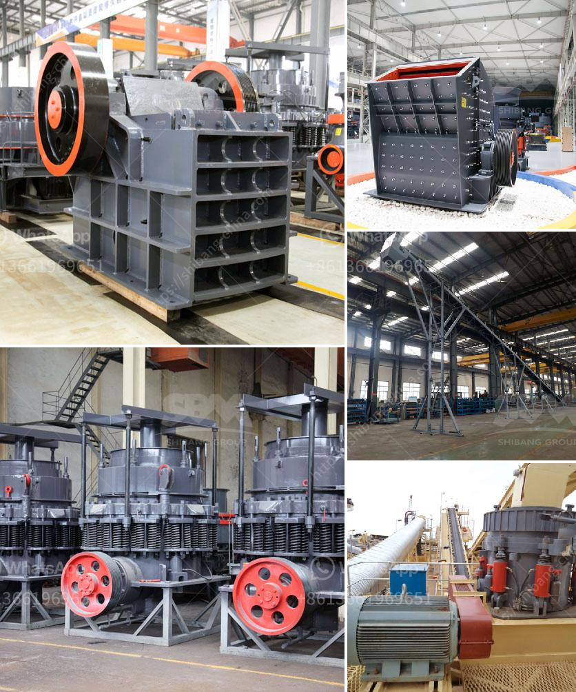

<h3>بيع كسارة مخروطية صنعت في الصين</h3>
في السنوات الأخيرة، شهدت صناعة التعدين ومعالجة المواد الصلبة ازدهارًا ملحوظًا حول العالم. وبسبب الطلب المتزايد على المواد البناءية، أصبحت الكسارات المخروطية أحد الأجهزة الأساسية التي تستخدم لتكسير وطحن المواد الصخرية الصلبة.

ومع تقدم صناعة تصنيع الكسارات في الصين، أصبحت هذه البلدة المشهورة جدًا في تصدير الكسارات المخروطية. ولذلك، يعد شراء كسارة مخروطية صنعت في الصين استثمارًا مواتيًا للعديد من المشاريع المعدنية والتعدينية وتجهيز المواد البناءية.

أولًا، يتمتع المنتج الصيني بسمعة جيدة في العالم بسبب الجودة الممتازة والتكنولوجيا المتقدمة والأسعار التنافسية. فعند شراء كسارة مخروطية صنعت في الصين ستحظى بضمانة بأنك تقتني آلة تعمل بكفاءة عالية وتدوم لفترة طويلة. حيث يتم استخدام مواد عالية الجودة في تصنيع الكسارات المخروطية والتي تضمن عمرًا أطول وتكون مقاومة للتآكل والتآكل.

ثانيًا، بسبب التكلفة الأقل للعمالة في الصين، يوفر لك شراء الكسارة المخروطية صنعت في الصين فوائد مالية كبيرة. فالتكلفة الأقل للعمالة يترجم إلى تكلفة أقل للإنتاج، وهذا يعني أنه يمكنك الحصول على منتج عالي الجودة بسعر تنافسي. وهذا يعزز الربحية ويجعل استثمارك أكثر فعالية.

ثالثًا، تتميز الكسارات المخروطية صنعت في الصين بالموثوقية العالية والتشغيل السهل. حيث يتم تصميمها بطريقة تجعل عملية الصيانة والاستخدام أكثر سهولة. بالإضافة إلى ذلك، تتوفر قطع الغيار بسهولة وبأسعار في المتناول، مما يوفر لك الوقت والجهد في الصيانة والإصلاح.

وأخيرًا، يجب أن يؤخذ في الاعتبار أن شركات تصنيع الكسارات في الصين تلتزم بمعايير الجودة العالمية وتمتلك شهادات توثق جودة المنتجات. فأثناء عملية الشراء، يتمتع المشتري بالاطمئنان إلى أن المنتج مطابق للمواصفات ويتم اختباره وفقًا للمعايير المحددة.

باختصار، استثمار شراء كسارة مخروطية صنعت في الصين هو استثمار مواتٍ وموفر للمال. فهو يمنحك منتجًا عالي الجودة بأسعار معقولة، ويوفر لك تكاليف الإنتاج المنخفضة وتوفير الصيانة السهلة. إذا كنت تخطط لشراء كسارة مخروطية، فشراء منتج صنع في الصين قد يكون الخيار الأفضل بالنسبة لك.
<h3>Contact us</h3><ul><li><strong>Whatsapp:&nbsp;<a href="https://wa.me/8613661969651">+8613661969651</a></strong></li><li><a href="https://swt.shibang-china.com/?git&amp;zhl&amp;بيع كسارة مخروطية صنعت في الصين"><strong>Online Service(chat now)</strong></a></li></ul><h3>Related</h3><ul><li><a href='كسارة الأسطوانة لفحم متنوع الحجم.md'>كسارة الأسطوانة لفحم متنوع الحجم</a></li><li><a href='الدوران الروتوري لكسارة الحجر الجيري.md'>الدوران الروتوري لكسارة الحجر الجيري</a></li><li><a href='معدات تكسير الخرسانة.md'>معدات تكسير الخرسانة</a></li><li><a href='مطاحن الهامر.md'>مطاحن الهامر</a></li><li><a href='كسارة الحجر ساياجي.md'>كسارة الحجر ساياجي</a></li></ul>