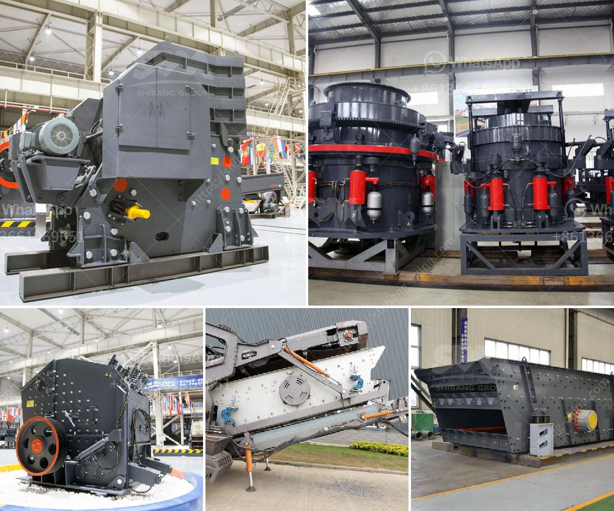

<h3>بيع محطة تكسير الحجارة</h3>
تعتبر محطات تكسير الحجارة أحد الصناعات الرئيسية في قطاع التعدين والإنشاءات. تستخدم هذه المحطات لتحويل الصخور الكبيرة إلى مواد صغيرة ومتناسقة الحجم، والتي يمكن استخدامها في العديد من التطبيقات مثل الطرق والبناء والأساسات. إذا كنت ترغب في بيع محطة تكسير الحجارة، فإليك بعض النقاط المهمة التي يجب أخذها في الاعتبار:

1-الحالة الفنية: يجب التأكد من أن المحطة تعمل بشكل صحيح وأن جميع المكونات الرئيسية موجودة وتعمل بكفاءة. إذا كان هناك أي أعطال أو مشاكل تقنية، يجب تصليحها قبل عرض المحطة للبيع.

2-التحقق من السوق: يجب دراسة السوق قبل بيع المحطة، لمعرفة ما إذا كان هناك طلب كافٍ على محطات تكسير الحجارة في المنطقة الجغرافية المحددة. يمكنك الاطلاع على السوق المحلي والعالمي لتحديد الطلب المحتمل والمشترين المحتملين.

3-التسعير: يجب تحديد سعر مناسب للمحطة، بناءً على حالتها الفنية والمكونات المرفقة وقيمتها. يجب أخذ في الاعتبار أيضًا العمر التشغيلي للمحطة وسوق الطلب المحتمل.

4-التسويق: يجب الترويج للمحطة بشكل فعال من خلال وسائل الإعلام المختلفة، مثل المواقع الإلكترونية المتخصصة والإعلانات المطبوعة والمعارض التجارية. يجب أن تشتمل الحملة الإعلانية على معلومات شاملة عن المحطة وصور واضحة لها.

5-عملية البيع: ينبغي أن تتضمن عملية البيع عقوداً واضحة ومفهومة وملائمة للجانبين. يجب أن تتضمن العقود جميع التفاصيل المهمة مثل الشروط المالية وجدولة الدفع وشروط الضمان.

باختصار، لبيع محطة تكسير الحجارة بنجاح، يجب أن تأخذ في الاعتبار الحالة الفنية للمحطة، التحقق من السوق، تحديد سعر مناسب، الترويج بفعالية وضمان عملية البيع. باتباع هذه الخطوات، يمكنك زيادة فرص نجاح عملية البيع وتحقيق أفضل قيمة للمحطة.
<h3>Contact us</h3><ul><li><strong>Whatsapp:&nbsp;<a href="https://wa.me/8613661969651">+8613661969651</a></strong></li><li><a href="https://swt.shibang-china.com/?git&amp;zhl&amp;بيع محطة تكسير الحجارة"><strong>Online Service(chat now)</strong></a></li></ul><h3>Related</h3><ul><li><a href='طرق التعدين على الذهب الطبيعي في زيمبابوي.md'>طرق التعدين على الذهب الطبيعي في زيمبابوي</a></li><li><a href='عملية تحويل الحجر الجيري إلى الإسمنت.md'>عملية تحويل الحجر الجيري إلى الإسمنت</a></li><li><a href='شركة تصنيع آلة كسارة الحجر.md'>شركة تصنيع آلة كسارة الحجر</a></li><li><a href='تقرير جدوى المشروع حول كسارة الحجر.md'>تقرير جدوى المشروع حول كسارة الحجر</a></li><li><a href='تكسير صخور صغيرة في لاس فيغاس.md'>تكسير صخور صغيرة في لاس فيغاس</a></li></ul>