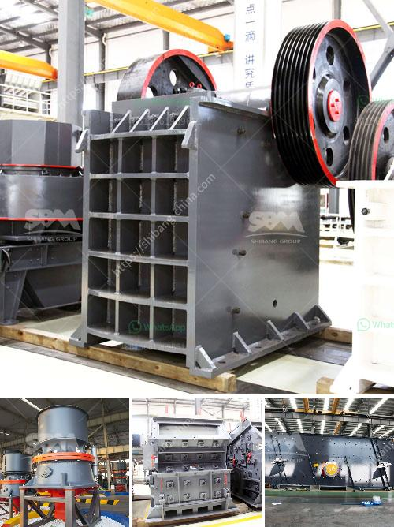

<h3>بيع مطحنة في كاليفورنيا</h3>
في ولاية كاليفورنيا الخلابة في الولايات المتحدة الأمريكية ، توجد العديد من الفرص العقارية الجذابة. واحدة من هذه الفرص هي بيع مطحنة قديمة في كاليفورنيا. تعتبر المطاحن القديمة من العقارات النادرة والمثيرة للاهتمام، حيث تمتاز بالتصميمات المعمارية الجميلة وتاريخها الثقافي الغني.

تقع هذه المطحنة الرائعة في وسط كاليفورنيا وهي تعتبر واحدة من أبرز الأمثلة على مطاحن القرن التاسع عشر. تم بناء المبنى الأصلي للمطحنة في عام 1876 وقد خدمت المجتمع المحلي لعقود طويلة في عملية إنتاج الطحين وطحن الحبوب. تم استخدام مطحنة لوقت طويل قبل أن يتم تحويلها في وقت لاحق إلى سكن ريفي.

تأتي هذه المطحنة بتصميم معماري رائع يحافظ على الجمال التاريخي للمنطقة. تتميز بواجهة حجرية جميلة وتفاصيل خشبية متقنة. يمكن للمشترين المحتملين تجديد المطحنة ومحافظتها على عناصرها التاريخية لإعادتها لسابق عهدها العريق كمجتمع مزدهر.

وتتمتع المطحنة بموقع جغرافي مميز يجعلها خيارًا مثاليًا للمشترين المهتمين بتجربة العيش في الريف. تحيط بها المروج الخضراء الجميلة والزهور المتنوعة، مما يزيد من جاذبيتها الطبيعية. أيضًا، تقع المطحنة بالقرب من العديد من المعالم السياحية المشهورة، مثل الحدائق الوطنية الشهيرة والشلالات الجميلة ومنتجعات التزلج الشهيرة في المنطقة.

وفيما يتعلق بالتجهيزات الداخلية، تتمتع المطحنة بمساحات واسعة ومفتوحة توفر الكثير من الخيارات للعديد من الأنشطة المختلفة. يمكن تحويلها إلى منزل ذو طابع ريفي حديث أو منتجع صحي فاخر أو حتى مركز فنون.

تتوفر هذه المطحنة الرائعة للبيع بسعر يتراوح بين 200,000 دولار إلى 400,000 دولار. تلك الأسعار قد تشمل أرض محيطة بالمطحنة، مما يوفر فرصة لتوسيع المساحة الخارجية أو تطوير مشاتل أو حدائق خاصة.

في النهاية، يعد بيع مطحنة في كاليفورنيا فرصة فريدة للاستثمار في قطعة تاريخية رائعة، إضافة إلى العيش في بيئة طبيعية مدهشة. سواء كنت تبحث عن مكان للإقامة المستقلة أو فكرة لمشروع تجاري ، فإن بيع مطحنة في كاليفورنيا سيكون خيارًا مهمًا ومغريًا.
<h3>Contact us</h3><ul><li><strong>Whatsapp:&nbsp;<a href="https://wa.me/8613661969651">+8613661969651</a></strong></li><li><a href="https://swt.shibang-china.com/?git&amp;zhl&amp;بيع مطحنة في كاليفورنيا"><strong>Online Service(chat now)</strong></a></li></ul><h3>Related</h3><ul><li><a href='أسعار كسارة الحجر في إندونيسيا.md'>أسعار كسارة الحجر في إندونيسيا</a></li><li><a href='كسارة على أساس الإيجار في نيجيريا.md'>كسارة على أساس الإيجار في نيجيريا</a></li><li><a href='معدات التعدين في جنوب أفريقيا.md'>معدات التعدين في جنوب أفريقيا</a></li><li><a href='تكلفة آلة سحق الحجر كسارة الحجر.md'>تكلفة آلة سحق الحجر كسارة الحجر</a></li><li><a href='مصنع لطحن الحجر الجيري والجبس للإسمنت.md'>مصنع لطحن الحجر الجيري والجبس للإسمنت</a></li></ul>