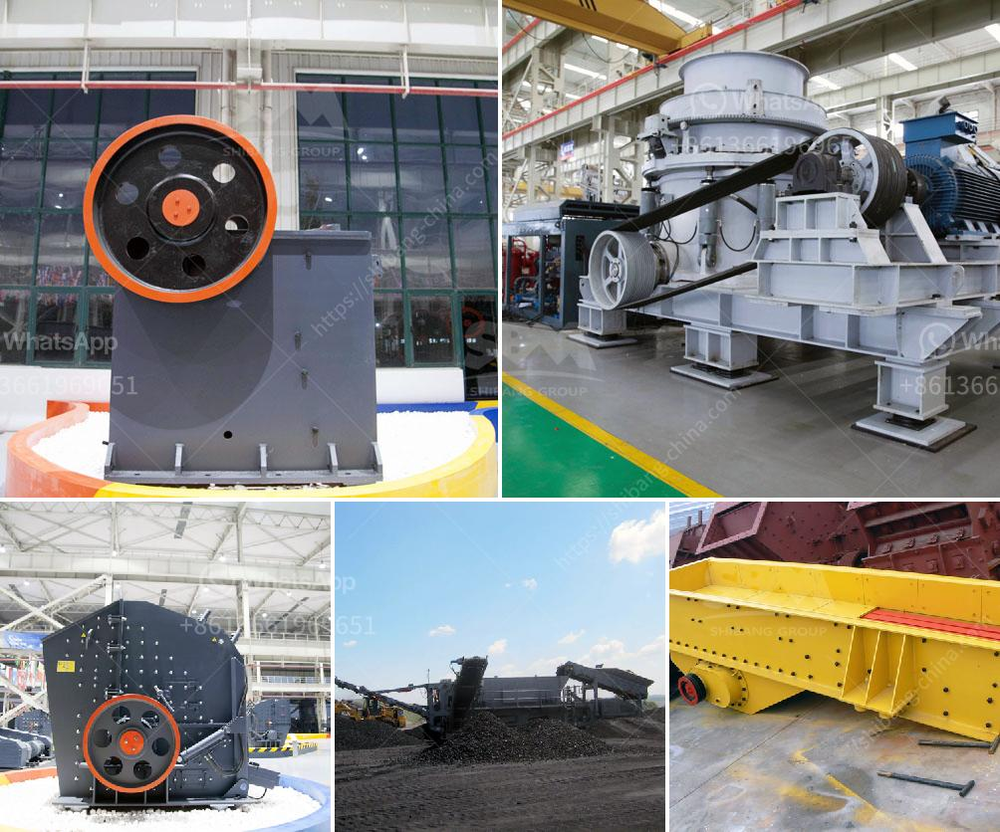

<h3>تأجير حزام الناقل في أيرلندا</h3>
في أيرلندا، يمكن للمسافرين والعمال الاستمتاع بخدمة تأجير حزام الناقل التي تتيح لهم نقل الأمتعة بكل سهولة وراحة. تعد خدمة تأجير حزام الناقل إضافة رائعة لرحلات السفر أو لنقل البضائع والأمتعة الثقيلة في المدينة. سنستعرض في هذه المقالة أهمية تأجير حزام الناقل وما يتضمنه هذا الخيار في أيرلندا.

توفر شركات تأجير حزام الناقل في أيرلندا مجموعة واسعة من الخيارات لعملائها. يمكن للمستأجرين اختيار نوع الحزام الناقل الذي يناسب احتياجاتهم بناءً على حجم ووزن البضائع التي يرغبون في نقلها. قد يتوفر الحزام الناقل بطول مختلف ومعدات إضافية، مثل السلالم المتحركة، لتسهيل عملية التحميل والتفريغ. إن مرونة هذه الخدمة تعزز من قدرة العميل على استخدامها بطريقة تتناسب مع احتياجاتهم الفردية.

تأجير حزام الناقل في أيرلندا يوفر العديد من المزايا للمستأجرين. أحد هذه المزايا هو سهولة الوصول إلى الحزام الناقل عند الحاجة. يمكن للعملاء أن يستأجروا الحزام الناقل لعدة ساعات أو أيام وفقًا لاحتياجاتهم. بالإضافة إلى ذلك، يمكن للمستأجرين استخدام الحزام الناقل في أي مكان بداخل البلاد، مما يعني أنهم لن يكونوا محدودين بتنقلاتهم في مدينة واحدة فقط.

تعد تكلفة استئجار حزام الناقل في أيرلندا معقولة وتتناسب مع ميزانية معظم الناس. يتم تحديد السعر بناءً على فترة التأجير ونوع الحزام المطلوب. قد تتراوح تكلفة تأجير الحزام الناقل بين 200 و 400 أورو. بالنسبة للعملاء الذين يحتاجون إلى تنقلات متكررة أو لفترة طويلة، قد يكون هناك خصومات متاحة.

يجب الإشارة إلى أن تأجير حزام الناقل في أيرلندا هو خيار يتمتع بشعبية كبيرة لدى السكان المحليين والزائرين على حد سواء. لا يمكن إنكار أن وجود هذه الخدمة يتسبب في تبسيط حركة البضائع والأمتعة، وبالتالي يحافظ على سلاسة حركة المرور في المدينة. كما يعتبر تأجير حزام الناقل وسيلة مستدامة لنقل البضائع، حيث يتم إعادة استخدام الحزام وتقليل الهدر بشكل عام.

في الختام، يعتبر تأجير حزام الناقل من الخدمات القيمة التي يمكن الاستفادة منها في أيرلندا. مع تكلفة معقولة وسهولة الوصول إليها، فإن هذه الخدمة توفر حلاً موثوقًا لنقل الأمتعة والبضائع الثقيلة بطريقة مريحة وفعالة. إن تعدد خيارات الحزام الناقل وقابليته للتكيف مع متطلبات العميل تزيد من فائدته وشعبيته بين المسافرين والعمال في أيرلندا.
<h3>Contact us</h3><ul><li><strong>Whatsapp:&nbsp;<a href="https://wa.me/8613661969651">+8613661969651</a></strong></li><li><a href="https://swt.shibang-china.com/?git&amp;zhl&amp;تأجير حزام الناقل في أيرلندا"><strong>Online Service(chat now)</strong></a></li></ul><h3>Related</h3><ul><li><a href='تجار الكسارات المحمولة في جنوب أفريقيا.md'>تجار الكسارات المحمولة في جنوب أفريقيا</a></li><li><a href='مصنع جفاف الفحم في الهند.md'>مصنع جفاف الفحم في الهند</a></li><li><a href='سعر كسارة الحجر المحمولة في الفلبين.md'>سعر كسارة الحجر المحمولة في الفلبين</a></li><li><a href='كسارة الخرسانة المصنوعة في اليابان.md'>كسارة الخرسانة المصنوعة في اليابان</a></li><li><a href='موردي آلات الأسمنت ووحدة الطحن.md'>موردي آلات الأسمنت ووحدة الطحن</a></li></ul>