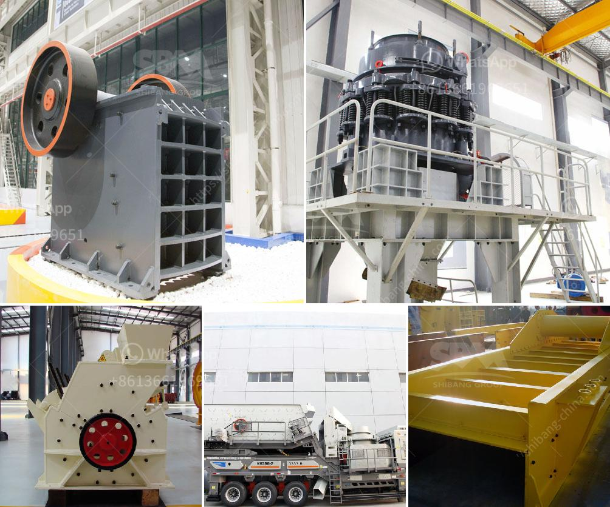

<h3>تأجير سيارات الكسارة في كالتيم</h3>
تشتهر مدينة كالتيم بأنها واحدة من أهم المدن السياحية في العالم، حيث تجذب الآلاف من السياح سنويًا. ومن ضمن الخدمات التي يبحث عنها السياح هناك هو تأجير سيارات الكسارة.

سيارات الكسارة هي سيارات صغيرة ذات تصميم يسمح للسائق بالقيادة على الطرق الوعرة والغير ممهدة بسهولة وأمان. فهي تتميز بقوة المحرك ومرونتها في التنقل، مما يجعلها مناسبة للاستخدام في الأماكن التي تفتقد التجهيزات الطرقية اللازمة.

تأجير سيارات الكسارة في كالتيم يقدم العديد من الفوائد للسياح، ومنها:

1. تجربة فريدة من نوعها: يمكن للسائحين أن يستمتعوا بتجربة قيادة السيارة على الطرق الوعرة واستكشاف المناظر الطبيعية الخلابة التي تحيط بمدينة كالتيم. فإن استئجار سيارة الكسارة يضيف المغامرة والتشويق إلى رحلتهم.

2. الوصول إلى الأماكن التي يصعب الوصول إليها: تسمح سيارات الكسارة للسياح بالوصول إلى الأماكن التي يصعب الوصول إليها بالسيارات التقليدية. فإنها تعتبر الخيار المثالي للسياح الذين يرغبون في استكشاف المناطق الجبلية والمناطق النائية التي تتمتع بطبيعة خلابة.

3. الحرية والمرونة: يمنح تأجير سيارات الكسارة السياح الحرية والمرونة في تنظيم رحلاتهم وجدولتها. يستطيع السائحون تعديل خططهم وزيارة المزيد من الأماكن دون قيود النقل العام.

4. الخدمات المتميزة: تعمل شركات تأجير سيارات الكسارة في كالتيم على توفير خدمات عالية الجودة لعملائها. فهم يقدمون سيارات حديثة ومجهزة بأحدث التقنيات والمرافق لضمان حصول السائحين على تجربة مرضية ومريحة.

باختصار، تأجير سيارات الكسارة في كالتيم يعد الخيار المثالي للسياح الذين يرغبون في استكشاف المناظر الطبيعية الخلابة والوصول إلى الأماكن التي تصعب الوصول إليها بواسطة السيارات التقليدية. بفضل الحرية والمرونة التي توفرها سيارات الكسارة، يمكن للسائحين تجربة رحلة فريدة من نوعها في كالتيم.
<h3>Contact us</h3><ul><li><strong>Whatsapp:&nbsp;<a href="https://wa.me/8613661969651">+8613661969651</a></strong></li><li><a href="https://swt.shibang-china.com/?git&amp;zhl&amp;تأجير سيارات الكسارة في كالتيم"><strong>Online Service(chat now)</strong></a></li></ul><h3>Related</h3><ul><li><a href='آلة تكبير الفحم الدقيقة في الهند.md'>آلة تكبير الفحم الدقيقة في الهند</a></li><li><a href='كرات كربونات الكالسيوم.md'>كرات كربونات الكالسيوم</a></li><li><a href='سعر آلة تصنيع لوحات الجبس.md'>سعر آلة تصنيع لوحات الجبس</a></li><li><a href='معدات مستخدمة في تعدين الفحم.md'>معدات مستخدمة في تعدين الفحم</a></li><li><a href='سعر مصنع خام الحديد للبيع في المكسيك.md'>سعر مصنع خام الحديد للبيع في المكسيك</a></li></ul>