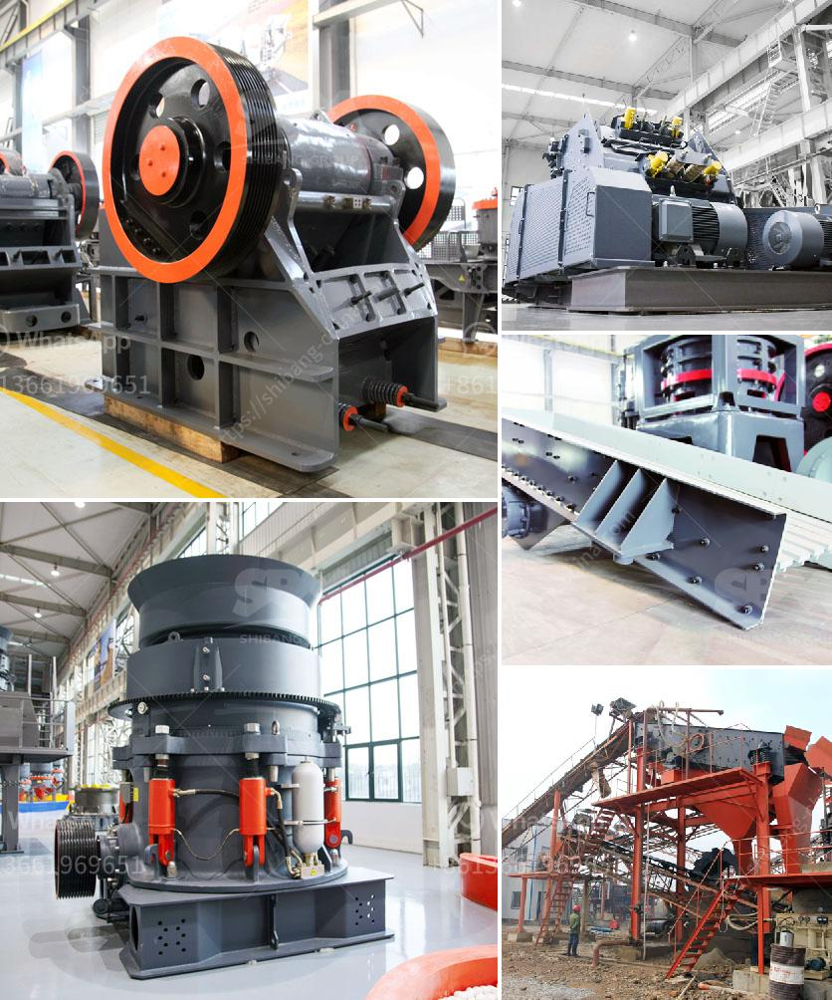

<h3>تأجير كسارة إعادة تدوير الخرسانة</h3>
تتمثل التحديات البيئية في عصرنا الحالي في إيجاد طرق فعالة ومستدامة لإدارة النفايات والحفاظ على الموارد الطبيعية. واحدة من هذه الطرق التي تحظى بشعبية متزايدة هي إعادة تدوير الخرسانة. وتلعب كسارات إعادة تدوير الخرسانة دورًا هامًا في هذا العملية، حيث تقوم بتكسير الخرسانة القديمة واستخدامها في إنتاج خرسانة جديدة.

تعد كسارات إعادة تدوير الخرسانة مفيدة على العديد من الجوانب. أولاً، يتم تقليل كمية النفايات التي يتم التخلص منها في المقالع أو المواقع البنائية. وبدلاً من ذلك، يتم استغلال الخرسانة القديمة بشكل فعال وإعادة استخدامها في البناء. ثانيًا، تساهم هذه الكسارات في زيادة الاستدامة البيئية، حيث تقلل من انبعاثات ثاني أكسيد الكربون المرتبطة بإعادة إنتاج الخرسانة بشكل تقلص كبير.

بالإضافة إلى ذلك، تعتبر كسارات إعادة تدوير الخرسانة مفيدة للمقاولين والمطورين العقاريين. فعندما يستأجرون كسارة إعادة تدوير الخرسانة، يتمكنون من إعادة استخدام الخرسانة القديمة الموجودة في مواقع البناء، مما يوفر لهم تكاليف الشراء والشحن والتخلص من الخرسانة الجديدة. بالإضافة إلى ذلك، قد يعتبر الاستخدام المستمر لكسارة إعادة تدوير الخرسانة مصدرًا للإيرادات، إذ يمكن استئجارها لمقاولين آخرين ومشاريع أخرى.

من الواضح أن تأجير كسارة إعادة تدوير الخرسانة يمثل بديلًا فعالًا واقتصاديًا لإعادة استخدام الخرسانة القديمة وتحقيق الاستدامة البيئية. يمكن للمقاولين والمطورين الاستفادة من هذه التكنولوجيا المتقدمة لتحقيق المزيد من الفوائد الاقتصادية والبيئية. وبالتالي، يتوجب على الجميع أن يقدروا الأهمية البيئية والاقتصادية لإعادة تدوير الخرسانة واستخدام تقنية كسارة إعادة تدوير الخرسانة لتحقيق عالم أفضل وأكثر استدامة.
<h3>Contact us</h3><ul><li><strong>Whatsapp:&nbsp;<a href="https://wa.me/8613661969651">+8613661969651</a></strong></li><li><a href="https://swt.shibang-china.com/?git&amp;zhl&amp;تأجير كسارة إعادة تدوير الخرسانة"><strong>Online Service(chat now)</strong></a></li></ul><h3>Related</h3><ul><li><a href='معلمات كسارة 250 طن في الساعة.md'>معلمات كسارة 250 طن في الساعة</a></li><li><a href='مطاحن الكرة الأرجنتينية.md'>مطاحن الكرة الأرجنتينية</a></li><li><a href='كسارة الحجر الجرانيت الهند.md'>كسارة الحجر الجرانيت الهند</a></li><li><a href='سعر آلة طحن الرخام.md'>سعر آلة طحن الرخام</a></li><li><a href='شركة تصنيع كسارة الفك الدورانية في الهند.md'>شركة تصنيع كسارة الفك الدورانية في الهند</a></li></ul>