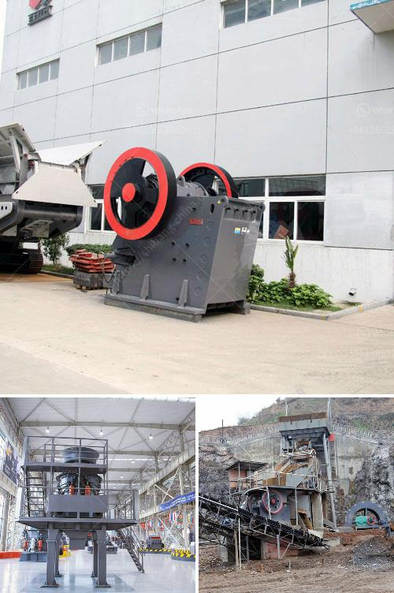

<h3>تأجير كسارة تأجير في غانا</h3>
تُعتبر غانا وجهةً رئيسية لصناعة البناء في غرب أفريقيا، حيث يتم إنشاء المباني والطرق والمشاريع الأخرى بشكلٍ متزايد. ولتلبية احتياجات هذه الصناعة النامية، أصبحت خدمة تأجير الكسارات في غانا شائعةً ومنتشرةً. 

إن تأجير الكسارة هو عملية تتيح للشركات والمقاولين استئجار معدات الكسارة لاستخدامها في إنتاج وتكسير الحجارة والصخور لأغراض البناء. يمتلك تأجير الكسارة العديد من الفوائد التي تجعله الاختيار الأمثل في غانا.

أحد أبرز الفوائد هو توفير التكاليف العالية لشراء آلات الكسارة الجديدة. إذا قررت الشركة أو المقاول استئجار كسارة، فإنها لن تضطر لاستخدام جزء كبير من رأس المال لشراء أو صيانة الكسارة، بل ستدفع رسوماً شهرية معتدلة لاستخدامها فقط. هذا سيساعد الشركة على توفير المزيد من الأموال للاستثمار في مشاريع أخرى، وتوفير فرص عمل إضافية.

بالإضافة إلى ذلك، تأجير الكسارة يعطي الشركة المرونة اللازمة لتلبية احتياجات المشروع. فإذا زادت أعمال البناء واحتاجت الشركة إلى المزيد من المعدات، يمكنها بسهولة زيادة عدد الكسارات المستأجرة دون الانتظار لشراء وصيانة الكسارات الإضافية. هذا يساعد في تلبية المتطلبات الزمنية وتنفيذ المشاريع في الوقت المحدد.

أيضًا، يمكن للشركات المقاولة استفادة من خبرة فنيي التأجير الذين يمكنهم تقديم الدعم الفني والصيانة اللازمة. يمكن لهؤلاء الفنيين أن يساعدوا في تثبيت وتشغيل الكسارة بشكلٍ صحيح، والتأكد من سلامتها وفعاليتها. هذا يضمن أن المقاول سيتمتع بأداءٍ ممتاز ومستدام للكسارة خلال فترة الإيجار.

في النهاية، يمكننا القول إن تأجير الكسارة في غانا هو حلاً فعالًا لمتطلبات صناعة البناء المتزايدة. إنه يوفر الاقتصاد والمرونة والدعم الفني لتلبية الاحتياجات المتغيرة للشركات والمقاولين. إذا كنتم تعملون في صناعة البناء في غانا، فإن تأجير الكسارة هو خيارك الأمثل للنجاح والتوسع في هذا المجال المزدهر.
<h3>Contact us</h3><ul><li><strong>Whatsapp:&nbsp;<a href="https://wa.me/8613661969651">+8613661969651</a></strong></li><li><a href="https://swt.shibang-china.com/?git&amp;zhl&amp;تأجير كسارة تأجير في غانا"><strong>Online Service(chat now)</strong></a></li></ul><h3>Related</h3><ul><li><a href='موردين استفادة خام الحديد.md'>موردين استفادة خام الحديد</a></li><li><a href='المعدات المطلوبة لتعدين الفحم.md'>المعدات المطلوبة لتعدين الفحم</a></li><li><a href='مطحنة طحن ألمانية.md'>مطحنة طحن ألمانية</a></li><li><a href='سعر كسارة الفحم القدرة.md'>سعر كسارة الفحم القدرة</a></li><li><a href='تجار كسارات الحجر الكوارتز.md'>تجار كسارات الحجر الكوارتز</a></li></ul>