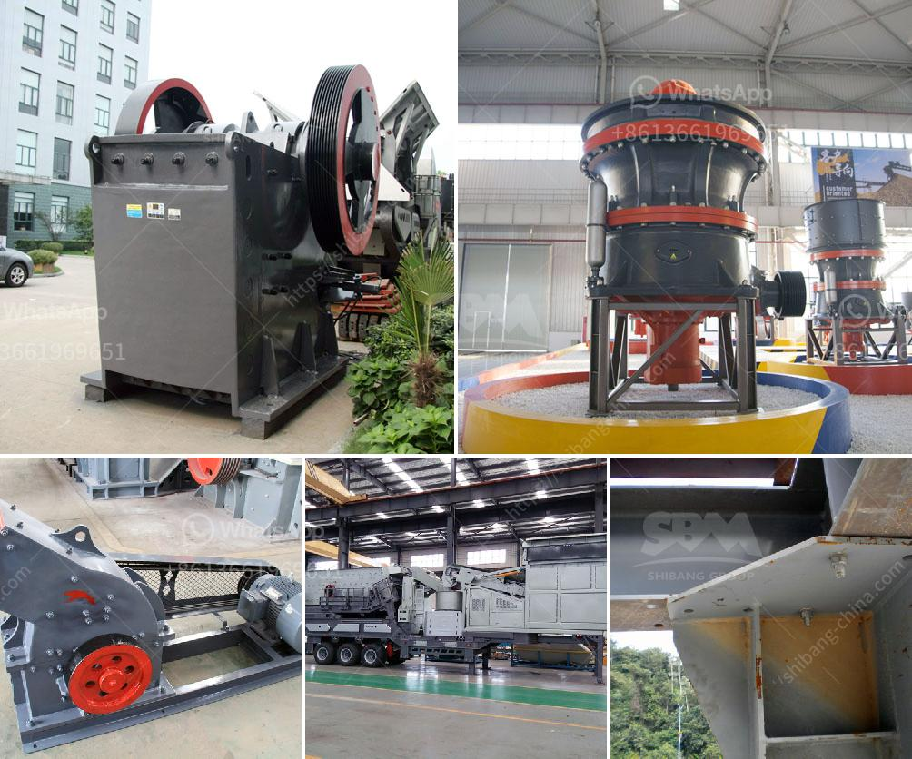

<h3>تأجير معدات التعدين في إندونيسيا</h3>
يعد قطاع التعدين في إندونيسيا أحد القطاعات الهامة للاقتصاد الوطني، حيث تعد البلاد أحد أكبر منتجي المعادن في العالم. ولتحقيق أقصى استفادة من هذا القطاع، يعتمد على توفير المعدات والآلات اللازمة لعمليات التعدين. وهنا يأتي دور تأجير معدات التعدين في تلبية احتياجات الشركات والمقاولين والمستثمرين.

يُعتبر تأجير المعدات أحد الخيارات الأكثر فعالية واقتصادية للحصول على المعدات المطلوبة للتعدين في إندونيسيا. حيث تتوفر العديد من شركات تأجير المعدات التعدينية المحلية والدولية التي تقدم مجموعة متنوعة من المعدات التي تتناسب مع احتياجات العملاء المختلفة.

توفر شركات تأجير المعدات التعدينية جميع أنواع المعدات المهمة والضرورية لعمليات التعدين في إندونيسيا، بما في ذلك الحفارات والجرافات وآلات الحفر العملاقة وشاحنات النقل ومعدات المعالجة وغيرها. كما يتم توفير الصيانة اللازمة لتلك المعدات من قبل فرق الفنيين المتخصصين.

فوائد تأجير معدات التعدين في إندونيسيا هي عديدة. فبدلاً من شراء المعدات بالكامل، يمكن للشركات والمقاولين استئجار المعدات للفترة التي يحتاجونها فقط، مما يساعدهم على تقليل التكاليف الرأسمالية. هذا يتيح لهم توجيه المزيد من الأموال لعمليات التعدين الأساسية وتحسين أدائها بشكل عام.

علاوة على ذلك، توفر شركات تأجير المعدات التعدينية معدات حديثة ومتطورة تساعد على زيادة كفاءة وإنتاجية عمليات التعدين. فالمعدات الحديثة تتميز بتقنيات متقدمة وقدرات أعلى، مما يساهم في تحقيق أفضل النتائج وتقليل فترة التوقف والأعطال غير المخطط لها.

أخيرًا، يتيح تأجير المعدات التعدينية للشركات المرونة في التعامل مع التغيرات في احتياجات المشروعات والطلب على المعدات. فبفضل هذا النهج، يمكن زيادة أو تقليل عدد المعدات حسب الحاجة، مما يتيح فرصًا أكبر للتوسع والنمو للشركات التعدينية في إندونيسيا.

في الختام، يمكن القول أن تأجير معدات التعدين في إندونيسيا يعتبر خيارًا ممتازًا يتيح للشركات توفير التكاليف والحصول على المعدات الحديثة والمتطورة، بالإضافة إلى المرونة في التعامل مع التغيرات في احتياجات المشاريع. وبالتالي، فإن استخدام خدمات تأجير المعدات التعدينية يساهم في تعزيز قطاع التعدين في البلاد وتعزيز الاقتصاد الوطني.
<h3>Contact us</h3><ul><li><strong>Whatsapp:&nbsp;<a href="https://wa.me/8613661969651">+8613661969651</a></strong></li><li><a href="https://swt.shibang-china.com/?git&amp;zhl&amp;تأجير معدات التعدين في إندونيسيا"><strong>Online Service(chat now)</strong></a></li></ul><h3>Related</h3><ul><li><a href='كسارة الحجر في تركيا.md'>كسارة الحجر في تركيا</a></li><li><a href='سعر مصنع تعدين الذهب في الصين.md'>سعر مصنع تعدين الذهب في الصين</a></li><li><a href='مطاحن تلك جنوب أفريقيا.md'>مطاحن تلك جنوب أفريقيا</a></li><li><a href='مصنع تكسير الكروم.md'>مصنع تكسير الكروم</a></li><li><a href='كسارة الحجر الهامر.md'>كسارة الحجر الهامر</a></li></ul>