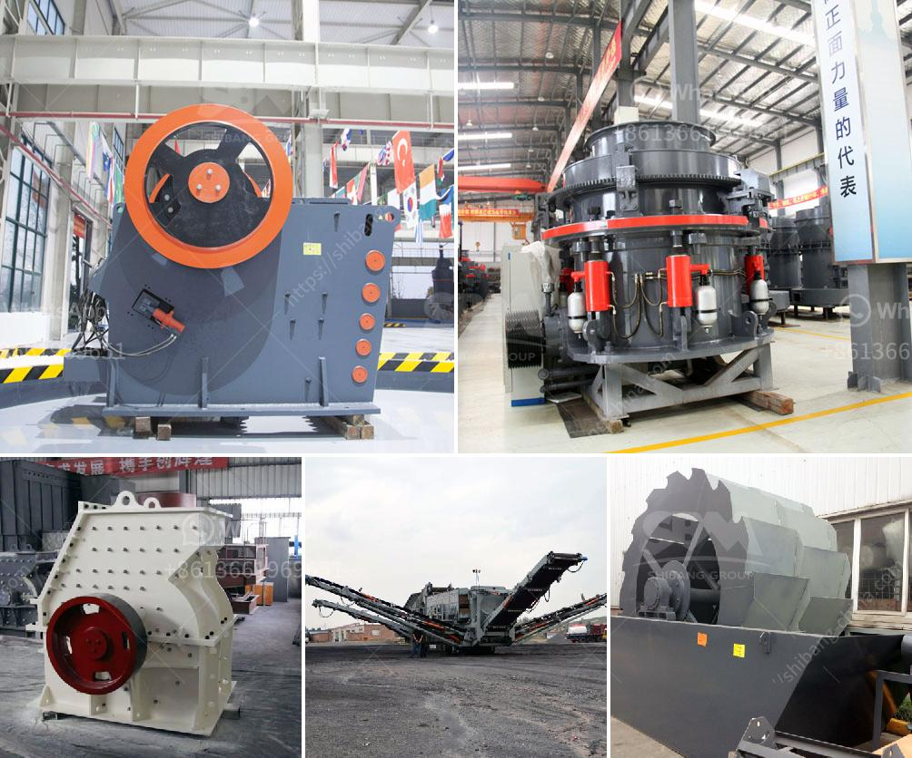

<h3>تاجر آلة طحن في بنجلاديش</h3>
تجمع بنجلاديش بين تاريخها العريق واقتصادها الحديث، فهي واحدة من الدول النامية التي تعاني من الفقر المدقع وارتفاع معدلات البطالة. ومع ذلك، يوجد في البلاد فئة من التجار الذين يعملون جاهدين على تحسين الوضع الاقتصادي وتوفير فرص عمل للسكان المحليين. ومن بين هؤلاء التجار، يأتي تاجر آلة طحن المطاحن، الذي يلعب دوراً حيوياً في صناعة الغذاء في بنجلاديش.

تعتبر صناعة تجارة طحن الحبوب من أكثر الصناعات ازدهاراً في البلاد، فبنجلاديش من أكبر منتجي الأرز والقمح في العالم. وبالتالي، فإن تاجر آلة طحن المطاحن يلعب دورًا حاسمًا في تلبية احتياجات السكان المحليين من الطحين، الذي يعد المكون الأساسي في الغذاء.

يقوم تاجر آلة طحن بشراء آلات طحن المطاحن وتسويقها في البلاد، كما يقوم بتوفير الدعم الفني والتقني للعملاء. وتتنوع المطاحن التي يقوم التاجر بتسويقها من الصغيرة إلى الكبيرة، بحيث يمكن استخدامها في البيوت والمشاريع الصغيرة وحتى المشاريع الصناعية الكبيرة.

بالإضافة إلى ذلك، فإن تاجر آلة طحن يشارك في تنمية الاقتصاد المحلي من خلال توفير فرص عمل للعمال المحليين. حيث يتطلب تشغيل مطحنة طحن الحبوب عمالة ماهرة في مجالات مختلفة مثل الصيانة الفنية والإنتاج والتعبئة. وبالتالي، فإن عمل هؤلاء العمال يسهم في زيادة مستوى الدخل الشخصي وتحسين الظروف المعيشية للأسر المحلية.

تواجه تجارة طحن المطاحن في بنجلاديش تحديات عديدة، مثل القيود المالية والسياسية والتنظيمية. لكن تاجر آلة الطحن الماهر يجتاز هذه التحديات ويحافظ على استمرارية أعماله، بفضل مهارته في التسويق واستخدامه للابتكار في تطوير منتجاته وتقديم خدمات التدريب والدعم للعملاء.

في الختام، يمكن القول إن تجارة طحن المطاحن تلعب دورًا هامًا في توفير فرص العمل وتحسين الاقتصاد المحلي في بنجلاديش. تاجر آلة طحن المطاحن يمثل مثالًا على مجموعة من التجار الذين يسعون للنمو والتطور الاقتصادي، بالإضافة إلى تلبية احتياجات السكان المحليين من الغذاء الأساسي.
<h3>Contact us</h3><ul><li><strong>Whatsapp:&nbsp;<a href="https://wa.me/8613661969651">+8613661969651</a></strong></li><li><a href="https://swt.shibang-china.com/?git&amp;zhl&amp;تاجر آلة طحن في بنجلاديش"><strong>Online Service(chat now)</strong></a></li></ul><h3>Related</h3><ul><li><a href='آلة الكالسيوم كاربونات الحجر.md'>آلة الكالسيوم كاربونات الحجر</a></li><li><a href='أسعار كسارات الخرسانة.md'>أسعار كسارات الخرسانة</a></li><li><a href='حجم كسارة الفك pe 600x900.md'>حجم كسارة الفك pe 600x900</a></li><li><a href='مطحنة المطرقة ستال ميستر للبيع.md'>مطحنة المطرقة ستال ميستر للبيع</a></li><li><a href='توازن المواد والطاقة لكسارة الفك.md'>توازن المواد والطاقة لكسارة الفك</a></li></ul>