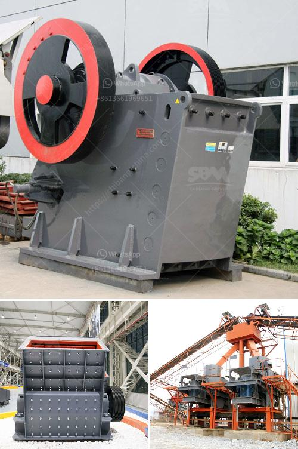

<h3>تاجر شاشة اهتزاز في الفلبين</h3>
تاجر الشاشة الهزازة في الفلبين: المهنة الرائجة والمهمة للتطوير الاقتصادي

تعتبر صناعة الشاشات الهزازة من الصناعات الناشئة في العالم، وتستخدم في العديد من التطبيقات مثل الأجهزة الإلكترونية، وأجهزة الهاتف المحمولة، والألعاب، وصناعة السيارات. وتعد الفلبين واحدة من الدول الرائدة في إنتاج وتصدير هذه الشاشات الهزازة.

تعمل صناعة الشاشات الهزازة على تصميم وتصنيع الأجزاء الحركية الصغيرة التي تتحرك بصورة متقطعة لخلق حركة هزازة. ويتم استخدام هذه الشاشات في العديد من التطبيقات، من المدمج في الهواتف الذكية إلى التطبيقات الصناعية الأكثر تخصصًا.

تضم الصناعة الفلبينية للشاشات الهزازة العديد من الشركات الصغيرة والمتوسطة التي تعمل على إنتاج وتصدير هذه الشاشات إلى العديد من الدول حول العالم. تعمل هذه الشركات على توفير أحدث التقنيات في تصميم وتصنيع الشاشات الهزازة، مما يساعد في تعزيز التجارة والتنمية الاقتصادية في الفلبين.

وتوفر هذه الصناعة فرص عمل هامة للكثير من العاملين في الفلبين. حيث تشمل هذه الوظائف التصميم والهندسة والبحث والتطوير والتصنيع والتجارة. بالإضافة إلى ذلك، تعزز الصناعة الفلبينية للشاشات الهزازة المزيد من الاستثمارات في البلاد، مما يساهم في تنمية البنية التحتية وتطوير الصناعات الأخرى.

يعمل تاجر الشاشات الهزازة على تجميع الشاشات وتحضيرها للتوزيع في السوق المحلية والعالمية. يقومون بالتفاوض مع المصنعين والتجار المحليين والدوليين لضمان توفير شاشات ذات جودة عالية بأسعار مناسبة. وتلعب مهارات التجارة الهامة دورًا كبيرًا في تحقيق النجاح في هذه المهنة.

وعلى الرغم من أن صناعة الشاشات الهزازة تعتبر ناشئة، إلا أنها تحظى بشعبية كبيرة بين المصنعين والمستهلكين، مما يفتح الباب لفرص تجارية جديدة ونمو اقتصادي مستدام للفلبين.

باختصار، يعد تاجر الشاشات الهزازة في الفلبين واحدًا من أعمدة التنمية الاقتصادية في البلاد. حيث تساهم هذه الصناعة الناشئة في توفير فرص عمل وتعزيز الاستثمار وتطوير الصناعات الأخرى. وبفضل الابتكار والتطور التكنولوجي، يمكن التوقع أن تتوسع هذه الصناعة بشكل أكبر في المستقبل وتساهم في الازدهار الاقتصادي للفلبين.
<h3>Contact us</h3><ul><li><strong>Whatsapp:&nbsp;<a href="https://wa.me/8613661969651">+8613661969651</a></strong></li><li><a href="https://swt.shibang-china.com/?git&amp;zhl&amp;تاجر شاشة اهتزاز في الفلبين"><strong>Online Service(chat now)</strong></a></li></ul><h3>Related</h3><ul><li><a href='كسارات الحجر للبيع في المملكة المتحدة.md'>كسارات الحجر للبيع في المملكة المتحدة</a></li><li><a href='مطحنة الكرات المطحنة في الهند.md'>مطحنة الكرات المطحنة في الهند</a></li><li><a href='اتصالات أحزمة الناقلات.md'>اتصالات أحزمة الناقلات</a></li><li><a href='شركات تكسير الحجر في بيرو.md'>شركات تكسير الحجر في بيرو</a></li><li><a href='مقترح مشروع أعمال لكسارة الحجر.md'>مقترح مشروع أعمال لكسارة الحجر</a></li></ul>