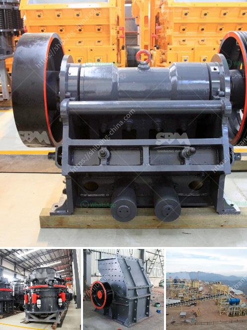

<h3>تاجر كسارة الحجر في الصين</h3>
تعد صناعة التعدين والبناء من الصناعات الحيوية في الصين، وتلعب الكسارات الحجرية دورًا هامًا في هذا القطاع. ويوجد العديد من التجار الذين يتخصصون في تجارة كسارات الحجر في الصين، حيث يقدمون منتجات عالية الجودة وفقًا لاحتياجات السوق المحلية والعالمية.

يعتبر تاجر كسارة الحجر في الصين شخصًا يتمتع بمعرفة واسعة بالمنتج والسوق، ويمتلك شبكة واسعة من العملاء والموردين. فعادةً ما يعمل هؤلاء التجار مع الشركات المصنعة الكبرى للكسارات، حيث يشترون المنتجات بكميات كبيرة ويقومون بتوزيعها على العملاء في الصين والخارج.

تتوفر في السوق الصينية أنواع مختلفة من الكسارات الحجرية، مثل كسارات الفك والصدم والمخروطية والهيدروليكية. تختلف هذه الكسارات في الحجم والقدرة والأداء، وتستخدم في العديد من التطبيقات مثل تكسير الصخور والأحجار والمعادن الصلبة.

تعد جودة المنتج هي أحد العوامل الرئيسية التي يتميز بها تاجر كسارة الحجر في الصين. فهم يضمنون توافر منتجات عالية الجودة وبأسعار تنافسية لعملائهم. كما يوفرون خدمات ما بعد البيع الممتازة مثل التدريب والدعم الفني المستمر، وهذا يجعلهم شركاء يمكن الاعتماد عليهم لتلبية احتياجات العملاء.

ومن الجدير بالذكر أن تجار كسارة الحجر في الصين يتبعون آخر التطورات التكنولوجية في هذا المجال، حيث يستثمرون في الأبحاث والتطوير لتحسين أداء المنتجات. فتقنيات مثل التحكم الأوتوماتيكي والهيدروليكية وتقنيات التكسير المتقدمة تستخدم لتوفير أعلى مستويات الكفاءة والدقة في تكسير الصخور.

في النهاية، يلعب تاجر كسارة الحجر في الصين دورًا حاسمًا في دعم صناعة التعدين والبناء النشطة في البلاد. ومن خلال توفير منتجات عالية الجودة والتقنيات المتقدمة، يساهمون في تحقيق التنمية المستدامة وتلبية احتياجات البنية التحتية العالمية.
<h3>Contact us</h3><ul><li><strong>Whatsapp:&nbsp;<a href="https://wa.me/8613661969651">+8613661969651</a></strong></li><li><a href="https://swt.shibang-china.com/?git&amp;zhl&amp;تاجر كسارة الحجر في الصين"><strong>Online Service(chat now)</strong></a></li></ul><h3>Related</h3><ul><li><a href='شراء مصنع غسيل الرمل في سريلانكا.md'>شراء مصنع غسيل الرمل في سريلانكا</a></li><li><a href='أعمال التعدين والاستغلال في جنوب أفريقيا.md'>أعمال التعدين والاستغلال في جنوب أفريقيا</a></li><li><a href='دراسة جدوى لمصنع تكسير بذور جوز النخيل.md'>دراسة جدوى لمصنع تكسير بذور جوز النخيل</a></li><li><a href='موردين رمل السيليكا في زيمبابوي.md'>موردين رمل السيليكا في زيمبابوي</a></li><li><a href='جهات اتصال ووكلاء شاشات الرمل والغرابيل.md'>جهات اتصال ووكلاء شاشات الرمل والغرابيل</a></li></ul>