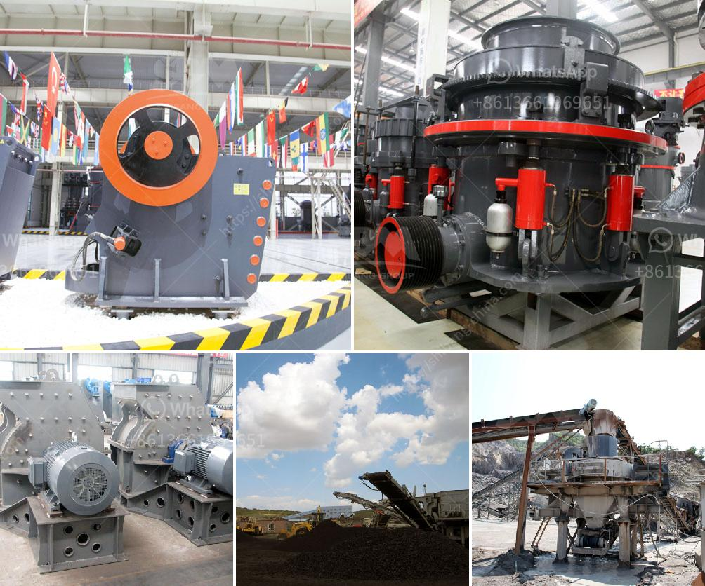

<h3>تبطين أنابيب مطحنة فحم الحجر</h3>
تبطين أنابيب مطحنة فحم الحجر هو عملية توضيب وحماية الأنابيب التي تستخدم في مطحنة فحم الحجر. تعد هذه الأنابيب حيوية لعملية توليد الطاقة الكهربائية من خلال حرق الفحم.

يمر الفحم في مطحنة الفحم الحجري بعملية طحن لتحويله إلى مسحوق ناعم، وتحتاج هذه العملية إلى أنابيب عالية الجودة لنقل الفحم الناعم من منطقة الطحن إلى الأفران أو المراجل. تعتبر المطاحن العمودية والمطاحن الأفقية أنواعا شائعة من مطاحن الفحم الحجري، وتستخدم أنابيب لنقل الفحم الناعم في هاتين العمليتين.

فحم الحجر الناعم قد يتسبب في تآكل الأنابيب نتيجة لتأثير الاحتكاك الزائد والتغيرات الحرارية. بالإضافة إلى ذلك، تتعرض الأنابيب أيضًا للتآكل الكيميائي نتيجة لتأثير المواد الكيميائية المتواجدة في الفحم. وبالتالي فإن تبطين الأنابيب يعتبر فعالًا لمنع التآكل وضمان استمرارية تدفق الفحم.

تتوفر العديد من الخيارات لتبطين الأنابيب في مطحنة فحم الحجر، وتشمل هذه الخيارات الطلاء السيراميكي، والخرسانة المقاومة للتآكل، وطبقات البطانات المصنوعة من المواد المقاومة للتآكل مثل أكسيد الألومنيوم. يتم اختيار نوع التبطين وفقًا لظروف التشغيل والبيئة.

يتم استبدال التبطين القديم بعد فترة زمنية محددة، حيث يتآكل نتيجة استخدام طويل والتعرض للتآكل المستمر. يتم إجراء الصيانة بانتظام للتأكد من سلامة التبطين واستمرارية أدائه.

باختصار، يعتبر تبطين أنابيب مطحنة فحم الحجر عملية حاسمة لحماية الأنابيب من التآكل والتعب، وضمان استمرارية تدفق الفحم الناعم. يتطلب ذلك الاستخدام المناسب للمواد المقاومة للتآكل والصيانة الدورية للتأكد من أداء التبطين بكفاءة.
<h3>Contact us</h3><ul><li><strong>Whatsapp:&nbsp;<a href="https://wa.me/8613661969651">+8613661969651</a></strong></li><li><a href="https://swt.shibang-china.com/?git&amp;zhl&amp;تبطين أنابيب مطحنة فحم الحجر"><strong>Online Service(chat now)</strong></a></li></ul><h3>Related</h3><ul><li><a href='آلة مطحنة المطارق.md'>آلة مطحنة المطارق</a></li><li><a href='أسعار آلات تكسير الحجر في زيمبابوي.md'>أسعار آلات تكسير الحجر في زيمبابوي</a></li><li><a href='كاولين مورد كسارة محمولة في أنغولا.md'>كاولين مورد كسارة محمولة في أنغولا</a></li><li><a href='سعر كسارة الفك 400x600.md'>سعر كسارة الفك 400x600</a></li><li><a href='سحق مصنع لخام الحديد.md'>سحق مصنع لخام الحديد</a></li></ul>