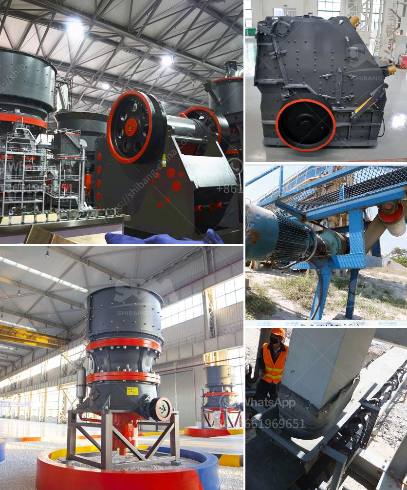

<h3>تبيع شاشات الاهتزاز للحصى والرمل</h3>
تعد شاشات الاهتزاز معدات هامة في صناعة التعدين ومواد البناء، حيث تستخدم لفصل وتصنيف الحصى والرمل وغيرها من المواد الخام. تتوفر هذه الشاشات في السوق بتصاميم وأحجام مختلفة، وتباع بأسعار تتراوح من 200 إلى 400 دولار، وذلك حسب المواصفات والميزات المختلفة.

تتميز الشاشات الاهتزاز بقدرتها على فصل الحصى والرمل تلقائيًا، فعندما يتم إدخال المادة الخام إلى الشاشة، يبدأ الجهاز في الاهتزاز بشدة باستخدام محركات الاهتزاز الموجودة في الأسفل، وهذا يساعد على تجزئة وتصنيف الحصى والرمل حسب الحجم. ويتم التحكم بحجم وشكل الثقوب في الشاشة لتحقيق الفصل الأمثل.

تتوافر شاشات الاهتزاز بمختلف الأحجام والأشكال للسماح بتصنيف المواد بشكل فعال، ومن بين الميزات الأخرى المتوفرة في بعض الشاشات، هناك خاصية التحكم في سرعة الاهتزاز وزاوية الميل للحصول على أداء مثلى. تتفاوت أيضًا المواد المصنوعة منها الشاشة مثل الفولاذ عالي الجودة أو المطاط المقوى بالبلاستيك.

تتمتع هذه الشاشات بتطبيقات واسعة في مجالات مختلفة، بدءًا من صناعة التعدين حيث تستخدم لاستخراج الحصى والرمل من المواد الخام وفصلها عن الأوساخ والشوائب. كما تستخدم في مصانع الخرسانة والبناء لاختيار الرمل المناسب لإنتاج الخرسانة عالية الجودة. وفي صناعة الزجاج، فإن استخدام الشاشات الاهتزاز يساعد في فصل الجسيمات الزجاجية المختلفة حسب الحجم والنقاوة.

بفضل تقنيات التحسين المستمرة، أصبحت شاشات الاهتزاز أكثر كفاءة وموثوقية في عملية الفصل، وبالتالي فهي تعتبر استثمارًا جيدًا للشركات التي تعمل في صناعة البناء والتعدين. بفضل زيادة الطلب على هذه المعدات، زادت منافسة الأسواق في توفير الشاشات ذات الجودة العالية بأسعار تنافسية، مما يجعلها متاحة لمختلف الشركات والمشاريع الصغيرة والكبيرة.

باختصار، تبيع شاشات الاهتزاز للحصى والرمل بأسعار تتراوح من 200 إلى 400 دولار، وهي وسيلة فعالة لفصل وتصنيف المواد الخام في صناعة التعدين والبناء. وبفضل التحسينات المستمرة في تصميمها وأدائها، أصبحت هذه الشاشات أكثر كفاءة وجودة، مما يجعلها استثمارًا رائعًا للشركات الراغبة في تحسين عملياتها وزيادة إنتاجيتها.
<h3>Contact us</h3><ul><li><strong>Whatsapp:&nbsp;<a href="https://wa.me/8613661969651">+8613661969651</a></strong></li><li><a href="https://swt.shibang-china.com/?git&amp;zhl&amp;تبيع شاشات الاهتزاز للحصى والرمل"><strong>Online Service(chat now)</strong></a></li></ul><h3>Related</h3><ul><li><a href='معدات صنع مسحوق كربونات الكالسيوم في ألمانيا.md'>معدات صنع مسحوق كربونات الكالسيوم في ألمانيا</a></li><li><a href='كسارة الحجر المحمولة اللوحة المزدوجة.md'>كسارة الحجر المحمولة اللوحة المزدوجة</a></li><li><a href='كسارة الفك هي.md'>كسارة الفك هي</a></li><li><a href='كسارة معدنية للإيجار.md'>كسارة معدنية للإيجار</a></li><li><a href='كسارة أسطوانية للحجر الجيري.md'>كسارة أسطوانية للحجر الجيري</a></li></ul>