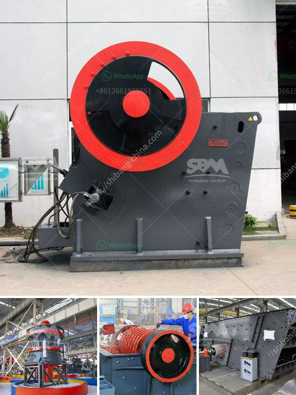

<h3>تجار الكسارات المتنقلة المستخدمة في غانا</h3>
تعد تجار الكسارات المتنقلة من الصناعات الحديثة التي تستخدم بشكل واسع في غانا وغيرها من البلدان المطورة والنامية. تتميز هذه الكسارات بقدرتها على نقل الحجر وسحقه في موقع العمل، مما يوفر الوقت والموارد ويزيد من كفاءة العمليات.

تستخدم تجار الكسارات المتنقلة في غانا لمجموعة واسعة من التطبيقات، بدءًا من مواد البناء والطرق وصولاً إلى صناعة التعدين والبناء والهدم. تعتبر غانا من بين البلدان الرائدة في إنتاج المواد الخام مثل الذهب والماس والبوكسيت، وتستخدم تجار الكسارات المتنقلة في تكسير هذه المواد وتحويلها إلى مواد صالحة للاستخدام.

تحظى تجار الكسارات المتنقلة بشعبية كبيرة في غانا بسبب قدرتها على العمل في ظروف العمل التي تعتبر صعبة ومتغيرة. فهي تمكن التجار من نقل الكسارات بسهولة إلى موقع العمل المحدد والعمل في أي وقت وفي أي مكان. كما أنها توفر مرونة أكبر في عملية النقل والتشغيل مقارنة بالكسارات الثابتة التقليدية.

كما تعزز تجار الكسارات المتنقلة الاستدامة البيئية في غانا والمناطق المحيطة بها. فعندما تستخدم الكسارات المتنقلة، يمكن تحويل المواد الخام المحطمة إلى قطع أصغر وأكثر صالحة للاستخدام، مما يقلل من حجم المواد غير المرغوب فيها ويقلل من تلوث البيئة. بالإضافة إلى ذلك، فإن تقنية التكسير المحمولة تقلل من حاجة النقل البعيد للمواد المحطمة وتقلل من انبعاثات ثاني أكسيد الكربون المترتبة على ذلك.

وبصفة عامة، يتوقع أن يستمر استخدام تجار الكسارات المتنقلة في غانا وبقية العالم بزيادة مستمرة. فهي توفر أداءً أفضل وتكلفة أقل وتسهل النقل والتشغيل وتقلل من التلوث. كما أنها تعزز الاستدامة البيئية وتساعد على تعزيز تنمية البنية التحتية في البلاد.

باختصار، يعد تجار الكسارات المتنقلة المستخدمة في غانا فعّالين ومهمين في تكسير المواد الخام وتحويلها إلى منتجات قابلة للاستخدام في الصناعات المختلفة. من خلال تحسين الكفاءة والاستدامة وتقليل التكاليف، ستستمر تلك الصناعة في النمو والتطور في السنوات القادمة.
<h3>Contact us</h3><ul><li><strong>Whatsapp:&nbsp;<a href="https://wa.me/8613661969651">+8613661969651</a></strong></li><li><a href="https://swt.shibang-china.com/?git&amp;zhl&amp;تجار الكسارات المتنقلة المستخدمة في غانا"><strong>Online Service(chat now)</strong></a></li></ul><h3>Related</h3><ul><li><a href='صيانة محطة توليد الفحم بصيغة PDF.md'>صيانة محطة توليد الفحم بصيغة PDF</a></li><li><a href='شركات تصنيع أحزمة الناقل في كولكاتا.md'>شركات تصنيع أحزمة الناقل في كولكاتا</a></li><li><a href='صناعة الحجر الجيري في الفلبين.md'>صناعة الحجر الجيري في الفلبين</a></li><li><a href='خط إنتاج سحق الجرانيت.md'>خط إنتاج سحق الجرانيت</a></li><li><a href='تقرير المشروع حول وحدة تكسير الحجر.md'>تقرير المشروع حول وحدة تكسير الحجر</a></li></ul>