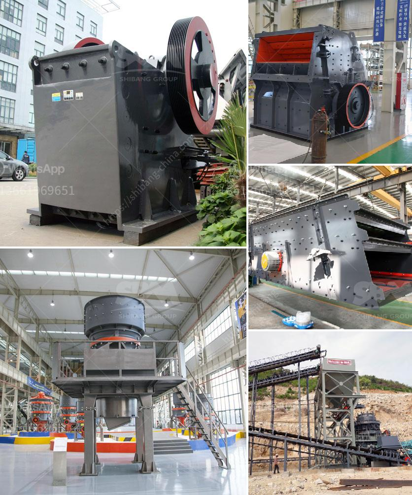

<h3>تجار الكسارات المحمولة في جنوب أفريقيا</h3>
تعد جنوب أفريقيا واحدة من أكبر الدول الصناعية في القارة الأفريقية. تعتبر صناعة التعدين والبناء من القطاعات الحيوية في البلاد، وتتطلب هذه الصناعتان استخدام العديد من المعدات والآليات المتخصصة. ومن بين هذه المعدات المهمة، تأتي الكسارات المحمولة، فهي تعتبر حلاً مثالياً للعمليات الصناعية في مجال التعدين والبناء.

تتميز الكسارات المحمولة بكونها متعددة الاستخدامات، حيث يمكن استخدامها في عدة عمليات بناء مختلفة. تقوم هذه الكسارات بتحطيم المواد الخام مثل الصخور والأحجار والركام، وتحويلها إلى مواد أصغر قابلة للاستخدام في عمليات البناء والتعدين. تتمتع هذه الكسارات بسهولة النقل والتركيب، مما يسمح للمقاولين بنقلها واستخدامها في مناطق مختلفة دون الحاجة إلى تجهيزات إضافية.

يحظى تجار الكسارات المحمولة في جنوب أفريقيا بشعبية كبيرة بين المقاولين وشركات التعدين. فقد تم تحقيق نجاح كبير في هذا القطاع، نتيجة للفوائد التي يوفرها استخدام الكسارات المحمولة. فمن بين هذه الفوائد، يمكننا ذكر توفير الوقت والجهد في عمليات التشغيل والتنقل، بالإضافة إلى خفض التكاليف التشغيلية. كما أن الكسارات المحمولة تعزز من الإنتاجية وتعتبر خيارًا مستدامًا وصديقًا للبيئة، حيث تقوم بإعادة تدوير المواد بدلاً من التخلص منها.

على الرغم من الفوائد العديدة التي توفرها الكسارات المحمولة، إلا أنه يجب أن نلاحظ أنها تحتاج إلى الصيانة والعناية المستمرة. عادة ما يعتمد تجار الكسارات المحمولة على مزودي الخدمات المحليين لضمان تشغيل سلس لهذه الآليات وإصلاح الأعطال التي قد تحدث. يجب أن يكون لدى تجار الكسارات المحمولة مخزون من قطع الغيار الأساسية والأدوات اللازمة للصيانة والإصلاح، وذلك لتجنب توقف العمليات وتأثيرها على إنتاجيتهم.

في النهاية، يمكن القول إن تجار الكسارات المحمولة في جنوب أفريقيا يلعبون دورًا حاسمًا في تعزيز صناعة التعدين والبناء في البلاد. بفضل الكسارات المحمولة، يمكن تحقيق تطور مختلف العمليات الصناعية وزيادة الإنتاجية وتقليل التكاليف التشغيلية. إنها أداة لا غنى عنها للمقاولين وشركات التعدين في جنوب أفريقيا، والتي تساعدهم على تحقيق النجاح وتحقيق أقصى استفادة من الموارد الطبيعية الغنية في البلاد.
<h3>Contact us</h3><ul><li><strong>Whatsapp:&nbsp;<a href="https://wa.me/8613661969651">+8613661969651</a></strong></li><li><a href="https://swt.shibang-china.com/?git&amp;zhl&amp;تجار الكسارات المحمولة في جنوب أفريقيا"><strong>Online Service(chat now)</strong></a></li></ul><h3>Related</h3><ul><li><a href='مطحنة ريموند مستعملة للبيع في تايوان.md'>مطحنة ريموند مستعملة للبيع في تايوان</a></li><li><a href='سعر مصنع كسارة الحجر في الهند.md'>سعر مصنع كسارة الحجر في الهند</a></li><li><a href='صانع كسارة في مدينة سيبو.md'>صانع كسارة في مدينة سيبو</a></li><li><a href='كسارة مخروطية قياسية قدم.md'>كسارة مخروطية قياسية قدم</a></li><li><a href='الطحن بالكرات يعتمد على ماذا.md'>الطحن بالكرات يعتمد على ماذا</a></li></ul>